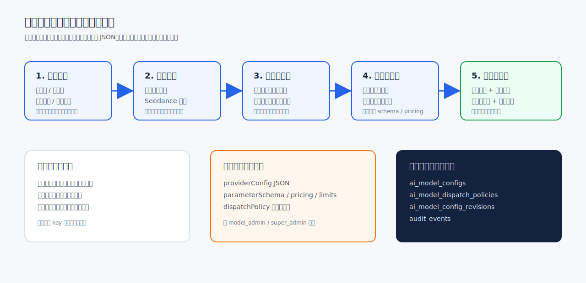
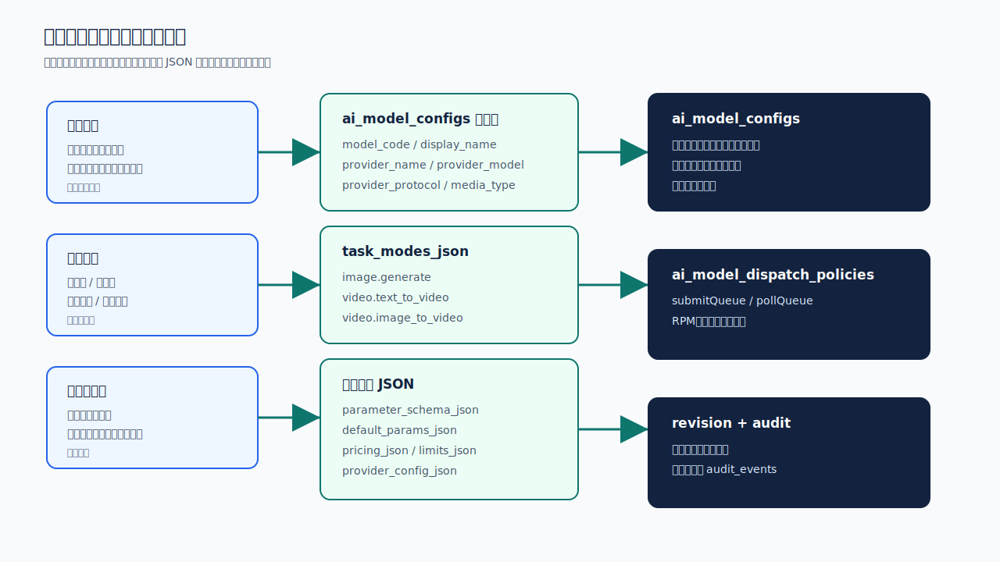
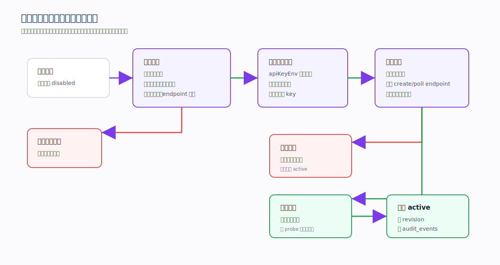

# 后台模型配置运营向导落地方案

本文档定义后台管理端“模型配置”如何从工程化长表单改造成运营可填写的模型接入向导。目标是让运营人员不手写内部任务模式、不直接编辑 JSON，也能按供应商文档完成模型草稿配置；技术管理员仍可通过高级配置兜底。

配套步骤图：







## 现状问题

当前新增模型抽屉把底层配置直接暴露给操作员：

- `任务模式` 是手填字符串，例如 `video.image_to_video`。
- `协议`、`调用方式`、`媒体类型` 能互相冲突，例如图片模型被配成视频协议。
- `parameterSchema`、`providerConfig`、`pricing`、`limits` 等 JSON 对运营不友好。
- 发布检查能阻断缺项，但不能指导运营在第几步修正。
- 真实供应商探测尚未形成保存前/发布前工作流。

因此第一版改造重点不是增加字段，而是把字段变成模板、复选框、表格和分步校验。

## 目标用户

| 角色 | 能做什么 | 不能要求他做什么 |
| --- | --- | --- |
| 运营管理员 | 新建模型草稿、选择模板、填写中文名称、配置价格和参数选项 | 手写任务模式 key、编辑复杂 JSON、理解 adapter 内部协议 |
| 模型管理员 | 修改高级配置、调整 endpoint、调度、结果解析 | 绕过发布检查直接启用 |
| 超级管理员 | 管理模板、密钥引用、发布和回滚 | 保存明文密钥 |

## 页面结构

把现有“新增模型配置”抽屉改为五步向导。

### 第 1 步：选择模型能力

运营看到中文能力，不看到内部 key。

| 运营选项 | 自动生成 `mediaType` | 自动生成 `taskModes` |
| --- | --- | --- |
| 文生图 | `image` | `["image.generate"]` |
| 图生图 | `image` | `["image.image_to_image"]` |
| 图片编辑 | `image` | `["image.edit"]` |
| 文生视频 | `video` | `["video.text_to_video"]` |
| 图生视频 | `video` | `["video.image_to_video"]` |
| 首尾帧视频 | `video` | `["video.first_last_frame_to_video"]` |
| 参考图视频 | `video` | `["video.reference_image_to_video"]` |

交互要求：

- 能力用复选框或卡片多选。
- 选择任意图片能力后，只能选择图片供应商模板。
- 选择任意视频能力后，只能选择视频供应商模板。
- 不允许同时混选图片能力和视频能力，除非模板声明支持 `multimodal`。

### 第 2 步：选择供应商模板

模板决定协议、调用方式、默认 endpoint、队列和基础 JSON。

第一版模板：

| 模板 | 供应商 | 协议 | 调用方式 | 媒体类型 |
| --- | --- | --- | --- | --- |
| 火山引擎 · 即梦图片 | `volcengine` | `custom_http` | `sync` | `image` |
| 火山引擎 · Seedance 视频 | `volcengine` | `volcengine_ark_video` | `async_polling` | `video` |
| OpenAI Images | `openai` | `openai_images` | `sync` | `image` |
| OpenAI Compatible | `openai_compatible` | `openai_compatible_chat` | `sync` | `text` |
| 自定义 HTTP | `custom` | `custom_http` | 手动选择 | 由能力决定 |

### 主流模型矩阵

后台模板必须覆盖运营常见上架项，但不能要求运营理解 adapter。模板按两类承接：

- 原生 adapter：后端已有直接适配，如 `openai_images`、`volcengine_ark_video`。
- 标准 HTTP 代理：暂未内置专用 adapter 的供应商统一走 `custom_http`，接入内部 Provider Proxy。Proxy 对后端暴露标准 `/submit` 或任务创建/查询接口，后端仍能真实保存、校验和调度。

图片模型模板：

| 模型 | 模板 id | 供应商 | 后端协议 | 默认能力 |
| --- | --- | --- | --- | --- |
| Nano Banana | `google-nano-banana-image` | `google` | `custom_http` | 文生图、图生图、图片编辑、参考生图 |
| Nano Banana 2 | `google-nano-banana-2-image` | `google` | `custom_http` | 文生图、图生图、图片编辑、参考生图 |
| Nano Banana Fast | `google-nano-banana-fast-image` | `google` | `custom_http` | 文生图、图生图、图片编辑、参考生图 |
| 即梦 5.0 图片 | `jimeng-5-image` | `volcengine` | `custom_http` | 文生图、图生图、图片编辑、参考生图 |
| 即梦 4.5 图片 | `jimeng-45-image` | `volcengine` | `custom_http` | 文生图、图生图、图片编辑、参考生图 |
| 即梦 4.0 图片 | `jimeng-40-image` | `volcengine` | `custom_http` | 文生图、图生图、图片编辑、参考生图 |
| Image 2 | `openai-image2` | `openai` | `openai_images` | 文生图、图生图、图片编辑、参考生图 |
| Imagen 4 | `google-imagen-4-image` | `google` | `custom_http` | 文生图、图生图、参考生图 |
| Qwen Image | `qwen-image-image` | `alibaba` | `custom_http` | 文生图、图生图、图片编辑、参考生图 |
| Flux Kontext | `flux-kontext-image` | `bfl` | `custom_http` | 文生图、图生图、图片编辑、参考生图 |

视频模型模板：

| 模型 | 模板 id | 供应商 | 后端协议 | 默认能力 |
| --- | --- | --- | --- | --- |
| 可灵 3.0 视频 | `kling-30-video` | `kling` | `custom_http` | 文生视频、首帧生视频、首尾帧生视频、参考生视频 |
| 可灵 2.6 视频 | `kling-26-video` | `kling` | `custom_http` | 文生视频、首帧生视频、首尾帧生视频、参考生视频 |
| 可灵 2.5 视频 | `kling-25-video` | `kling` | `custom_http` | 文生视频、首帧生视频、首尾帧生视频、参考生视频 |
| Grok 视频 | `grok-video` | `xai` | `custom_http` | 文生视频、首帧生视频、首尾帧生视频、参考生视频 |
| Seedance 2.0 | `seedance-20-video` | `volcengine` | `volcengine_ark_video` | 文生视频、首帧生视频、首尾帧生视频、参考生视频 |
| Seedance 2.0 Pro | `seedance-20-pro-video` | `volcengine` | `volcengine_ark_video` | 文生视频、首帧生视频、首尾帧生视频、参考生视频 |
| Seedance Fast | `seedance-fast-video` | `volcengine` | `volcengine_ark_video` | 文生视频、首帧生视频、首尾帧生视频、参考生视频 |
| Happy Horse 视频 | `happy-horse-video` | `happy-horse` | `custom_http` | 文生视频、首帧生视频、首尾帧生视频、参考生视频 |
| Veo 3.1 | `google-veo-31-video` | `google` | `custom_http` | 文生视频、首帧生视频、首尾帧生视频、参考生视频 |
| Sora 2 | `openai-sora-2-video` | `openai` | `custom_http` | 文生视频、首帧生视频、首尾帧生视频、参考生视频 |
| Runway Gen-4 | `runway-gen4-video` | `runway` | `custom_http` | 文生视频、首帧生视频、首尾帧生视频、参考生视频 |
| Luma Ray 3 | `luma-ray3-video` | `luma` | `custom_http` | 文生视频、首帧生视频、首尾帧生视频、参考生视频 |
| PixVerse 5.0 | `pixverse-5-video` | `pixverse` | `custom_http` | 文生视频、首帧生视频、首尾帧生视频、参考生视频 |
| Pika 2.5 | `pika-25-video` | `pika` | `custom_http` | 文生视频、首帧生视频、首尾帧生视频、参考生视频 |
| Hailuo 02 | `hailuo-02-video` | `minimax` | `custom_http` | 文生视频、首帧生视频、首尾帧生视频、参考生视频 |
| Wan 2.2 | `wan-22-video` | `alibaba` | `custom_http` | 文生视频、首帧生视频、首尾帧生视频、参考生视频 |

视频能力必须独立成运营可理解的复选框：

| 运营能力 | 内部 `taskMode` | 素材要求 |
| --- | --- | --- |
| 文生视频 | `video.text_to_video` | 只需要提示词 |
| 首帧生视频 | `video.image_to_video` | 需要 1 张首帧图 |
| 首尾帧生视频 | `video.first_last_frame_to_video` | 需要首帧图和尾帧图 |
| 参考生视频 | `video.reference_image_to_video` | 需要 1 到 4 张参考图 |

图片能力必须独立成运营可理解的复选框：

| 运营能力 | 内部 `taskMode` | 素材要求 |
| --- | --- | --- |
| 文生图 | `image.generate` | 只需要提示词 |
| 图生图 | `image.image_to_image` | 需要参考图 |
| 图片编辑 | `image.edit` | 需要原图，可选蒙版 |
| 参考生图 | `image.reference_generate` | 需要 1 到 8 张参考图 |

### 提示词字数限制

模型模板必须回显提示词上限，避免运营把超长文案保存到模型配置后才在供应商侧失败。模板里统一写入：

- `promptLimit.maxLength`：最大长度。
- `promptLimit.unit`：`characters` 或 `tokens`。
- `promptLimit.source`：`official`、`provider_proxy` 或 `platform_default`。
- `limits.maxPromptLength`、`limits.promptLengthUnit`：保存模型时随 limits 一起落库。
- `parameterSchema.prompt.maxLength`：参数表格里同步显示。

首批限制来源：

| 模型/模板 | 上限 | 来源 |
| --- | --- | --- |
| OpenAI Image 2 | 32,000 字符 | OpenAI Images API |
| Google Imagen 4 | 480 tokens | Google Vertex AI Imagen 4 |
| Flux Kontext | 2,083 字符 | Black Forest Labs API |
| Runway / Veo via Runway | 1,000 字符 | Runway API |
| Seedance 2.0 / Pro / Fast | 2,000 字符 | Cloudflare Workers AI Seedance 2.0 |
| PixVerse | 2,048 字符 | Cloudflare Workers AI PixVerse |
| Hailuo | 2,000 字符 | Cloudflare Workers AI MiniMax Hailuo |
| Luma Ray | 6,000 字符 | Luma Agents API |
| 可灵 | 2,500 字符 | Kling 代理 API 文档 |
| Sora 2 | 6,000 字符 | Sora 2 代理 API 文档 |
| Wan 2.2 | 800 字符 | Wan 2.2 代理 API 文档 |
| 其他未公开精确上限模型 | 图片 4,000 字符，视频 2,000 字符 | 平台默认保守值，供应商确认后可单独覆盖 |

### 视频输入素材参数差异

视频模型不能共用一套“首帧、尾帧、参考图、参考视频”参数。模板按公开文档和接入代理能力拆分为以下参数组合，页面参数表直接回显：

| 模板 | 默认能力 | 参数表会显示 |
| --- | --- | --- |
| 可灵 3.0 | 文生视频、首帧图、首尾帧、参考图 | `prompt`、`firstFrame`、`lastFrame`、`referenceImages`、比例、时长、分辨率、镜头运动 |
| 可灵 2.6 / 2.5 | 首帧图、首尾帧 | `prompt`、`firstFrame`、`lastFrame`、比例、时长、分辨率、镜头运动 |
| Seedance 2.0 / 2.0 Pro | 文生视频、首帧图、首尾帧、参考图 | `prompt`、`firstFrame`、`lastFrame`、`referenceImages`、比例、时长、分辨率 |
| Seedance Fast | 文生视频、首帧图 | `prompt`、`firstFrame`、比例、时长、分辨率 |
| Veo 3.1 | 文生视频、首帧图、首尾帧 | `prompt`、`firstFrame`、`lastFrame`、比例、时长、分辨率 |
| Runway Gen-4 | 首帧图生视频 | `prompt`、`firstFrame`、比例、时长、分辨率 |
| Sora 2 | 文生视频、首帧图、参考/源视频 | `prompt`、`firstFrame`、`sourceVideo`、比例、时长、分辨率 |
| Luma Ray 3 | 文生视频、首帧图、首尾帧 | `prompt`、`firstFrame`、`lastFrame`、比例、时长、分辨率 |
| PixVerse 5.0 | 文生视频、首帧图、首尾帧、参考图 | `prompt`、`firstFrame`、`lastFrame`、`referenceImages`、比例、时长、分辨率 |
| Happy Horse | 首帧图、参考/源视频、图+视频输入 | `prompt`、`firstFrame`、`sourceVideo`、`sourceVideoRole`、比例、时长、分辨率 |
| Pika 2.5 | 文生视频、首帧图、参考/源视频 | `prompt`、`firstFrame`、`sourceVideo`、比例、时长、分辨率 |
| Hailuo 02 / Wan 2.2 / Grok | 文生视频、首帧图 | `prompt`、`firstFrame`、比例、时长、分辨率 |

模板选择后自动填：

- `providerName`
- `providerProtocol`
- `invocationMode`
- `mediaType`
- `taskModes`
- `providerConfig.baseURL`
- `providerConfig.createTaskEndpoint`
- `providerConfig.queryTaskEndpoint`
- `pricing.unit`
- `dispatchPolicy.submitQueueName`
- `dispatchPolicy.pollQueueName`
- `dispatchPolicy.providerRpmLimit`
- `dispatchPolicy.providerConcurrentLimit`

### 第 3 步：填写业务信息

运营只填写业务可理解字段。

| 字段 | 说明 | 校验 |
| --- | --- | --- |
| 模型编码 | 系统唯一编码，例如 `jimeng-image-v4` | 小写字母、数字、横线；唯一 |
| 中文名称 | 后台和前台展示名，例如 `即梦 4.0 图片` | 必填 |
| 真实模型名 | 供应商文档中的模型名 | 必填 |
| 密钥引用 | 从系统设置的密钥引用下拉选择 | 必须存在，不填明文 |
| 排序 | 前台展示顺序 | 数字 |
| 状态 | 默认禁用 | 新模型不能默认启用 |

密钥引用下拉显示：

```text
火山主账号密钥 - VOLCENGINE_ARK_API_KEY - 已配置
OpenAI 图片密钥 - GPT_IMAGE2_API_KEY - 已配置
```

保存到 `providerConfig.apiKeyEnv` 时只保存环境变量名，不保存明文。

### 第 4 步：配置价格和参数

价格表单：

| 字段 | 说明 |
| --- | --- |
| 基础积分 | 每次最低消耗 |
| 计费单位 | image / video / request |
| 分辨率倍率 | 720p、1080p、2K 等 |
| 时长倍率 | 5 秒、10 秒、15 秒等 |
| 失败退款 | 供应商失败全退、用户取消不退 |

参数表格：

| 字段 | 说明 | 示例 |
| --- | --- | --- |
| 参数键 | 供应商或平台内部参数名 | `aspectRatio` |
| 中文名称 | 给运营看的名称 | 视频比例 |
| 类型 | enum / number / text / boolean / file / file[] | enum |
| 是否必填 | 是否必须传入 | 是 |
| 默认值 | 默认使用的值 | `16:9` |
| 选项 | 枚举可选值 | `16:9, 9:16, 1:1` |

点击“生成配置预览”后，系统写入 `parameter_schema_json`：

```json
{
  "aspectRatio": {
    "label": "视频比例",
    "type": "enum",
    "required": true,
    "default": "16:9",
    "options": ["16:9", "9:16", "1:1"]
  }
}
```

### 第 5 步：测试并保存

底部固定操作：

- 上一步
- 保存草稿
- 测试配置
- 发布模型

发布模型必须满足：

- 草稿已保存。
- 静态校验通过。
- 密钥引用检查通过。
- 真实供应商探测通过，或者由超级管理员带原因强制发布。

## 高级配置策略

高级配置默认折叠，标题为“高级配置，技术管理员使用”。

| 高级区 | 字段 |
| --- | --- |
| 请求配置 | `providerConfig` |
| 参数 JSON | `parameterSchema`、`defaultParams` |
| 计费 JSON | `pricing` |
| 素材限制 | `limits` |
| 调度限流 | `dispatchPolicy` |

展开权限：

- `model_admin`
- `super_admin`

运营无高级权限时只看到生成后的只读摘要，不可编辑。

## 后端 API 设计

### 获取模板

```text
GET /api/admin/model-templates
```

返回：

```json
{
  "data": [
    {
      "id": "volcengine-seedance-video",
      "name": "火山引擎 · Seedance 视频",
      "providerName": "volcengine",
      "providerProtocol": "volcengine_ark_video",
      "mediaType": "video",
      "invocationMode": "async_polling",
      "allowedTaskModes": ["video.text_to_video", "video.image_to_video"],
      "defaultProviderConfig": {
        "baseURL": "https://ark.cn-beijing.volces.com",
        "createTaskEndpoint": "/api/v3/contents/generations/tasks",
        "queryTaskEndpoint": "/api/v3/contents/generations/tasks/{taskId}",
        "apiKeyEnv": "",
        "requestFormat": "json"
      },
      "defaultPricing": {
        "unit": "video",
        "baseCredits": 120
      },
      "defaultDispatchPolicy": {
        "submitQueueName": "generation-submit-video",
        "pollQueueName": "generation-poll-video",
        "providerRpmLimit": 60,
        "providerConcurrentLimit": 5,
        "pollingIntervalMs": 15000
      }
    }
  ]
}
```

### 校验草稿

```text
POST /api/admin/models/validate-draft
```

请求体与创建模型请求一致，但不落库。

返回：

```json
{
  "data": {
    "ok": false,
    "failedItems": [
      {
        "step": "business",
        "field": "modelCode",
        "message": "模型编码已存在"
      },
      {
        "step": "provider",
        "field": "apiKeyEnv",
        "message": "请选择已配置的密钥引用"
      }
    ]
  }
}
```

该接口是页面“测试配置”和“保存草稿”的前置真实交互。前端不能只做本地校验；提交保存前必须调用该接口。校验失败时按 `failedItems.step` 定位到向导步骤：

| step | 页面位置 | 典型失败 |
| --- | --- | --- |
| `capability` | 选择模型能力 | 图片模型选择了视频能力 |
| `template` | 选择供应商模板 | 异步模型缺少 `queryTaskEndpoint` |
| `business` | 业务信息 | 模型编码重复、密钥引用为空或疑似明文 |
| `pricing` | 价格和参数 | 基础积分为 0、参数为空 |
| `review` | 测试并保存 | 协议、调用方式、媒体类型非法 |

### 探测已保存模型

```text
POST /api/admin/models/:id/probe
```

请求：

```json
{
  "reason": "发布前测试供应商配置",
  "sampleInput": {
    "prompt": "一只白色杯子放在木桌上",
    "aspectRatio": "1:1"
  }
}
```

第一阶段探测至少做静态后端探测并写审计：

- 校验密钥引用只保存环境变量名。
- 校验 endpoint/createTaskEndpoint/queryTaskEndpoint 格式。
- 校验调度队列、基础积分、参数 schema。
- 标记当前协议是否已有原生 adapter。
- 写入 `audit_events.event_type = admin.model.probed`。

第二阶段再接入真实供应商样例调用。样例 prompt 和供应商响应必须脱敏，禁止把完整 prompt、明文 key、原始响应落到审计表。

返回：

```json
{
  "data": {
    "ok": true,
    "checks": [
      { "key": "secret", "label": "密钥引用", "status": "passed" },
      { "key": "createEndpoint", "label": "创建任务接口", "status": "passed" },
      { "key": "resultMapping", "label": "结果解析", "status": "passed" }
    ],
    "checkedAt": "2026-06-05T12:00:00.000Z"
  }
}
```

## 数据落点

不新增核心业务表，继续使用现有表：

| 页面配置 | 落库字段 |
| --- | --- |
| 模型编码 | `ai_model_configs.model_code` |
| 中文名称 | `ai_model_configs.display_name` |
| 真实模型名 | `ai_model_configs.provider_model` |
| 供应商模板 | `ai_model_configs.provider_name`、`provider_protocol`、`media_type` |
| 能力复选框 | `ai_model_configs.task_modes_json` |
| 参数表格 | `ai_model_configs.parameter_schema_json` |
| 默认值 | `ai_model_configs.default_params_json` |
| 价格表单 | `ai_model_configs.pricing_json` |
| 供应商端点 | `ai_model_configs.provider_config_json` |
| 素材限制 | `ai_model_configs.limits_json` |
| 调度限流 | `ai_model_dispatch_policies` |
| 每次保存 | `ai_model_config_revisions` |
| 保存、探测、发布、回滚 | `audit_events` |

## 前端落地任务

文件：`apps/admin/index.html`

1. 新增模板状态：

```js
state.modelTemplates = [];
state.modelWizard = {
  step: "capability",
  selectedTemplateId: "",
  selectedCapabilities: [],
  advancedOpen: false
};
```

2. 新增加载方法：

```js
async function loadModelTemplates() {
  const result = await api("/api/admin/model-templates");
  state.modelTemplates = result.data || [];
}
```

3. 替换 `openModelEditorDrawer` 为分步渲染：

```text
renderModelWizardCapabilityStep
renderModelWizardTemplateStep
renderModelWizardBusinessStep
renderModelWizardPricingStep
renderModelWizardReviewStep
```

4. 替换任务模式输入框：

```text
从 <input name="taskModes"> 改为中文 checkbox group
```

5. 把 JSON textarea 包进高级折叠区：

```text
高级配置
  providerConfig
  parameterSchema
  pricing
  limits
  dispatchPolicy
```

6. 新增 `buildModelPayloadFromWizard`，把中文表单转换成现有后端 DTO。

7. 新增 `validateModelDraft`，每次点击下一步或测试前调用。

8. 保存草稿前必须再次调用 `validateModelDraft`。只有后端返回 `ok = true` 才能调用 `POST /api/admin/models` 或 `PATCH /api/admin/models/:id`。

9. 模板切换必须同步更新：

- `providerConfig`
- `parameterSchema`
- `defaultParams`
- `pricing`
- `limits`
- `uiConfig`
- `dispatchPolicy`

## 后端落地任务

文件：`apps/backend/src/modules/admin-models/admin-model-config.service.ts`

1. 新增模板常量：

```ts
const ADMIN_MODEL_TEMPLATES = [
  // google-nano-banana-image
  // google-nano-banana-2-image
  // google-nano-banana-fast-image
  // jimeng-5-image / jimeng-45-image / jimeng-40-image
  // openai-image2
  // kling-30-video / kling-26-video / kling-25-video
  // grok-video
  // seedance-20-video / seedance-20-pro-video / seedance-fast-video
  // happy-horse-video
];
```

2. 新增服务方法：

```ts
listModelTemplates()
validateModelDraft(input)
probeModelConfig(input)
```

3. 增强 `validateModelWriteInput`：

- `mediaType=image` 时只允许 `image.*` 任务模式。
- `mediaType=video` 时只允许 `video.*` 任务模式。
- 草稿校验时 `async_polling` 必须有 `queryTaskEndpoint`。
- `apiKeyEnv` 不能像明文 key。
- 价格必须能计算出每个任务模式的基础积分。

4. 探测动作必须写审计：

```text
eventType = admin.model.probed
targetType = ai_model_config
targetId = modelId
reason = 用户填写原因
metadata = 探测结果摘要，禁止保存明文 key 和完整 prompt
```

文件：`apps/backend/src/entrypoints/phone-auth-dev-server.ts`

新增路由：

```text
GET /api/admin/model-templates
POST /api/admin/models/validate-draft
POST /api/admin/models/:id/probe
```

## 测试清单

前端测试：`apps/admin/index.test.mjs`

- 新增模型不再出现手写 `taskModes` 输入框。
- 页面包含 `选择模型能力`、`选择供应商模板`、`价格和参数`、`测试配置`。
- `中文名称` 文案存在，`显示名称` 和 `展示名称` 不再出现。
- 高级配置默认折叠。
- 普通配置区存在密钥引用下拉。

后端 HTTP 测试：`apps/backend/src/entrypoints/tests/admin-platform-http.spec.ts`

- `GET /api/admin/model-templates` 返回至少 3 个模板。
- `POST /api/admin/models/validate-draft` 对图片/视频任务模式冲突返回失败项。
- `POST /api/admin/models/validate-draft` 对缺少 `queryTaskEndpoint` 的异步模型返回失败项。
- `POST /api/admin/models/:id/probe` 需要 `model.publish` 或 `model.write` 权限。
- 探测动作写入 `admin.model.probed` 审计。

服务测试：`apps/backend/src/modules/admin-models/admin-model-config.service.ts`

- 模板生成的 payload 能通过 `validateModelWriteInput`。
- `apiKeyEnv` 明文疑似值被拒绝。
- `mediaType=image` 加 `video.image_to_video` 被拒绝。
- `mediaType=video` 加 `image.generate` 被拒绝。

## 验收标准

1. 运营可以在 5 分钟内创建一个“禁用状态”的模型草稿。
2. 运营无需手写 `video.image_to_video`、`provider_config_json`、`pricing_json`。
3. 选错图片/视频能力时，页面立即阻止进入下一步。
4. 发布前能看到明确的失败项和对应步骤。
5. 保存后仍写入现有模型配置表和修订表。
6. 探测、发布、回滚都写审计。
7. 页面在 1366px 下底部按钮不被遮挡。

## 第一阶段开发顺序

1. 后端增加模板接口和模板常量。
2. 前端把任务模式输入框改成中文复选框。
3. 前端新增模板选择并自动填协议、媒体类型、调用方式、队列。
4. 前端把参数和价格改成表格表单。
5. 后端增加草稿校验接口。
6. 前端接入草稿校验并显示失败项。
7. 高级 JSON 默认折叠。
8. 增加探测接口和审计。
9. 增加前后端测试。
10. 用浏览器截图验收新增模型、编辑模型、发布检查三个场景。
