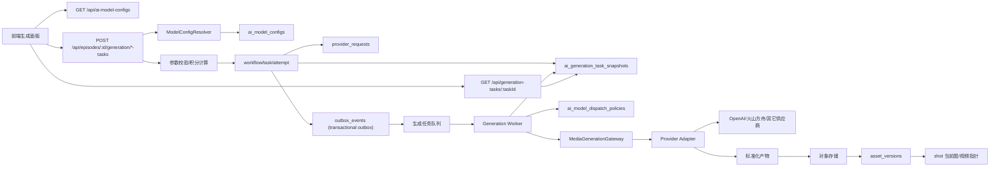
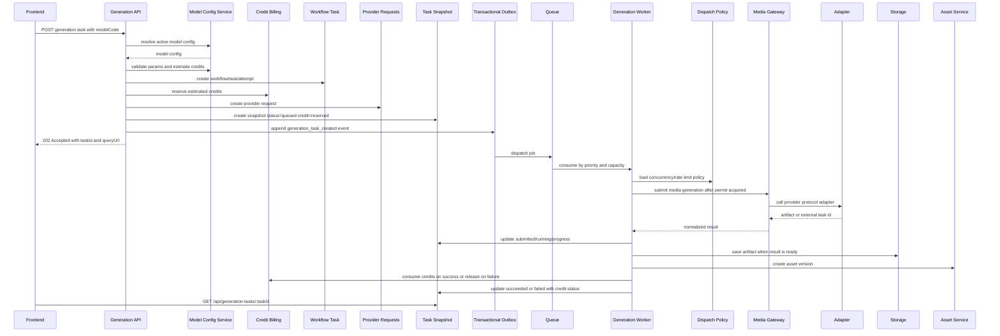

# AI 模型配置化接入方案

> 日期：2026-06-02  
> 目标：把图片、视频、文本等模型从前端硬编码和后端环境变量中抽离，统一沉淀为数据库配置，并通过稳定后端接口驱动前端展示、任务创建、供应商路由、参数校验、积分计费和结果落库。  
> 首批接入目标：`gpt-image-2` 用于图二生图，`Seedance` 用于图一图生视频。

## 1. 背景

当前项目已经有较完整的生成链路：

```text
前端生成面板
  -> 后端 generation image/video task
  -> workflows / tasks / task_attempts
  -> provider_requests
  -> provider adapter
  -> storage_objects
  -> asset_versions
  -> 分镜当前图/视频指针
```

现有问题是模型配置分散：

- 前端 `video-generation-panel.js` 里有模型列表、积分、模式、分辨率等静态配置。
- 后端 `creator-platform.config.ts` 通过环境变量决定 provider mode，适合单供应商或开发模式，不适合多模型运营。
- `OpenAIImagesProviderAdapter` 等 adapter 已存在，但模型、endpoint、能力、计费、参数限制还没有统一配置中心。

本方案把模型抽象成一张通用配置表：业务接口只传 `modelCode`，后端从数据库读取模型配置，再决定如何校验参数、扣积分、调用 adapter、轮询结果、存储产物。

## 2. 设计目标

1. 新增同协议模型时优先只新增数据库记录。
2. 前端模型下拉、默认参数、积分展示都来自后端接口。
3. 后端不信任前端参数，所有参数必须按数据库配置校验。
4. 模型供应商密钥不入库，只在配置中保存 `apiKeyEnv`。
5. 供应商差异留在 adapter 层，业务任务层只处理统一的模型配置和生成产物。
6. 生成结果必须落入平台对象存储，不长期依赖供应商临时 URL。
7. `provider_requests` 仍然是供应商调用审计和幂等边界。

## 3. 核心原则

### 3.1 配置表管“模型是什么”

配置表负责：

- 模型编码和展示名称。
- 供应商和真实模型名。
- 调用协议和调用模式。
- 支持的业务任务模式。
- 参数 schema、默认参数、限制。
- 前端展示信息。
- 计费配置。
- provider endpoint、region、轮询间隔等非密钥路由信息。

### 3.2 Adapter 管“协议怎么调”

Adapter 负责：

- 把平台标准请求转换为供应商请求。
- 提交同步或异步任务。
- 查询异步任务状态。
- 解析供应商响应。
- 标准化错误码。
- 返回可下载或可落库的生成产物。

### 3.3 业务服务管“结果怎么变成平台资产”

业务生成服务负责：

- 创建 workflow/task/attempt。
- 创建或复用 `provider_requests`。
- 扣积分或预留积分。
- 将图片/视频写入对象存储。
- 创建 `asset_versions`。
- 更新分镜当前图/视频指针。
- 记录对话历史和任务状态。

## 4. 总体架构



## 5. 数据库设计

### 5.1 主表：`ai_model_configs`

这张表是模型配置中心。P0 先做全局模型配置，不做租户级覆盖。后续如果需要给某个团队开放内测模型，可以增加 `ai_model_config_overrides`，但不要在第一版增加复杂度。

```sql
CREATE TABLE IF NOT EXISTS ai_model_configs (
  id uuid PRIMARY KEY,

  model_code text NOT NULL,
  display_name text NOT NULL,
  provider_name text NOT NULL,
  provider_model text NOT NULL,
  provider_protocol text NOT NULL,
  invocation_mode text NOT NULL,
  media_type text NOT NULL,

  task_modes_json jsonb NOT NULL DEFAULT '[]'::jsonb,
  capabilities_json jsonb NOT NULL DEFAULT '{}'::jsonb,
  parameter_schema_json jsonb NOT NULL DEFAULT '{}'::jsonb,
  default_params_json jsonb NOT NULL DEFAULT '{}'::jsonb,
  provider_config_json jsonb NOT NULL DEFAULT '{}'::jsonb,
  pricing_json jsonb NOT NULL DEFAULT '{}'::jsonb,
  limits_json jsonb NOT NULL DEFAULT '{}'::jsonb,
  ui_config_json jsonb NOT NULL DEFAULT '{}'::jsonb,

  status text NOT NULL DEFAULT 'active',
  sort_order integer NOT NULL DEFAULT 0,
  remark text NULL,
  created_by_user_id uuid NULL REFERENCES users(id),
  updated_by_user_id uuid NULL REFERENCES users(id),
  created_at timestamptz NOT NULL DEFAULT now(),
  updated_at timestamptz NOT NULL DEFAULT now(),

  UNIQUE (model_code),

  CHECK (provider_protocol IN (
    'creator_dev',
    'openai_images',
    'openai_compatible_chat',
    'volcengine_ark_video',
    'custom_http'
  )),

  CHECK (invocation_mode IN (
    'sync',
    'async_polling',
    'stream',
    'webhook'
  )),

  CHECK (media_type IN (
    'text',
    'image',
    'video',
    'audio',
    'multimodal'
  )),

  CHECK (status IN (
    'active',
    'disabled',
    'archived'
  ))
);

CREATE INDEX IF NOT EXISTS ai_model_configs_lookup_idx
  ON ai_model_configs (status, media_type, sort_order, updated_at DESC);

CREATE INDEX IF NOT EXISTS ai_model_configs_provider_idx
  ON ai_model_configs (provider_name, provider_protocol, status);

CREATE INDEX IF NOT EXISTS ai_model_configs_task_modes_gin_idx
  ON ai_model_configs USING gin (task_modes_json);
```

### 5.2 中文注释

```sql
COMMENT ON TABLE ai_model_configs IS
'AI模型通用配置表。统一管理图片、视频、文本、音频等模型的前端展示、后端路由、供应商协议、参数限制、计费和能力声明。新增同协议模型时优先新增配置记录，只有遇到新供应商协议时才新增 adapter。';

COMMENT ON COLUMN ai_model_configs.id IS '配置主键。';
COMMENT ON COLUMN ai_model_configs.model_code IS '平台内部模型编码。前端和业务接口只传该编码，例如 gpt-image-2-cn、seedance-i2v-pro。';
COMMENT ON COLUMN ai_model_configs.display_name IS '前端展示名称，例如 GPT Image 2、Seedance 图生视频。';
COMMENT ON COLUMN ai_model_configs.provider_name IS '供应商名称，例如 openai、volcengine、jimeng、keling、creator-dev。';
COMMENT ON COLUMN ai_model_configs.provider_model IS '供应商真实模型名，提交给上游 API 使用。';
COMMENT ON COLUMN ai_model_configs.provider_protocol IS '供应商协议类型。后端根据该字段选择对应 adapter。';
COMMENT ON COLUMN ai_model_configs.invocation_mode IS '调用模式：sync 同步、async_polling 异步轮询、stream 流式、webhook 回调。';
COMMENT ON COLUMN ai_model_configs.media_type IS '模型主输出类型：text、image、video、audio、multimodal。';
COMMENT ON COLUMN ai_model_configs.task_modes_json IS '模型支持的业务任务模式数组，例如 ["image.generate","image.edit","video.image_to_video"]。';
COMMENT ON COLUMN ai_model_configs.capabilities_json IS '能力声明，例如是否支持参考图、首帧、尾帧、音频、口型、透明背景、批量生成。';
COMMENT ON COLUMN ai_model_configs.parameter_schema_json IS '参数白名单和校验规则。前后端都应基于该字段限制用户可选参数。';
COMMENT ON COLUMN ai_model_configs.default_params_json IS '默认参数，例如默认比例、分辨率、时长、生成数量。';
COMMENT ON COLUMN ai_model_configs.provider_config_json IS '供应商路由配置，例如 baseURL、endpoint、apiKeyEnv、region、pollIntervalMs。禁止存储明文 API Key。';
COMMENT ON COLUMN ai_model_configs.pricing_json IS '计费配置，例如基础积分、按秒计费、按张计费、不同清晰度倍率。';
COMMENT ON COLUMN ai_model_configs.limits_json IS '限制配置，例如最大参考图数量、最大 prompt 长度、最大视频秒数、允许的 MIME 类型。';
COMMENT ON COLUMN ai_model_configs.ui_config_json IS '前端展示配置，例如标签、推荐标识、默认是否显示、按钮文案、排序分组。';
COMMENT ON COLUMN ai_model_configs.status IS '状态：active 可用，disabled 暂停使用，archived 归档隐藏。';
COMMENT ON COLUMN ai_model_configs.sort_order IS '前端排序权重，数值越小越靠前。';
COMMENT ON COLUMN ai_model_configs.remark IS '中文备注，记录接入说明、限制、供应商注意事项。';
COMMENT ON COLUMN ai_model_configs.created_by_user_id IS '创建配置的后台操作人。系统初始化写入时可以为空。';
COMMENT ON COLUMN ai_model_configs.updated_by_user_id IS '最后更新配置的后台操作人。';
COMMENT ON COLUMN ai_model_configs.created_at IS '创建时间。';
COMMENT ON COLUMN ai_model_configs.updated_at IS '最后更新时间。';
```

### 5.3 任务状态快照表：`ai_generation_task_snapshots`

现有系统已经有 `workflows`、`tasks`、`task_attempts`、`provider_requests`、`storage_objects`、`asset_versions` 等真实业务表。它们是执行事实来源。为了让前端通过 `taskId` 稳定回显生成进度、结果和失败原因，建议增加一张面向查询的任务快照表。

这张表不是替代 `tasks` 或 `provider_requests`，而是把多张表的执行事实聚合成前端容易消费的状态视图。Worker 每次提交供应商、轮询进度、落库存储、失败终止时都更新它。

```sql
CREATE TABLE IF NOT EXISTS ai_generation_task_snapshots (
  id uuid PRIMARY KEY,
  organization_id uuid NOT NULL REFERENCES organizations(id),
  workspace_id uuid NULL REFERENCES workspaces(id),
  project_id uuid NULL REFERENCES projects(id),
  episode_id uuid NULL REFERENCES episodes(id),
  target_type text NOT NULL CHECK (target_type IN ('storyboard', 'asset', 'shot', 'episode')),
  target_id uuid NOT NULL,

  workflow_id uuid NOT NULL REFERENCES workflows(id),
  task_id uuid NOT NULL REFERENCES tasks(id),
  attempt_id uuid NULL REFERENCES task_attempts(id),
  provider_request_id uuid NULL REFERENCES provider_requests(id),
  model_config_id uuid NULL REFERENCES ai_model_configs(id),
  credit_reservation_id uuid NULL REFERENCES credit_reservations(id),

  model_code text NOT NULL,
  media_type text NOT NULL CHECK (media_type IN ('image', 'video', 'audio', 'text', 'multimodal')),
  task_mode text NOT NULL,
  status text NOT NULL CHECK (
    status IN (
      'queued',
      'submitted',
      'accepted',
      'running',
      'succeeded',
      'failed',
      'canceled',
      'result_unknown',
      'manual_review_required'
    )
  ),
  progress_stage text NOT NULL DEFAULT 'queued',
  progress_percent integer NULL CHECK (progress_percent IS NULL OR (progress_percent >= 0 AND progress_percent <= 100)),

  request_summary_json jsonb NOT NULL DEFAULT '{}'::jsonb,
  provider_status_json jsonb NOT NULL DEFAULT '{}'::jsonb,
  result_assets_json jsonb NOT NULL DEFAULT '[]'::jsonb,
  failure_json jsonb NULL,
  estimated_credits integer NOT NULL DEFAULT 0 CHECK (estimated_credits >= 0),
  credit_status text NOT NULL DEFAULT 'not_required' CHECK (
    credit_status IN (
      'not_required',
      'reserved',
      'consumed',
      'released',
      'manual_review_required'
    )
  ),
  credit_summary_json jsonb NOT NULL DEFAULT '{}'::jsonb,

  submitted_at timestamptz NULL,
  started_at timestamptz NULL,
  completed_at timestamptz NULL,
  failed_at timestamptz NULL,
  last_polled_at timestamptz NULL,
  created_by_user_id uuid NULL REFERENCES users(id),
  created_at timestamptz NOT NULL DEFAULT now(),
  updated_at timestamptz NOT NULL DEFAULT now(),

  UNIQUE (organization_id, id),
  UNIQUE (organization_id, task_id),
  FOREIGN KEY (organization_id, workspace_id)
    REFERENCES workspaces (organization_id, id),
  FOREIGN KEY (organization_id, project_id)
    REFERENCES projects (organization_id, id),
  FOREIGN KEY (organization_id, episode_id)
    REFERENCES episodes (organization_id, id),
  FOREIGN KEY (organization_id, workflow_id)
    REFERENCES workflows (organization_id, id),
  FOREIGN KEY (organization_id, task_id)
    REFERENCES tasks (organization_id, id),
  FOREIGN KEY (organization_id, attempt_id)
    REFERENCES task_attempts (organization_id, id),
  FOREIGN KEY (organization_id, provider_request_id)
    REFERENCES provider_requests (organization_id, id),
  FOREIGN KEY (organization_id, credit_reservation_id)
    REFERENCES credit_reservations (organization_id, id)
);

CREATE INDEX IF NOT EXISTS ai_generation_task_snapshots_target_idx
  ON ai_generation_task_snapshots (organization_id, episode_id, target_type, target_id, updated_at DESC)
  WHERE episode_id IS NOT NULL;

CREATE INDEX IF NOT EXISTS ai_generation_task_snapshots_status_idx
  ON ai_generation_task_snapshots (organization_id, status, updated_at DESC);
```

中文注释：

```sql
COMMENT ON TABLE ai_generation_task_snapshots IS
'AI生成任务状态快照表。用于把 workflow、task、attempt、provider_request、asset_version 等执行事实聚合成前端可通过 taskId 查询的稳定视图。真实执行事实仍以原业务表为准。';

COMMENT ON COLUMN ai_generation_task_snapshots.id IS '快照主键。';
COMMENT ON COLUMN ai_generation_task_snapshots.organization_id IS '所属组织，用于租户隔离。';
COMMENT ON COLUMN ai_generation_task_snapshots.workspace_id IS '所属工作区。';
COMMENT ON COLUMN ai_generation_task_snapshots.project_id IS '所属项目。';
COMMENT ON COLUMN ai_generation_task_snapshots.episode_id IS '所属剧集。';
COMMENT ON COLUMN ai_generation_task_snapshots.target_type IS '生成目标类型，例如 storyboard、asset、shot、episode。';
COMMENT ON COLUMN ai_generation_task_snapshots.target_id IS '生成目标 ID。';
COMMENT ON COLUMN ai_generation_task_snapshots.workflow_id IS '关联工作流 ID。';
COMMENT ON COLUMN ai_generation_task_snapshots.task_id IS '关联任务 ID。前端后续轮询和回显主要使用该字段。';
COMMENT ON COLUMN ai_generation_task_snapshots.attempt_id IS '当前执行尝试 ID。重试时会指向最新尝试，历史尝试仍保留在 task_attempts。';
COMMENT ON COLUMN ai_generation_task_snapshots.provider_request_id IS '当前供应商请求 ID，用于关联 provider_requests 审计记录。';
COMMENT ON COLUMN ai_generation_task_snapshots.model_config_id IS '关联模型配置 ID。模型配置删除或归档后，历史任务仍保留 model_code。';
COMMENT ON COLUMN ai_generation_task_snapshots.credit_reservation_id IS '关联积分预留 ID。创建任务时先冻结积分，成功时结转消耗，失败时释放返还。';
COMMENT ON COLUMN ai_generation_task_snapshots.model_code IS '任务创建时使用的平台模型编码。';
COMMENT ON COLUMN ai_generation_task_snapshots.media_type IS '生成产物类型。';
COMMENT ON COLUMN ai_generation_task_snapshots.task_mode IS '业务任务模式，例如 image.generate、video.image_to_video。';
COMMENT ON COLUMN ai_generation_task_snapshots.status IS '任务聚合状态。前端直接根据该字段展示 queued、running、succeeded、failed 等状态。';
COMMENT ON COLUMN ai_generation_task_snapshots.progress_stage IS '进度阶段文案键，例如 queued、provider_submitted、provider_rendering、saving_asset、completed。';
COMMENT ON COLUMN ai_generation_task_snapshots.progress_percent IS '进度百分比。供应商不返回百分比时可以为空，前端展示阶段型进度。';
COMMENT ON COLUMN ai_generation_task_snapshots.request_summary_json IS '脱敏后的请求摘要，包括 prompt 摘要、参数、参考素材数量，不保存完整敏感原文。';
COMMENT ON COLUMN ai_generation_task_snapshots.provider_status_json IS '供应商状态摘要，包括外部任务 ID、供应商状态、最近轮询时间、脱敏响应摘要。';
COMMENT ON COLUMN ai_generation_task_snapshots.result_assets_json IS '生成成功后的资产摘要数组，包括 assetId、assetVersionId、signedUrl、mimeType、width、height、durationSec。';
COMMENT ON COLUMN ai_generation_task_snapshots.failure_json IS '失败摘要，包括 failureCode、providerErrorCode、providerMessage、retryable、displayMessage。';
COMMENT ON COLUMN ai_generation_task_snapshots.estimated_credits IS '创建任务时按模型配置计算出的预计积分。以后模型价格变化不影响历史任务。';
COMMENT ON COLUMN ai_generation_task_snapshots.credit_status IS '积分结算状态：not_required 不需要积分，reserved 已预扣冻结，consumed 已确认消耗，released 已失败返还，manual_review_required 需人工判断。';
COMMENT ON COLUMN ai_generation_task_snapshots.credit_summary_json IS '积分摘要，包括 reservationId、reserved、consumed、released、balanceAfter、settledAt 等前端可回显字段。';
COMMENT ON COLUMN ai_generation_task_snapshots.submitted_at IS '提交到平台任务系统的时间。';
COMMENT ON COLUMN ai_generation_task_snapshots.started_at IS 'Worker 开始处理时间。';
COMMENT ON COLUMN ai_generation_task_snapshots.completed_at IS '任务成功完成时间。';
COMMENT ON COLUMN ai_generation_task_snapshots.failed_at IS '任务失败时间。';
COMMENT ON COLUMN ai_generation_task_snapshots.last_polled_at IS '异步供应商最近一次轮询时间。';
```

如果第一版不想增加新表，也可以由 `/api/generation-tasks/:taskId` 实时 JOIN `tasks`、`provider_requests`、`asset_versions` 组装响应。但推荐保留快照表，因为它能明确解决前端轮询、失败回显、跨页面任务恢复和列表分页性能问题。

### 5.4 模型调度策略表：`ai_model_dispatch_policies`

当同时有数万生成请求进入系统时，不能让 API 请求线程直接调用模型供应商。API 层只负责创建平台任务、写入 `provider_requests`、写入任务快照和 outbox 事件，然后快速返回 `taskId`。真正的供应商调用由队列 Worker 根据调度策略表限速执行。

这张表用于把每个模型的 BullMQ 队列、并发、限流、轮询、重试、熔断配置化。新增同协议模型时，可以只新增 `ai_model_configs` 和 `ai_model_dispatch_policies` 两条配置，不需要改 Worker 代码。

第一版执行队列固定使用 BullMQ/Redis。`queue_backend` 仍保留字段，是为了避免未来迁移时再改表结构；但 P0 不开放 Kafka 执行队列，Kafka 后续更适合作为任务事件流和审计事件总线。

```sql
CREATE TABLE IF NOT EXISTS ai_model_dispatch_policies (
  id uuid PRIMARY KEY,
  model_config_id uuid NOT NULL REFERENCES ai_model_configs(id),

  queue_backend text NOT NULL DEFAULT 'bullmq',
  submit_queue_name text NOT NULL DEFAULT 'generation-submit',
  poll_queue_name text NULL,
  finalize_queue_name text NOT NULL DEFAULT 'generation-finalize-artifact',
  dead_letter_queue_name text NOT NULL DEFAULT 'generation-dead-letter',
  priority integer NOT NULL DEFAULT 100,
  job_id_template text NOT NULL DEFAULT 'generation:{taskId}:{stage}',
  bullmq_job_options_json jsonb NOT NULL DEFAULT '{}'::jsonb,
  enabled boolean NOT NULL DEFAULT true,

  global_concurrency_limit integer NULL,
  provider_concurrency_limit integer NULL,
  model_concurrency_limit integer NOT NULL DEFAULT 5,
  tenant_concurrency_limit integer NULL,
  requests_per_minute integer NULL,
  requests_per_day integer NULL,
  tokens_per_minute integer NULL,

  polling_interval_ms integer NULL,
  polling_concurrency_limit integer NULL,
  max_retry_count integer NOT NULL DEFAULT 3,
  retry_policy_json jsonb NOT NULL DEFAULT '{}'::jsonb,
  polling_backoff_json jsonb NOT NULL DEFAULT '{}'::jsonb,
  circuit_breaker_json jsonb NOT NULL DEFAULT '{}'::jsonb,
  backpressure_policy_json jsonb NOT NULL DEFAULT '{}'::jsonb,

  remark text NULL,
  created_by_user_id uuid NULL REFERENCES users(id),
  updated_by_user_id uuid NULL REFERENCES users(id),
  created_at timestamptz NOT NULL DEFAULT now(),
  updated_at timestamptz NOT NULL DEFAULT now(),

  UNIQUE (model_config_id),

  CHECK (queue_backend IN ('bullmq')),
  CHECK (priority >= 0),
  CHECK (global_concurrency_limit IS NULL OR global_concurrency_limit > 0),
  CHECK (provider_concurrency_limit IS NULL OR provider_concurrency_limit > 0),
  CHECK (model_concurrency_limit > 0),
  CHECK (tenant_concurrency_limit IS NULL OR tenant_concurrency_limit > 0),
  CHECK (requests_per_minute IS NULL OR requests_per_minute > 0),
  CHECK (requests_per_day IS NULL OR requests_per_day > 0),
  CHECK (tokens_per_minute IS NULL OR tokens_per_minute > 0),
  CHECK (polling_interval_ms IS NULL OR polling_interval_ms >= 1000),
  CHECK (polling_concurrency_limit IS NULL OR polling_concurrency_limit > 0),
  CHECK (max_retry_count >= 0)
);

CREATE INDEX IF NOT EXISTS ai_model_dispatch_policies_backend_idx
  ON ai_model_dispatch_policies (queue_backend, enabled, priority);

CREATE INDEX IF NOT EXISTS ai_model_dispatch_policies_queues_idx
  ON ai_model_dispatch_policies (submit_queue_name, poll_queue_name, finalize_queue_name);
```

中文注释：

```sql
COMMENT ON TABLE ai_model_dispatch_policies IS
'AI模型调度策略表。用于配置每个模型进入哪个队列、允许多少并发、每分钟最多请求多少次、如何轮询、如何重试、何时熔断以及队列拥塞时如何降级。它解决高并发削峰和供应商限流保护问题。';

COMMENT ON COLUMN ai_model_dispatch_policies.id IS '调度策略主键。';
COMMENT ON COLUMN ai_model_dispatch_policies.model_config_id IS '关联的模型配置。通常一个模型配置对应一条调度策略。';
COMMENT ON COLUMN ai_model_dispatch_policies.queue_backend IS '队列后端类型。第一版固定为 bullmq，表示由 BullMQ/Redis 执行生成任务、延迟轮询、重试和死信处理。';
COMMENT ON COLUMN ai_model_dispatch_policies.submit_queue_name IS '提交供应商任务使用的队列名，例如 generation-submit-image、generation-submit-video。';
COMMENT ON COLUMN ai_model_dispatch_policies.poll_queue_name IS '异步供应商轮询队列名。同步模型可为空，异步视频模型建议单独队列，避免提交 Worker 被轮询占满。';
COMMENT ON COLUMN ai_model_dispatch_policies.finalize_queue_name IS '产物下载、对象存储写入、asset_versions 创建使用的队列名。';
COMMENT ON COLUMN ai_model_dispatch_policies.dead_letter_queue_name IS '死信队列名。超过重试次数、持续失败或人工排查任务进入该队列。';
COMMENT ON COLUMN ai_model_dispatch_policies.priority IS '队列优先级。数值越小优先级越高，可用于付费用户、短任务、交互式任务优先。';
COMMENT ON COLUMN ai_model_dispatch_policies.job_id_template IS 'BullMQ jobId 模板。用于生成稳定 jobId，避免 outbox 重放或 Worker 重试导致同一阶段重复入队。';
COMMENT ON COLUMN ai_model_dispatch_policies.bullmq_job_options_json IS 'BullMQ JobOptions 配置，例如 attempts、backoff、removeOnComplete、removeOnFail、delay、priority。';
COMMENT ON COLUMN ai_model_dispatch_policies.enabled IS '调度策略是否启用。关闭后新任务不再派发到该模型 Worker。';
COMMENT ON COLUMN ai_model_dispatch_policies.global_concurrency_limit IS '平台全局并发上限。用于保护本系统资源，例如总出站模型请求并发。';
COMMENT ON COLUMN ai_model_dispatch_policies.provider_concurrency_limit IS '同一供应商并发上限。用于保护 openai、volcengine 等供应商账号不被打满。';
COMMENT ON COLUMN ai_model_dispatch_policies.model_concurrency_limit IS '单模型并发上限。用于限制某个模型同时提交给供应商的任务数量。';
COMMENT ON COLUMN ai_model_dispatch_policies.tenant_concurrency_limit IS '单租户并发上限。用于避免一个团队的大批量任务占满全部容量。';
COMMENT ON COLUMN ai_model_dispatch_policies.requests_per_minute IS '单模型或单供应商每分钟请求上限。Worker 获取令牌后才能真正调用供应商。';
COMMENT ON COLUMN ai_model_dispatch_policies.requests_per_day IS '每日请求上限。用于控制供应商额度和成本。';
COMMENT ON COLUMN ai_model_dispatch_policies.tokens_per_minute IS '按 token 计费模型的每分钟 token 上限。图片和视频模型可为空。';
COMMENT ON COLUMN ai_model_dispatch_policies.polling_interval_ms IS '异步任务轮询间隔。供应商建议 5 秒轮询时不要配置成 1 秒。';
COMMENT ON COLUMN ai_model_dispatch_policies.polling_concurrency_limit IS '异步轮询并发上限。防止大量视频任务轮询压垮本系统或供应商查询接口。';
COMMENT ON COLUMN ai_model_dispatch_policies.max_retry_count IS '平台侧最大自动重试次数。不应对已提交到供应商但结果未知的任务盲目重复提交。';
COMMENT ON COLUMN ai_model_dispatch_policies.retry_policy_json IS '重试策略，例如指数退避、最大延迟、哪些错误可重试、哪些错误不可重试。';
COMMENT ON COLUMN ai_model_dispatch_policies.polling_backoff_json IS '轮询退避策略，例如前 3 次 5 秒、之后 15 秒、30 秒、60 秒，并加入 jitter 避免同一秒大量任务同时醒来。';
COMMENT ON COLUMN ai_model_dispatch_policies.circuit_breaker_json IS '熔断策略，例如连续失败次数、失败率窗口、熔断持续时间、半开探测数量。';
COMMENT ON COLUMN ai_model_dispatch_policies.backpressure_policy_json IS '背压策略，例如队列过长时是否拒绝新任务、是否降低优先级、是否提示用户预计等待时间。';
COMMENT ON COLUMN ai_model_dispatch_policies.remark IS '中文备注，记录供应商限流说明、账号额度、调度注意事项。';
COMMENT ON COLUMN ai_model_dispatch_policies.created_by_user_id IS '创建策略的后台操作人。';
COMMENT ON COLUMN ai_model_dispatch_policies.updated_by_user_id IS '最后更新策略的后台操作人。';
COMMENT ON COLUMN ai_model_dispatch_policies.created_at IS '创建时间。';
COMMENT ON COLUMN ai_model_dispatch_policies.updated_at IS '最后更新时间。';
```

## 6. JSON 字段约定

JSONB 字段可以承载不同模型差异，但必须有平台约定，否则会变成另一种不可维护的硬编码。

### 6.1 `task_modes_json`

用于描述模型能服务哪些业务入口。

```json
[
  "image.generate",
  "image.edit",
  "image.multi_reference",
  "video.text_to_video",
  "video.image_to_video",
  "video.first_last_frame",
  "video.reference_to_video",
  "text.chat"
]
```

首批使用：

- 图二做图片：`image.generate`, `image.edit`, `image.multi_reference`
- 图一做视频：`video.image_to_video`

### 6.2 `capabilities_json`

```json
{
  "prompt": true,
  "negativePrompt": false,
  "referenceImages": true,
  "multiReferenceImages": true,
  "firstFrame": true,
  "lastFrame": false,
  "referenceVideo": false,
  "audio": false,
  "lipSync": false,
  "batchOutput": true,
  "transparentBackground": false
}
```

### 6.3 `parameter_schema_json`

这是前端控件和后端校验的共同来源。

```json
{
  "aspectRatio": {
    "type": "enum",
    "values": ["1:1", "16:9", "9:16"],
    "required": true
  },
  "resolution": {
    "type": "enum",
    "values": ["720p", "1080p", "2K"],
    "required": true
  },
  "durationSec": {
    "type": "integer",
    "min": 3,
    "max": 10,
    "required": false
  },
  "imageCount": {
    "type": "integer",
    "min": 1,
    "max": 4,
    "required": false
  }
}
```

### 6.4 `provider_config_json`

只放非密钥配置。

```json
{
  "baseURL": "https://ark.cn-beijing.volces.com",
  "createTaskEndpoint": "/api/v3/contents/generations/tasks",
  "queryTaskEndpoint": "/api/v3/contents/generations/tasks/{taskId}",
  "apiKeyEnv": "VOLCENGINE_ARK_API_KEY",
  "region": "cn-beijing",
  "pollIntervalMs": 3000,
  "pollTimeoutMs": 600000
}
```

禁止写入：

- 明文 API Key
- 明文 Secret
- 用户原始 prompt 全量日志
- 供应商返回的长期敏感 payload

### 6.5 `pricing_json`

```json
{
  "baseCredits": 120,
  "unit": "video",
  "countField": "videoCount",
  "durationField": "durationSec",
  "durationMultiplier": {
    "5": 1,
    "10": 1.8
  },
  "resolutionMultiplier": {
    "720p": 1,
    "1080p": 1.4,
    "2K": 2
  }
}
```

建议第一版只做估算积分，不做供应商真实成本回填。真实成本回填可作为 P0-C 能力接入。

### 6.6 `ui_config_json`

```json
{
  "group": "视频生成",
  "badge": "推荐",
  "showInImagePanel": false,
  "showInVideoPanel": true,
  "defaultForTaskMode": "video.image_to_video",
  "description": "适合分镜首帧图生视频",
  "tags": ["图生视频", "火山方舟"],
  "buttonCreditLabel": "120 生成"
}
```

## 7. 首批模型配置示例

### 7.1 GPT Image 2：图二生图

```sql
INSERT INTO ai_model_configs (
  id,
  model_code,
  display_name,
  provider_name,
  provider_model,
  provider_protocol,
  invocation_mode,
  media_type,
  task_modes_json,
  capabilities_json,
  parameter_schema_json,
  default_params_json,
  provider_config_json,
  pricing_json,
  limits_json,
  ui_config_json,
  status,
  sort_order,
  remark
) VALUES (
  gen_random_uuid(),
  'gpt-image-2-cn',
  'GPT Image 2',
  'openai-cn-proxy',
  'gpt-image-2',
  'openai_images',
  'sync',
  'image',
  '["image.generate","image.edit","image.multi_reference"]',
  '{
    "prompt": true,
    "referenceImages": true,
    "multiReferenceImages": true,
    "batchOutput": true,
    "transparentBackground": false
  }',
  '{
    "aspectRatio": {"type":"enum","values":["1:1","16:9","9:16"],"required":true},
    "resolution": {"type":"enum","values":["1024","1536","2048","2K"],"required":true},
    "imageCount": {"type":"integer","min":1,"max":4,"required":true}
  }',
  '{
    "aspectRatio": "16:9",
    "resolution": "2K",
    "imageCount": 1
  }',
  '{
    "baseURL": "https://your-openai-compatible-host.example.com",
    "endpoint": "/v1/images/generations",
    "editEndpoint": "/v1/images/edits",
    "apiKeyEnv": "GPT_IMAGE2_API_KEY",
    "resultFormat": "b64_json"
  }',
  '{
    "baseCredits": 50,
    "unit": "image",
    "countField": "imageCount",
    "resolutionMultiplier": {
      "1024": 1,
      "1536": 1.3,
      "2048": 1.8,
      "2K": 1.8
    }
  }',
  '{
    "maxPromptLength": 5000,
    "maxReferenceImages": 10,
    "allowedInputMimeTypes": ["image/jpeg","image/png","image/webp"],
    "allowedOutputMimeTypes": ["image/png","image/jpeg","image/webp"]
  }',
  '{
    "group": "图片生成",
    "badge": "链路G",
    "showInImagePanel": true,
    "showInVideoPanel": false,
    "defaultForTaskMode": "image.generate",
    "description": "适合角色、场景、道具多参考图合成分镜图"
  }',
  'active',
  10,
  '用于图二做图片。支持文本生图和多参考图生图；真实 endpoint 以国内代理商配置为准。'
);
```

如果使用中转站连接 `gpt-image-2`，这条配置可以成立，但必须满足以下兼容条件：

| 检查项 | 要求 | 不满足时的处理 |
| --- | --- | --- |
| URL 拼接 | `provider_config_json.baseURL + endpoint` 能得到完整生图地址，例如 `https://proxy.example.com/v1/images/generations` | 调整 `baseURL` 或 `endpoint`，不要在代码里硬编码 |
| 鉴权方式 | 支持 `Authorization: Bearer ${GPT_IMAGE2_API_KEY}` | 在 `provider_config_json.auth` 增加类型，或写专用 adapter |
| 请求体 | 支持 OpenAI Images 风格的 `model`、`prompt`、`size`、`n`、`response_format` 等字段 | 新增 `requestMapping_json` 或新 adapter |
| 返回体 | 支持 `data[].b64_json` 或 `data[].url` | 在配置里声明 `resultFormat = b64_json/url`，adapter 按格式解析 |
| 图片编辑 | 如果要多参考图/图生图，必须支持 `/v1/images/edits` 或中转站自定义上传格式 | 只支持纯文本生图时，关闭 `image.edit`、`image.multi_reference` 能力 |
| 错误格式 | 最好返回 OpenAI 风格 `error.code/message/type` | adapter 需要做错误标准化 |

推荐中转站配置：

```json
{
  "baseURL": "https://your-relay.example.com",
  "endpoint": "/v1/images/generations",
  "editEndpoint": "/v1/images/edits",
  "apiKeyEnv": "GPT_IMAGE2_API_KEY",
  "auth": {
    "type": "bearer"
  },
  "resultFormat": "b64_json",
  "requestFormat": "openai_images",
  "timeoutMs": 120000
}
```

如果中转站只兼容 OpenAI Chat Completions，但不兼容 Images API，不能直接使用 `provider_protocol = openai_images`。这种情况应该：

1. 新增 `provider_protocol = custom_http` 或中转站专用协议。
2. 在 `provider_config_json` 中声明请求映射和响应映射。
3. 新增对应 adapter，把平台参数转换为中转站要求的格式。

当前代码层面已补入 `createProviderAdapterFromModelConfig`：后端从 `ai_model_configs` 读取模型配置后，可以按 `provider_protocol`、`provider_model`、`provider_config_json.baseURL/endpoint/apiKeyEnv` 创建对应 adapter。`gpt-image-2` 走中转站时，不需要把中转站地址硬编码到业务接口里。

```text
model config
  -> provider_protocol = openai_images
  -> provider_config_json.baseURL + endpoint
  -> process.env[apiKeyEnv]
  -> new OpenAIImagesProviderAdapter({ endpoint, apiKey, model })
```

已支持的配置化协议：

| provider_protocol | 当前支持 | 说明 |
| --- | --- | --- |
| `openai_images` | 已支持配置化创建 | 适合 OpenAI Images 兼容的 `gpt-image-2` 或国内中转站。 |
| `custom_http` | 已支持配置化创建 | 适合平台内部标准 HTTP provider；现有 `HttpProviderAdapter` 会在 endpoint 后追加 `/submit`。 |
| `creator_dev` / `dev` | 已支持 | 本地开发和 mock 生成。 |
| `volcengine_ark_video` | 已支持配置化创建 | 用于 Seedance 视频任务，已支持 create task、poll task、状态解析和视频 URL 解析。 |

### 7.2 Seedance：图一首帧图生视频

```sql
INSERT INTO ai_model_configs (
  id,
  model_code,
  display_name,
  provider_name,
  provider_model,
  provider_protocol,
  invocation_mode,
  media_type,
  task_modes_json,
  capabilities_json,
  parameter_schema_json,
  default_params_json,
  provider_config_json,
  pricing_json,
  limits_json,
  ui_config_json,
  status,
  sort_order,
  remark
) VALUES (
  gen_random_uuid(),
  'seedance-i2v-pro',
  'Seedance 图生视频',
  'volcengine',
  'seedance-2-0-i2v',
  'volcengine_ark_video',
  'async_polling',
  'video',
  '["video.image_to_video"]',
  '{
    "prompt": true,
    "firstFrame": true,
    "lastFrame": false,
    "referenceImages": true,
    "referenceVideo": false,
    "audio": false,
    "lipSync": false,
    "batchOutput": true
  }',
  '{
    "aspectRatio": {"type":"enum","values":["1:1","16:9","9:16"],"required":true},
    "resolution": {"type":"enum","values":["720p","1080p"],"required":true},
    "durationSec": {"type":"integer","min":3,"max":10,"required":true},
    "videoCount": {"type":"integer","min":1,"max":4,"required":true}
  }',
  '{
    "aspectRatio": "16:9",
    "resolution": "1080p",
    "durationSec": 5,
    "videoCount": 1
  }',
  '{
    "baseURL": "https://ark.cn-beijing.volces.com",
    "createTaskEndpoint": "/api/v3/contents/generations/tasks",
    "queryTaskEndpoint": "/api/v3/contents/generations/tasks/{taskId}",
    "apiKeyEnv": "VOLCENGINE_ARK_API_KEY",
    "region": "cn-beijing",
    "pollIntervalMs": 3000,
    "pollTimeoutMs": 600000
  }',
  '{
    "baseCredits": 120,
    "unit": "video",
    "countField": "videoCount",
    "durationField": "durationSec",
    "durationMultiplier": {
      "5": 1,
      "10": 1.8
    },
    "resolutionMultiplier": {
      "720p": 1,
      "1080p": 1.4
    }
  }',
  '{
    "maxPromptLength": 5000,
    "maxReferenceImages": 1,
    "allowedInputMimeTypes": ["image/jpeg","image/png","image/webp"],
    "allowedOutputMimeTypes": ["video/mp4"]
  }',
  '{
    "group": "视频生成",
    "badge": "图生视频",
    "showInImagePanel": false,
    "showInVideoPanel": true,
    "defaultForTaskMode": "video.image_to_video",
    "description": "使用当前分镜图作为首帧生成视频"
  }',
  'active',
  20,
  '用于图一做视频。当前分镜图作为首帧，异步创建任务后轮询结果并落入对象存储。'
);
```

## 8. 后端模块设计

### 8.1 新增模块

建议新增：

```text
apps/backend/src/modules/model-catalog/
  ai-model-config.types.ts
  ai-model-config.store.ts
  ai-model-config.service.ts
  ai-model-config.validation.ts
  ai-model-pricing.service.ts
```

职责：

- `store`：查询和更新 `ai_model_configs`。
- `service`：给业务层解析模型、过滤可用模型、返回前端展示 DTO。
- `validation`：基于 `parameter_schema_json` 和 `limits_json` 校验请求参数。
- `pricing`：基于 `pricing_json` 计算预计积分。

### 8.2 ModelConfig DTO

后端内部完整结构：

```ts
export interface AiModelConfig {
  id: string;
  modelCode: string;
  displayName: string;
  providerName: string;
  providerModel: string;
  providerProtocol:
    | "creator_dev"
    | "openai_images"
    | "openai_compatible_chat"
    | "volcengine_ark_video"
    | "custom_http";
  invocationMode: "sync" | "async_polling" | "stream" | "webhook";
  mediaType: "text" | "image" | "video" | "audio" | "multimodal";
  taskModes: string[];
  capabilities: Record<string, unknown>;
  parameterSchema: Record<string, unknown>;
  defaultParams: Record<string, unknown>;
  providerConfig: Record<string, unknown>;
  pricing: Record<string, unknown>;
  limits: Record<string, unknown>;
  uiConfig: Record<string, unknown>;
  status: "active" | "disabled" | "archived";
  sortOrder: number;
  remark: string | null;
}
```

给前端的 DTO 必须脱敏：

```ts
export interface PublicAiModelConfig {
  modelCode: string;
  displayName: string;
  mediaType: string;
  taskModes: string[];
  capabilities: Record<string, unknown>;
  parameterSchema: Record<string, unknown>;
  defaultParams: Record<string, unknown>;
  pricing: Record<string, unknown>;
  limits: Record<string, unknown>;
  uiConfig: Record<string, unknown>;
  estimatedCredits: number;
}
```

不要把以下字段返回给普通前端：

- `providerConfig.apiKeyEnv`
- `providerConfig.baseURL`
- `providerConfig.endpoint`
- `providerName`
- `providerModel`

## 9. 后端接口设计

### 9.1 前端读取可用模型

```http
GET /api/ai-model-configs?mediaType=image&taskMode=image.generate
GET /api/ai-model-configs?mediaType=video&taskMode=video.image_to_video
```

响应：

```json
{
  "models": [
    {
      "modelCode": "gpt-image-2-cn",
      "displayName": "GPT Image 2",
      "mediaType": "image",
      "taskModes": ["image.generate", "image.edit", "image.multi_reference"],
      "capabilities": {
        "referenceImages": true,
        "multiReferenceImages": true
      },
      "parameterSchema": {
        "aspectRatio": {
          "type": "enum",
          "values": ["1:1", "16:9", "9:16"],
          "required": true
        }
      },
      "defaultParams": {
        "aspectRatio": "16:9",
        "resolution": "2K",
        "imageCount": 1
      },
      "pricing": {
        "baseCredits": 50,
        "unit": "image"
      },
      "limits": {
        "maxPromptLength": 5000,
        "maxReferenceImages": 10
      },
      "uiConfig": {
        "group": "图片生成",
        "badge": "链路G",
        "description": "适合角色、场景、道具多参考图合成分镜图"
      },
      "estimatedCredits": 50
    }
  ]
}
```

### 9.2 预估积分

```http
POST /api/ai-model-configs/:modelCode/estimate
```

请求：

```json
{
  "taskMode": "video.image_to_video",
  "parameters": {
    "durationSec": 5,
    "resolution": "1080p",
    "videoCount": 1
  }
}
```

响应：

```json
{
  "modelCode": "seedance-i2v-pro",
  "estimatedCredits": 168,
  "breakdown": {
    "baseCredits": 120,
    "count": 1,
    "durationMultiplier": 1,
    "resolutionMultiplier": 1.4
  }
}
```

### 9.3 创建图片生成任务

沿用现有接口，扩展参数：

```http
POST /api/episodes/:episodeId/generation/image-tasks
```

请求：

```json
{
  "targetType": "storyboard",
  "targetId": "storyboard-id",
  "model": "gpt-image-2-cn",
  "prompt": "根据当前角色、场景、道具生成电影感分镜图",
  "referenceAssetVersionIds": ["asset-version-character", "asset-version-scene"],
  "parameters": {
    "aspectRatio": "16:9",
    "resolution": "2K",
    "imageCount": 1
  }
}
```

后端处理：

1. 用 `model` 查 `ai_model_configs.model_code`。
2. 要求模型 `status = active`。
3. 要求 `media_type = image`。
4. 要求 `task_modes_json` 包含当前任务模式。
5. 用 `parameter_schema_json` 校验 `parameters`。
6. 用 `limits_json` 校验 prompt 长度、参考图数量、MIME 类型。
7. 用 `pricing_json` 计算积分。
8. 校验组织可用积分是否足够。
9. 在同一个数据库事务内创建 workflow/task/attempt。
10. 在同一个数据库事务内调用 `reserveCredits` 预扣冻结积分。
11. 创建 `provider_requests`。
12. 创建 `ai_generation_task_snapshots`，写入 `credit_reservation_id`、`estimated_credits`、`credit_status = reserved`。
13. 写入 `outbox_events`，由 BullMQ Worker 后续通过 `createProviderAdapterFromModelConfig` 调用 `OpenAIImagesProviderAdapter` 或同协议 adapter。
14. 返回 `202 Accepted`、`taskId`、`polling.queryUrl`、积分预扣摘要。

### 9.4 创建视频生成任务

沿用现有接口，扩展参数：

```http
POST /api/episodes/:episodeId/generation/video-tasks
```

请求：

```json
{
  "targetType": "storyboard",
  "targetId": "storyboard-id",
  "model": "seedance-i2v-pro",
  "prompt": "镜头缓慢推进，角色转身看向远方，保持原画风格",
  "firstFrameAssetVersionId": "current-image-asset-version-id",
  "parameters": {
    "aspectRatio": "16:9",
    "resolution": "1080p",
    "durationSec": 5,
    "videoCount": 1
  }
}
```

后端处理：

1. 用 `model` 查配置。
2. 要求 `media_type = video`。
3. 要求任务模式为 `video.image_to_video`。
4. 校验当前分镜必须已有当前图。
5. 给首帧图生成临时签名 URL，或将图片转为供应商支持的输入格式。
6. 用 `pricing_json` 计算积分。
7. 校验组织可用积分是否足够。
8. 在同一个数据库事务内创建 workflow/task/attempt。
9. 在同一个数据库事务内调用 `reserveCredits` 预扣冻结积分。
10. 创建 `provider_requests`。
11. 创建 `ai_generation_task_snapshots`，写入 `credit_reservation_id`、`estimated_credits`、`credit_status = reserved`。
12. 写入 `outbox_events`，由 BullMQ Worker 后续调用 `SeedanceVideoAdapter`。
13. 返回 `202 Accepted`、`taskId`、`polling.queryUrl`、积分预扣摘要。

### 9.5 创建任务响应契约

图片和视频任务创建接口都必须返回可轮询的 `taskId`。前端提交后不需要知道供应商任务 ID，只保存平台 `taskId`。

```json
{
  "workflowId": "workflow-id",
  "taskId": "task-id",
  "taskStatus": "queued",
  "model": {
    "modelCode": "seedance-i2v-pro",
    "displayName": "Seedance 图生视频",
    "mediaType": "video",
    "taskMode": "video.image_to_video"
  },
  "estimatedCredits": 168,
  "credit": {
    "reservationId": "credit-reservation-id",
    "status": "reserved",
    "reserved": 168,
    "consumed": 0,
    "released": 0,
    "balanceAfterReservation": 832,
    "message": "已预扣 168 积分，任务失败会自动返还"
  },
  "polling": {
    "enabled": true,
    "intervalMs": 3000,
    "timeoutMs": 600000,
    "queryUrl": "/api/generation-tasks/task-id"
  }
}
```

同步模型也建议返回 `taskId`。如果上游同步完成，创建接口可以直接返回 `taskStatus = succeeded` 和 `resultAssets`；前端仍可用同一个 `taskId` 查询最终状态。

### 9.6 通过任务 ID 查询进度和回显

现有前端已经有 `creatorApi.getGenerationTask(taskId)`，后端也已有 `/api/generation-tasks/:taskId` 路由。配置化模型接入后，这个接口必须成为任务回显的稳定契约。

```http
GET /api/generation-tasks/:taskId
```

成功响应：

```json
{
  "taskId": "task-id",
  "workflowId": "workflow-id",
  "attemptId": "attempt-id",
  "providerRequestId": "provider-request-id",
  "targetType": "storyboard",
  "targetId": "storyboard-id",
  "mediaType": "video",
  "taskMode": "video.image_to_video",
  "model": {
    "modelCode": "seedance-i2v-pro",
    "displayName": "Seedance 图生视频"
  },
  "status": "running",
  "progress": {
    "stage": "provider_rendering",
    "percent": 45,
    "message": "视频生成中"
  },
  "request": {
    "promptPreview": "镜头缓慢推进，角色转身看向远方...",
    "parameters": {
      "aspectRatio": "16:9",
      "resolution": "1080p",
      "durationSec": 5
    },
    "referenceSummary": {
      "imageCount": 1,
      "videoCount": 0,
      "audioCount": 0
    }
  },
  "provider": {
    "name": "volcengine",
    "externalRequestId": "seedance-provider-task-id",
    "status": "running",
    "lastPolledAt": "2026-06-02T10:30:00.000Z"
  },
  "credit": {
    "reservationId": "credit-reservation-id",
    "status": "reserved",
    "estimatedCredits": 168,
    "reserved": 168,
    "consumed": 0,
    "released": 0,
    "message": "已预扣积分，任务完成后确认消耗"
  },
  "resultAssets": [],
  "failure": null,
  "timestamps": {
    "submittedAt": "2026-06-02T10:28:00.000Z",
    "startedAt": "2026-06-02T10:28:02.000Z",
    "completedAt": null,
    "failedAt": null,
    "updatedAt": "2026-06-02T10:30:00.000Z"
  }
}
```

完成响应：

```json
{
  "taskId": "task-id",
  "workflowId": "workflow-id",
  "status": "succeeded",
  "progress": {
    "stage": "completed",
    "percent": 100,
    "message": "生成完成"
  },
  "model": {
    "modelCode": "gpt-image-2-cn",
    "displayName": "GPT Image 2"
  },
  "credit": {
    "reservationId": "credit-reservation-id",
    "status": "consumed",
    "estimatedCredits": 50,
    "reserved": 0,
    "consumed": 50,
    "released": 0,
    "message": "生成成功，已消耗 50 积分"
  },
  "resultAssets": [
    {
      "assetId": "asset-id",
      "assetVersionId": "asset-version-id",
      "kind": "image",
      "mimeType": "image/png",
      "width": 2048,
      "height": 1152,
      "durationSec": null,
      "signedUrl": "https://storage.example.com/signed-preview-url",
      "isCurrent": true
    }
  ],
  "failure": null
}
```

失败响应：

```json
{
  "taskId": "task-id",
  "workflowId": "workflow-id",
  "status": "failed",
  "progress": {
    "stage": "provider_failed",
    "percent": null,
    "message": "模型返回失败"
  },
  "model": {
    "modelCode": "seedance-i2v-pro",
    "displayName": "Seedance 图生视频"
  },
  "provider": {
    "name": "volcengine",
    "externalRequestId": "seedance-provider-task-id",
    "status": "failed",
    "lastPolledAt": "2026-06-02T10:32:00.000Z"
  },
  "credit": {
    "reservationId": "credit-reservation-id",
    "status": "released",
    "estimatedCredits": 168,
    "reserved": 0,
    "consumed": 0,
    "released": 168,
    "message": "任务失败，已返还 168 积分"
  },
  "resultAssets": [],
  "failure": {
    "failureCode": "provider_content_policy_rejected",
    "providerErrorCode": "ContentPolicyRejected",
    "providerMessage": "Prompt or reference image was rejected by provider policy.",
    "displayMessage": "模型内容安全审核未通过，请调整提示词或参考图后重试。",
    "retryable": false
  }
}
```

前端轮询规则：

1. 创建任务后保存 `taskId`。
2. 每 3 到 15 秒调用 `GET /api/generation-tasks/:taskId`，具体间隔以后端返回 `polling.intervalMs` 为准。
3. `queued/submitted/accepted/running` 继续轮询。
4. `succeeded` 停止轮询，并用 `resultAssets` 回显图片或视频。
5. `failed/canceled/result_unknown/manual_review_required` 停止常规轮询，并展示 `failure.displayMessage`。
6. 页面刷新或重新进入工作台时，通过 `GET /api/episodes/:episodeId/generation-tasks` 恢复最近任务列表，再用任务 ID 回显每条任务详情。

### 9.7 剧集任务列表接口

```http
GET /api/episodes/:episodeId/generation-tasks?page=1&pageSize=10&targetType=storyboard&targetId=storyboard-id
```

响应：

```json
{
  "items": [
    {
      "taskId": "task-id",
      "workflowId": "workflow-id",
      "targetType": "storyboard",
      "targetId": "storyboard-id",
      "mediaType": "image",
      "modelCode": "gpt-image-2-cn",
      "modelLabel": "GPT Image 2",
      "status": "succeeded",
      "progressStage": "completed",
      "resultAssets": [
        {
          "assetVersionId": "asset-version-id",
          "kind": "image",
          "signedUrl": "https://storage.example.com/signed-preview-url"
        }
      ],
      "failure": null,
      "createdAt": "2026-06-02T10:28:00.000Z",
      "updatedAt": "2026-06-02T10:31:00.000Z"
    }
  ],
  "page": 1,
  "pageSize": 10,
  "total": 1
}
```

这个接口用于：

- 页面刷新后恢复任务列表。
- 进入分镜时展示最近一次图/视频生成历史。
- 对话栏中回显用户请求、任务状态和结果消息。

### 9.8 后台管理接口

后台接口必须要求 admin/ops 权限。

#### 列表

```http
GET /api/admin/ai-model-configs?status=active&mediaType=image
```

#### 详情

```http
GET /api/admin/ai-model-configs/:modelCode
```

#### 创建

```http
POST /api/admin/ai-model-configs
```

#### 更新

```http
PATCH /api/admin/ai-model-configs/:modelCode
```

#### 启用/禁用

```http
PATCH /api/admin/ai-model-configs/:modelCode/status
```

请求：

```json
{
  "status": "disabled",
  "reason": "供应商接口异常，临时下线"
}
```

#### 配置校验

```http
POST /api/admin/ai-model-configs/validate
```

用途：

- 校验 JSON 字段结构。
- 校验 `provider_protocol` 是否有 adapter。
- 校验 `apiKeyEnv` 对应环境变量是否存在。
- 校验默认参数是否满足参数 schema。
- 校验 pricing 是否能计算积分。

## 10. Adapter 接口设计

### 10.1 统一请求

```ts
export interface MediaGenerationRequest {
  providerRequestId: string;
  organizationId: string;
  workspaceId: string | null;
  projectId: string | null;
  taskId: string;
  attemptId: string;

  model: AiModelConfig;
  taskMode: string;
  prompt: string;
  parameters: Record<string, unknown>;
  references: Array<{
    role: "character" | "scene" | "prop" | "first_frame" | "last_frame" | "reference_image";
    assetVersionId: string;
    mimeType: string;
    width?: number;
    height?: number;
    signedUrl?: string;
    storageObjectKey?: string;
  }>;
}
```

### 10.2 统一响应

```ts
export type MediaGenerationSubmitResult =
  | {
      status: "succeeded";
      externalRequestId: string;
      artifacts: MediaGenerationArtifact[];
      redactedResponse: Record<string, unknown>;
    }
  | {
      status: "accepted" | "running";
      externalRequestId: string;
      redactedResponse: Record<string, unknown>;
    };

export interface MediaGenerationArtifact {
  kind: "image" | "video" | "audio";
  source: "url" | "base64" | "bytes";
  url?: string;
  base64?: string;
  bytes?: Uint8Array;
  mimeType: string;
  width?: number;
  height?: number;
  durationSec?: number;
  providerMetadata?: Record<string, unknown>;
}
```

### 10.3 Adapter 能力

```ts
export interface MediaProviderAdapter {
  submit(request: MediaGenerationRequest): Promise<MediaGenerationSubmitResult>;
  poll?(input: {
    model: AiModelConfig;
    externalRequestId: string;
    providerRequestId: string;
  }): Promise<MediaGenerationSubmitResult>;
  cancel?(input: {
    model: AiModelConfig;
    externalRequestId: string;
  }): Promise<void>;
}
```

### 10.4 根据配置选择 Adapter

后端不能根据前端传来的模型名写 `if model === "seedance"` 这种分支。正确流程是：

```text
modelCode
  -> ai_model_configs
  -> provider_protocol
  -> adapter registry
  -> provider_model + provider_config_json
  -> submit / poll
```

Adapter 注册表：

```ts
const adapter = createProviderAdapterFromModelConfig({
  providerProtocol: model.providerProtocol,
  providerModel: model.providerModel,
  providerConfig: model.providerConfigJson,
});

// openai_images 会读取：
// providerConfigJson.baseURL
// providerConfigJson.endpoint
// providerConfigJson.apiKeyEnv
// 然后转为 OpenAIImagesProviderAdapter({ endpoint, apiKey, model })
```

当前 factory 行为：

```ts
export function createProviderAdapterFromModelConfig(modelConfig) {
  if (modelConfig.providerProtocol === "openai_images") {
    return new OpenAIImagesProviderAdapter({
      endpoint: baseURL + endpoint,
      apiKey: process.env[apiKeyEnv],
      model: providerModel,
    });
  }

  if (modelConfig.providerProtocol === "custom_http") {
    return new HttpProviderAdapter({ endpoint, apiKey });
  }

  if (modelConfig.providerProtocol === "creator_dev") {
    return createCreatorDevProviderAdapter();
  }

  throw new Error("provider_adapter_missing");
}
```

Worker 侧模型转发伪代码：

```ts
async function submitConfiguredGeneration(input: {
  taskId: string;
  providerRequestId: string;
  modelCode: string;
  taskMode: string;
  prompt: string;
  parameters: Record<string, unknown>;
  references: MediaGenerationRequest["references"];
  context: GenerationExecutionContext;
}) {
  const model = await modelConfigService.requireActiveModel(input.modelCode);

  modelConfigService.assertSupportsTaskMode(model, input.taskMode);
  modelConfigService.assertMediaTypeMatchesTaskMode(model, input.taskMode);
  modelConfigValidation.validateParameters(model, input.parameters);
  modelConfigValidation.validateReferences(model, input.references);

  const providerRequest = await providerRequestService.findById(input.providerRequestId);
  if (!providerRequest || providerRequest.taskId !== input.taskId) {
    throw new ModelGatewayError("provider_request_missing");
  }

  const adapter = createProviderAdapterFromModelConfig({
    providerProtocol: model.providerProtocol,
    providerModel: model.providerModel,
    providerConfig: model.providerConfigJson,
  });

  // 这是防重复提交边界。设置成功后，即使 HTTP 超时也不能自动创建第二个供应商任务。
  await providerRequestService.markExternalSubmissionStarted(providerRequest.id);

  return adapter.submit({
    providerRequestId: providerRequest.id,
    model,
    taskMode: input.taskMode,
    prompt: input.prompt,
    parameters: {
      ...model.defaultParams,
      ...input.parameters,
    },
    references: input.references,
    ...input.context,
  });
}
```

要点：

- 前端只传 `modelCode`，不传 provider、endpoint、真实模型名。
- `provider_model` 只能从数据库配置读取。
- `provider_config_json.apiKeyEnv` 只能用于读取环境变量，不能直接返回给前端。
- `provider_protocol` 只决定 adapter，不决定业务任务状态。
- 新增同协议模型不改 adapter registry。
- `provider_requests` 必须在创建任务的数据库事务内先创建为 `created`，Worker 只能认领和更新该记录，不能绕过平台任务重新创建供应商请求。
- 当前低层 `ProviderAdapter` 只返回 `externalRequestId/status/redactedResponse`。完整媒体落库需要扩展为 `MediaProviderAdapter`，或者让图片/视频 adapter 返回可下载的 artifact 描述。

### 10.5 失败标准化

所有 adapter 必须把供应商错误转换为平台错误结构，再写入 `ai_generation_task_snapshots.failure_json` 和 `provider_requests.response_redacted_json`。

```ts
export interface NormalizedProviderFailure {
  failureCode:
    | "provider_auth_missing"
    | "provider_rate_limited"
    | "provider_content_policy_rejected"
    | "provider_invalid_request"
    | "provider_timeout"
    | "provider_internal_error"
    | "provider_output_download_failed"
    | "provider_output_upload_failed"
    | "provider_output_persist_failed"
    | "provider_result_unknown";
  providerErrorCode?: string;
  providerMessage?: string;
  displayMessage: string;
  retryable: boolean;
  rawResponseHash?: string;
}
```

示例映射：

| 上游场景 | 平台 failureCode | retryable | 前端展示 |
| --- | --- | --- | --- |
| API Key 缺失或无效 | `provider_auth_missing` | false | 模型服务未配置，请联系管理员 |
| 429 限流 | `provider_rate_limited` | true | 模型服务繁忙，请稍后重试 |
| 内容安全拒绝 | `provider_content_policy_rejected` | false | 内容审核未通过，请调整提示词或参考图 |
| 参数不合法 | `provider_invalid_request` | false | 当前参数不被模型支持 |
| 轮询超时 | `provider_timeout` | true | 生成超时，请稍后查询或重试 |
| 上游 5xx | `provider_internal_error` | true | 模型服务异常，请稍后重试 |
| 已提交但无法确认结果 | `provider_result_unknown` | false | 任务状态待确认，请稍后刷新 |
| 上游已成功但下载产物失败 | `provider_output_download_failed` | false | 结果保存失败，请重试或联系管理员 |
| 上游已成功但上传云存储失败 | `provider_output_upload_failed` | false | 结果上传失败，积分已返还 |
| 上游已成功但写入平台资产失败 | `provider_output_persist_failed` | false | 已保存到平台存储，正在等待后台补写资产记录 |

`providerMessage` 可以保存供应商返回的脱敏错误摘要，但不要保存包含用户隐私、完整 prompt、完整图片 URL 的原始响应。

### 10.6 异步轮询与持久化写回

对 `invocation_mode = async_polling` 的模型，创建任务接口只负责把平台任务写入数据库并投递到生成队列，然后返回平台 `taskId`。后续由 Worker 获取限流令牌后提交供应商，并由独立轮询 Worker 查询上游状态。

Worker 轮询写回规则：

| 轮询结果 | `provider_requests.status` | `ai_generation_task_snapshots.status` | 快照写入 |
| --- | --- | --- | --- |
| 已提交，等待上游开始 | `accepted` | `accepted` | `progress_stage = provider_accepted` |
| 上游生成中 | `running` | `running` | `provider_status_json`、`last_polled_at`、进度 |
| 上游成功但本地未保存 | `succeeded` | `running` | `progress_stage = saving_asset` |
| 产物已保存 | `succeeded` | `succeeded` | `result_assets_json`、`completed_at`、`credit_status = consumed` |
| 上游失败 | `failed` | `failed` | `failure_json`、`failed_at`、`credit_status = released` |
| 轮询超时但外部可能仍在跑 | `result_unknown` | `result_unknown` | `failure_json.failureCode = provider_result_unknown`、`credit_status = manual_review_required` |
| 本地下载产物失败 | `succeeded` 或 `result_unknown` | `failed` | `failure_json.failureCode = provider_output_download_failed`、默认 `credit_status = released` |
| 云存储上传失败 | `succeeded` | `failed` | `failure_json.failureCode = provider_output_upload_failed`、默认 `credit_status = released` |
| 平台资产版本写入失败 | `succeeded` | `manual_review_required` | `failure_json.failureCode = provider_output_persist_failed`、保留 `storageObjectKey`，`credit_status = manual_review_required` |

关键约束：

- `external_submission_started_at` 设置后，系统不能因为 HTTP 超时就盲目创建第二个供应商任务。
- 每次轮询都要更新 `last_polled_at`，方便前端和运维判断任务是否卡住。
- 上游成功后，只有对象存储写入和 `asset_versions` 创建成功，前端才看到 `succeeded`。
- 供应商返回的图片/视频 URL 或 b64 只能作为后端内部下载/解码源。前端任务查询、任务列表、对话回显和画布预览只能使用平台 URL，例如 `/uploads/storage/...` 或云存储平台域名。
- 当供应商返回 URL 时，后端应优先使用流式上传：`provider URL response.body -> COS/S3 putObject stream`，避免 `arrayBuffer()` 把完整视频读入内存。每次上传重试都重新打开供应商 URL，避免复用已经被消费的 stream。
- 对象存储记录建议先创建为 `pending_upload`；上传成功后调用 `markStorageObjectAvailable`，再创建 `asset_versions`。上传失败时调用 `markStorageObjectFailed`，任务置为 `failed` 并返还积分。
- 前端看到 `succeeded` 时，积分已经从预扣转为确认消耗。
- 前端看到明确 `failed/canceled` 时，如果任务没有进入人工复核，积分已经返还。
- 如果上游成功但本地保存失败，前端看到失败，但后台仍可通过 `provider_requests` 排查供应商是否已出结果。

### 10.7 积分预扣、成功消耗与失败返还

生成任务必须先扣除积分，但这里的“扣除”不应直接记为最终消费，而是走现有 `credit_reservations` 预扣冻结模型：

```text
创建任务
  -> 按 pricing_json 计算 estimatedCredits
  -> reserveCredits(...)
  -> available credits 减少
  -> reserved credits 增加
  -> ai_generation_task_snapshots.credit_status = reserved

任务成功
  -> settleReservationAllocation(outcome = consumed)
  -> reserved credits 减少
  -> consumed credits 增加
  -> ai_generation_task_snapshots.credit_status = consumed

任务失败或取消
  -> settleReservationAllocation(outcome = released)
  -> reserved credits 减少
  -> available credits 增加
  -> ai_generation_task_snapshots.credit_status = released
```

推荐使用项目现有账本表：

| 表 | 作用 |
| --- | --- |
| `credit_reservations` | 任务创建时的积分预留单，记录本次任务预计冻结多少积分 |
| `credit_reservation_allocations` | 每个任务或子任务的一次结算分配，保证 consume/release 只能发生一次 |
| `credit_ledger_entries` | 追加式账本事实，记录 reservation、consume、release |
| `organizations.credit_balance_cached` | 可用积分读模型，创建任务预扣时减少，失败返还时增加 |
| `organizations.credit_reserved_cached` | 冻结积分读模型，创建任务预扣时增加，成功或失败结算时减少 |

创建任务时必须在同一个 PostgreSQL 事务里完成：

1. 校验模型配置和参数。
2. 计算 `estimatedCredits`。
3. 创建 `workflow/task/attempt`，得到稳定平台 `taskId`。
4. 调用 `reserveCredits`，`sourceType = generation_task`，`sourceId = taskId`。
5. 创建 `provider_requests`。
6. 创建 `ai_generation_task_snapshots`，写入 `credit_reservation_id`、`estimated_credits`、`credit_status = reserved`。
7. 写入 `outbox_events`。

如果积分不足，整个事务回滚，不创建任务、不写 outbox，接口返回：

```json
{
  "code": "insufficient_credits",
  "message": "积分不足，请充值后再生成"
}
```

Worker 结算规则：

| 任务最终状态 | 积分动作 | `credit_status` | 说明 |
| --- | --- | --- | --- |
| `succeeded` 且资产已落库 | `settleReservationAllocation(outcome = consumed)` | `consumed` | 只有平台资产真正可用才确认消耗 |
| `failed`，未产生可用资产 | `settleReservationAllocation(outcome = released)` | `released` | 自动返还预扣积分 |
| `canceled`，供应商未开始或取消成功 | `settleReservationAllocation(outcome = released)` | `released` | 用户取消后返还 |
| `provider_content_policy_rejected` | `released` | `released` | 默认不扣用户积分 |
| `provider_rate_limited` 且仍会重试 | 保持预扣 | `reserved` | 任务还在队列中，不返还 |
| `provider_output_download_failed` | `settleReservationAllocation(outcome = released)` | `released` | 供应商已成功但平台未拿到可用产物，默认返还用户；后台可在供应商 URL 未过期时 `retry_finalize` |
| `provider_output_upload_failed` | `settleReservationAllocation(outcome = released)` | `released` | 供应商已成功但平台未保存到对象存储，默认返还用户；后台可 `retry_finalize` 重新下载/上传 |
| `provider_output_persist_failed` | 暂不自动结算，等待补写或人工选择 | `manual_review_required` | 对象存储可能已经可用，必须保留 `storage_object_key`，后台通过 `retry_persist_asset` 只补写资产记录和业务绑定 |
| `result_unknown` | 不自动结算 | `manual_review_required` | 外部可能已生成或已计费，进入人工/对账 |
| `manual_review_required` | 不自动结算 | `manual_review_required` | 后台人工选择 consume 或 release |

幂等要求：

- `reserveCredits` 使用稳定 `sourceType/sourceId`，同一个 `taskId` 重放不会重复预扣。
- `settleReservationAllocation` 使用稳定 `allocationKey = generation:{taskId}`。
- 同一个 allocation 只能产生一条 `consume` 或 `release` 账本记录。
- BullMQ 重试、outbox 重放、Worker 重复消费都不能造成多扣或多退。
- 任务成功最终化时，`asset_versions` 创建、任务状态成功、积分 `consume` 应在同一个最终化事务内完成。
- 任务失败最终化时，失败状态、`failure_json`、积分 `release` 应在同一个事务内完成。

### 10.8 产物最终化失败重试策略

供应商已经生成成功后，平台仍然可能在“下载供应商产物、上传 COS/对象存储、写入平台资产记录”三个阶段失败。重试策略必须只重试当前失败阶段，不重新提交模型生成，避免重复消耗供应商成本或生成不一致的结果。

通用原则：

- `generation-finalize-artifact` 使用稳定 `jobId = finalize:{taskId}`，避免重复最终化同一任务。
- 每次重试前都读取 `provider_requests`、`storage_objects`、`asset_versions` 和任务快照，判断当前阶段是否已经完成。
- 已经完成的阶段不能重复执行；例如 COS 已上传成功后，不再重新下载和上传，只重试资产记录写入。
- 3 次自动重试只处理本地可恢复问题，例如网络超时、COS 短暂错误、数据库瞬时失败。
- 3 次后仍失败时，任务必须持久化失败或进入人工复核，并写入可排查的 `failure_json`。
- 前端永远不回显供应商原始临时 URL；只有平台对象存储 URL 或签名 URL 可以进入 `resultAssets`。

| 失败阶段 | failureCode | 自动重试策略 | 3 次仍失败后的处理 | 后台补救 |
| --- | --- | --- | --- | --- |
| 从供应商下载失败 | `provider_output_download_failed` | 重新打开供应商 URL 或重新请求供应商产物流，最多 3 次；每次按指数退避并重新校验 content-type、content-length、size limit | `task = failed`，`credit_status = released`，写入下载失败原因和供应商产物摘要 | 如果供应商 URL 未过期，允许后台执行 `retry_finalize`；如果 URL 已过期或供应商不再可取，只能重新生成 |
| 下载成功但上传 COS/对象存储失败 | `provider_output_upload_failed` | 重新执行上传阶段，最多 3 次；大视频使用流式或分片上传，每次失败后重新打开供应商下载流，不能复用已消费 stream | `task = failed`，`storage_objects.status = failed`，`credit_status = released`，保留 object key、bucket、upload error | 允许后台只重试上传/最终化阶段；如果本地没有可复用文件流，则从供应商 URL 重新下载后上传 |
| COS 上传成功但写 `asset_versions` 或绑定分镜失败 | `provider_output_persist_failed` | 不重新下载、不重新上传；只重试数据库最终化事务，最多 3 次，包含创建 `asset_versions`、更新分镜当前图/视频、更新快照和积分结算 | 优先进入 `manual_review_required`，保留 `storage_object_key`，避免用户资产已经上传但平台记录缺失；必要时由后台选择补写记录或释放积分 | 后台执行 `retry_persist_asset`，用已有 `storage_object_key` 补写 `asset_versions` 和业务绑定；确认无用时清理孤儿对象 |

推荐状态流：

```text
provider succeeded
  -> finalize job started
  -> create storage_objects status=pending_upload
  -> download provider artifact
  -> upload to COS/object storage
  -> mark storage_objects status=available
  -> create asset_versions and bind storyboard
  -> consume reserved credits
  -> task status=succeeded
```

失败时：

```text
download failed
  -> retry download up to 3 times
  -> failed/provider_output_download_failed
  -> release reserved credits

upload failed
  -> retry upload up to 3 times
  -> failed/provider_output_upload_failed
  -> mark storage object failed
  -> release reserved credits

persist failed
  -> retry database finalization up to 3 times
  -> manual_review_required/provider_output_persist_failed
  -> keep storage object available
  -> keep reserved credits in manual review until retry_persist_asset or admin settlement
```

`provider_output_persist_failed` 和前两个失败不同：此时平台可能已经拥有可用的 COS 对象。默认不要立即删除对象，也不要盲目重新上传；应保留 `storage_object_key`、`assetVersionDraft` 摘要和失败事务原因，给后台补写资产记录的机会。

## 11. Seedance 接入流程

### 11.1 输入准备

图一生成视频依赖当前分镜图：

```text
storyboard.currentImageAssetVersionId
  -> asset_versions.storage_object_key
  -> storage signed URL
  -> Seedance create task
```

如果供应商要求公网可访问 URL，需要：

- 签名 URL 有效期大于视频任务创建读取时间。
- 图片 MIME 类型在 `limits_json.allowedInputMimeTypes` 中。
- 图片尺寸和比例符合模型配置。

### 11.2 提交流程

```text
POST video-task
  -> validate model config
  -> validate first frame exists
  -> estimate credits by pricing_json
  -> create workflow/task/attempt
  -> reserve credits by credit_reservations
  -> create provider_requests
  -> create ai_generation_task_snapshots status=queued, credit_status=reserved
  -> append outbox_events generation_task_created event
  -> return taskId and polling queryUrl

worker consume submit queue
  -> load ai_model_dispatch_policies
  -> acquire provider/model/tenant rate-limit permit
  -> set external_submission_started_at
  -> call Seedance create task
  -> save external_request_id
  -> task enters running
  -> enqueue poll job by polling_interval_ms
```

### 11.3 轮询流程

```text
worker poll provider task
  -> running: update provider_requests.response_redacted_json
  -> succeeded: download video, save storage object, finalize asset version, consume reserved credits
  -> failed: mark provider request failed, release reserved credits, finalize task failed
  -> timeout after pollTimeoutMs: result_unknown/manual_review_required and keep reservation pending
```

### 11.4 成功落库

成功后写入：

- `storage_objects`
- `asset_versions`
- `provider_requests.response_redacted_json`
- `task_attempts`
- `tasks`
- 分镜当前视频字段
- 对话历史消息
- 积分消费记录：`credit_reservation_allocations.status = consumed`
- 账本记录：`credit_ledger_entries.entry_type = consume`

## 12. GPT Image 2 接入流程

### 12.1 输入准备

图二生图可能有三类输入：

- 纯 prompt 生图。
- 当前角色/场景/道具参考图生图。
- 用户上传参考图 + 资产库参考图混合生图。

后端需要把 `referenceAssetVersionIds` 解析为：

- 签名 URL。
- 或 base64。
- 或 multipart file。

具体取决于国内代理商接口是否完全 OpenAI-compatible。

### 12.2 提交流程

```text
POST image-task
  -> validate model config
  -> validate prompt/reference image limits, availability and MIME allowlist
  -> estimate credits by pricing_json
  -> create workflow/task/attempt
  -> reserve credits by credit_reservations
  -> create provider_requests
  -> create ai_generation_task_snapshots status=queued, credit_status=reserved
  -> append outbox_events generation_task_created event
  -> return taskId and polling queryUrl

worker consume submit queue
  -> load ai_model_dispatch_policies
  -> acquire provider/model/tenant rate-limit permit
  -> set external_submission_started_at
  -> call GPT Image 2 endpoint
  -> receive b64_json or URL
  -> store generated image
  -> create asset version
  -> set storyboard current image
  -> consume reserved credits
```

### 12.3 结果处理

不要把供应商图片 URL 直接当最终资产。图片和视频统一处理：

```text
provider result
  -> decode b64 or download provider URL
  -> create storage_objects status=pending_upload
  -> upload bytes to COS/S3/local object storage
  -> mark storage_objects status=available
  -> create asset_versions with platform preview/source/download URL
  -> task status=succeeded and credits consumed
  -> frontend receives only platform URL
```

如果 `decode/download` 失败，任务失败码为 `provider_output_download_failed`；如果云存储上传失败，任务失败码为 `provider_output_upload_failed`；如果 `asset_versions` 或最终业务绑定写入失败，任务失败码为 `provider_output_persist_failed`。下载失败和上传失败默认释放预扣积分，前端通过 `taskId` 查询失败状态和提示，不回显供应商原始结果 URL。持久化失败和前两类不同：此时 COS/对象存储可能已经成功，必须进入 `manual_review_required`，在 `failure_json` 保留 `storageObjectKey`、`storageBucket`、`noticeType = manual_review` 和展示文案，后台只能通过 `retry_persist_asset` 补写 `asset_versions` 和业务绑定，不重新下载、不重新上传、不重新提交模型生成。

## 13. 前端改造方案

### 13.1 移除硬编码模型列表

当前前端里类似：

```js
const IMAGE_MODELS = { ... };
const VIDEO_MODE_TABS = [ ... ];
const REFERENCE_VIDEO_MODELS = [ ... ];
```

改为：

```text
进入工作台
  -> GET /api/ai-model-configs?mediaType=image
  -> GET /api/ai-model-configs?mediaType=video
  -> 按 taskModes + uiConfig 渲染模型列表
```

推荐前端状态结构：

```js
const generationModelState = {
  imageModels: [],
  videoModels: [],
  selectedImageModelCode: null,
  selectedVideoModelCode: null,
  modelDefaultsByCode: {},
  modelSchemasByCode: {},
};
```

读取模型配置后：

1. 按 `uiConfig.showInImagePanel` 渲染图二做图片模型。
2. 按 `uiConfig.showInVideoPanel` 渲染图一做视频模型。
3. 用 `uiConfig.defaultForTaskMode` 决定默认模型。
4. 用 `parameterSchema` 渲染比例、分辨率、时长、数量等控件。
5. 用 `defaultParams` 初始化表单。
6. 用 `limits` 控制参考图数量、上传 MIME 类型和 prompt 长度。
7. 用 `pricing` 或 estimate 接口展示预计积分。

### 13.2 图二做图片

前端需要从模型配置驱动：

- 模型下拉。
- 比例选项。
- 分辨率选项。
- 图片数量。
- 是否允许参考图。
- 最大参考图数量。
- 预计积分。

提交时只传：

```json
{
  "model": "gpt-image-2-cn",
  "prompt": "...",
  "referenceAssetVersionIds": ["..."],
  "parameters": {
    "aspectRatio": "16:9",
    "resolution": "2K",
    "imageCount": 1
  }
}
```

提交后的前端处理：

```js
const created = await creatorApi.createImageTask(episodeId, payload);
state.imageGenerationResult = {
  status: created.taskStatus,
  taskId: created.taskId,
  modelCode: created.model.modelCode,
  modelLabel: created.model.displayName,
};
scheduleGenerationPolling(created.taskId, "image");
```

### 13.3 图一做视频

前端需要从模型配置驱动：

- 视频模型下拉。
- 时长选项。
- 分辨率选项。
- 是否必须首帧图。
- 最大视频数量。
- 预计积分。

提交时只传：

```json
{
  "model": "seedance-i2v-pro",
  "prompt": "...",
  "firstFrameAssetVersionId": "...",
  "parameters": {
    "aspectRatio": "16:9",
    "resolution": "1080p",
    "durationSec": 5,
    "videoCount": 1
  }
}
```

提交后的前端处理：

```js
const created = await creatorApi.createVideoTask(episodeId, payload);
state.videoGenerationResult = {
  status: created.taskStatus,
  taskId: created.taskId,
  modelCode: created.model.modelCode,
  modelLabel: created.model.displayName,
};
scheduleGenerationPolling(created.taskId, "video");
```

### 13.4 任务轮询和回显

现有前端已经具备类似 `creatorApi.getGenerationTask(taskId)` 的能力。配置化模型接入后，所有生成入口都统一走这个轮询方式。

```js
async function pollGenerationTask(taskId, mediaKind) {
  const task = await creatorApi.getGenerationTask(taskId);

  if (task.status === "succeeded") {
    applyGeneratedAssets(task.resultAssets, mediaKind);
    stopPolling(taskId);
    return;
  }

  if (["failed", "canceled", "result_unknown", "manual_review_required"].includes(task.status)) {
    showGenerationFailure(task.failure?.displayMessage ?? "生成失败，请稍后重试");
    stopPolling(taskId);
    return;
  }

  updateGenerationProgress({
    taskId,
    stage: task.progress?.stage,
    percent: task.progress?.percent,
    message: task.progress?.message,
  });
}
```

页面刷新恢复：

```text
进入 episode workbench
  -> GET /api/episodes/:episodeId/generation-tasks?page=1&pageSize=10
  -> 找到当前 storyboard/asset 最近任务
  -> running 任务继续 GET /api/generation-tasks/:taskId
  -> succeeded 任务直接用 resultAssets 回显
  -> failed 任务直接用 failure.displayMessage 回显
```

这能保证用户刷新页面、切换分镜、重新进入项目后，仍然能通过平台 `taskId` 找回生成状态，不依赖前端内存。

### 13.5 前端不应承担的事情

前端不要：

- 判断供应商协议。
- 拼接供应商 endpoint。
- 读取 API key。
- 自己算最终可信积分。
- 直接保存供应商产物 URL。
- 跳过后端参数限制。

前端可以：

- 根据公开 DTO 渲染控件。
- 做即时表单校验。
- 展示预计积分。
- 展示生成任务状态。

## 14. 后端任务创建时序



## 15. BullMQ 高并发削峰与异步轮询设计

当同时有数万请求任务进入系统时，必须使用队列削峰，不能让前端请求直接穿透到模型供应商。否则会出现三类问题：

- API 服务器线程、连接池、内存被长时间占用，导致正常页面和查询接口一起变慢。
- 模型供应商触发 QPS、RPM、并发数、日额度限制，返回大量 429 或封禁风险。
- 用户刷新后无法稳定找回任务状态，失败原因和供应商外部任务 ID 容易丢失。

第一版明确使用 BullMQ/Redis 作为生成任务执行队列。PostgreSQL 仍然是任务状态事实源，BullMQ 只负责调度执行、延迟轮询、重试和失败队列。

```text
前端创建任务
  -> API 校验模型配置、参数、积分
  -> PostgreSQL 事务内创建 workflow/task/attempt/provider_requests/snapshot/outbox_events
  -> API 返回 202 Accepted + taskId + queryUrl
  -> Outbox Dispatcher 投递 BullMQ submit queue
  -> BullMQ submit Worker 按提交队列并发和限流许可调用供应商
  -> Provider Adapter 调用供应商
  -> 异步模型使用 delayed job 进入 poll queue
  -> BullMQ poll Worker 按轮询队列并发和限流许可查询进度
  -> 成功后流式上传产物到 COS/对象存储、写入 storage_objects/asset_versions
  -> 更新 ai_generation_task_snapshots，前端通过 taskId 查询回显
```

### 15.1 BullMQ 队列划分

推荐队列名：

| 队列 | 用途 | 典型消费者 |
| --- | --- | --- |
| `generation-submit-image` | 图片任务提交供应商 | image submit worker |
| `generation-submit-video` | 视频任务提交供应商 | video submit worker |
| `generation-poll-video` | 异步视频任务轮询供应商状态 | video poll worker |
| `generation-finalize-artifact` | 下载供应商产物、写对象存储、创建资产版本 | artifact finalizer |
| `generation-dead-letter` | 超过重试次数、不可恢复错误、人工排查 | ops/admin worker |

提交队列和轮询队列必须拆开。视频任务可能要轮询几十次，如果轮询和提交共用 Worker，会导致大量已提交任务占住新任务提交能力。
当前阶段 Seedance 与 GPT Image 2 都已拆成 submit / finalize 两段，Seedance 额外包含 poll 阶段：submit / poll Worker 只负责向上游提交或查询状态，在确认成功后统一投递 `generation-finalize-artifact`；artifact finalizer 负责流式上传对象存储、创建 `asset_versions`、更新任务结果并结算积分。

### 15.2 Job Payload 与 jobId

BullMQ Job 中只放最小执行信息，不放完整 prompt、供应商密钥、临时签名 URL、大型响应体。Worker 通过 `taskId` 回查数据库，保证敏感信息和任务状态以 PostgreSQL 为准。

提交 Job：

```json
{
  "taskId": "uuid",
  "attemptId": "uuid",
  "providerRequestId": "uuid",
  "modelCode": "seedance-i2v-pro",
  "stage": "submit",
  "organizationId": "uuid",
  "createdAt": "2026-06-02T10:00:00.000Z"
}
```

轮询 Job：

```json
{
  "taskId": "uuid",
  "providerRequestId": "uuid",
  "modelCode": "seedance-i2v-pro",
  "stage": "poll",
  "pollAttempt": 4,
  "externalRequestId": "provider-task-id"
}
```

推荐 `jobId`：

```text
submit:{taskId}
poll:{taskId}:{pollAttempt}
finalize:{taskId}
dead-letter:{taskId}:{failureCode}
```

`submit:{taskId}` 必须稳定，避免 outbox dispatcher 重放时重复提交供应商。`poll:{taskId}:{pollAttempt}` 带轮询次数，避免同一次轮询重复执行；下一次轮询由 Worker 根据退避策略重新创建。

### 15.3 BullMQ JobOptions

默认 JobOptions 可以从 `ai_model_dispatch_policies.bullmq_job_options_json` 读取：

```json
{
  "attempts": 3,
  "backoff": {
    "type": "exponential",
    "delay": 5000
  },
  "removeOnComplete": {
    "age": 86400,
    "count": 10000
  },
  "removeOnFail": {
    "age": 604800,
    "count": 50000
  }
}
```

配置原则：

- `attempts` 只处理本地可重试错误，例如网络闪断、Redis 短暂异常、供应商 5xx。
- 已经设置 `external_submission_started_at` 的任务，不能因为 BullMQ retry 自动重复提交供应商。
- `removeOnComplete` 必须开启，避免 Redis 长期堆积已完成 Job。
- 失败 Job 保留时间要比排查窗口长，建议 7 天起步。

### 15.4 延迟轮询与退避

异步视频模型不要使用固定 1 秒轮询，也不要为一个任务一次性创建未来所有轮询 Job。只创建下一次 delayed poll job。

推荐退避策略写入 `polling_backoff_json`：

```json
{
  "initialDelayMs": 5000,
  "steps": [
    { "untilAttempt": 3, "delayMs": 5000 },
    { "untilAttempt": 10, "delayMs": 15000 },
    { "untilAttempt": 30, "delayMs": 30000 },
    { "untilAttempt": 999, "delayMs": 60000 }
  ],
  "jitterRatio": 0.2,
  "timeoutMs": 1800000
}
```

轮询流程：

```text
submit worker 得到 externalRequestId
  -> add poll job with delay = initialDelayMs

poll worker 查询供应商
  -> running: 更新快照 lastPolledAt/progress，再 add 下一次 delayed poll job
  -> succeeded: add finalize job
  -> failed: 写 failure_json，任务终止
  -> timeout: 写 result_unknown 或 manual_review_required
```

`jitterRatio` 用来把 10 万任务的唤醒时间打散，避免每 30 秒形成一次 Redis、Worker、供应商接口的尖峰。

### 15.5 Worker 并发、限流与背压

队列只能削峰，不能替代限流。Worker 调用供应商前必须依次检查：

1. 全局出站并发：保护本平台服务器、连接池、带宽。
2. 供应商并发：保护同一个供应商账号，例如火山、OpenAI 代理商。
3. 模型并发：保护某个慢模型或贵模型。
4. 租户并发：避免单个团队把全部容量占满。
5. RPM/日额度：避免触发供应商 429 或账号额度耗尽。
6. 熔断状态：供应商连续失败时暂停提交，只保留少量半开探测。

如果获取不到许可，不应该在 Worker 内忙等。应把任务重新延迟入队，并更新快照：

```json
{
  "status": "queued",
  "progress": {
    "stage": "queued_waiting_rate_limit",
    "message": "当前模型请求较多，任务正在排队"
  }
}
```

当队列长度超过 `backpressure_policy_json.maxQueueDepth` 时，创建接口可以继续返回 `202 queued`，也可以按策略返回可重试错误：

```json
{
  "code": "model_queue_overloaded",
  "message": "当前模型排队任务过多，请稍后再试",
  "retryAfterSeconds": 60
}
```

交互式生成默认建议继续入队并展示预计等待；批量任务或低优先级任务可以被背压拒绝。

BullMQ Worker 启动建议：

```text
generation-submit-image worker:
  concurrency = min(policy.model_concurrency_limit, imageWorkerCpuBudget)

generation-submit-video worker:
  concurrency = min(policy.model_concurrency_limit, videoSubmitBudget)

generation-poll-video worker:
  concurrency = policy.polling_concurrency_limit

generation-finalize-artifact worker:
  concurrency = storageDownloadBudget
```

限流建议使用 Redis 令牌桶或滑动窗口，key 至少包含：

```text
rate:provider:{providerName}:{stage}:rpm
rate:model:{modelCode}:{stage}:rpm
rate:tenant:{organizationId}:{stage}:rpm
concurrency:provider:{providerName}:{stage}
concurrency:model:{modelCode}:{stage}
concurrency:tenant:{organizationId}:{stage}
```

其中 `stage` 当前至少包含 `submit` 和 `poll`。拿不到令牌时，Worker 不忙等，而是按短 delay 重新入队；Seedance poll 阶段会保持原 `pollAttempt`，避免供应商限流误消耗最大轮询次数。

### 15.6 幂等与重复提交保护

高并发队列下最容易发生重复消费，所以必须有幂等边界：

- `provider_requests` 在调用供应商前创建，是供应商请求的审计和幂等边界。
- 设置 `external_submission_started_at` 后，即使 HTTP 超时，也不能立即创建第二个供应商任务。
- Worker 消费同一个 `taskId` 时必须先检查 `provider_requests.external_request_id` 和任务状态。
- 已经 `succeeded/failed/canceled` 的任务不能再次提交供应商。
- BullMQ 按至少一次处理设计，不假设消息只会被投递一次。

### 15.7 进度查询与失败回显

高并发模式下，前端查询不读队列系统，而是读平台任务快照：

- `GET /api/generation-tasks/:taskId` 返回 `queued/running/succeeded/failed/result_unknown`。
- 排队等待容量时返回 `progress.stage = queued_waiting_capacity` 或 `queued_waiting_rate_limit`。
- 供应商 429 时如果可重试，任务仍可保持 `queued/running` 并显示排队；超过重试策略后写入 `failure_json`。
- 失败时持久化 `failure.failureCode`、`failure.providerErrorCode`、`failure.displayMessage`。
- 成功时只有对象存储和 `asset_versions` 都写入成功，才把快照置为 `succeeded`。

这样即使队列里有数万任务，前端刷新页面也只需要根据 `taskId` 查询数据库快照，不依赖 Worker 内存或队列消息。

### 15.8 Redis/BullMQ 环境变量约定

第一版需要在 `.env` 和 `.env.example` 中提供 Redis/BullMQ 配置。Redis 只作为 BullMQ 执行调度器，不能作为任务状态事实源。

```env
REDIS_URL=redis://127.0.0.1:6379/0
REDIS_KEY_PREFIX=comic-ai:dev
BULLMQ_QUEUE_PREFIX=comic-ai-dev
BULLMQ_WORKERS_ENABLED=false
BULLMQ_OUTBOX_DISPATCHER_ENABLED=false
BULLMQ_DEFAULT_REMOVE_ON_COMPLETE_AGE_SECONDS=86400
BULLMQ_DEFAULT_REMOVE_ON_COMPLETE_COUNT=10000
BULLMQ_DEFAULT_REMOVE_ON_FAIL_AGE_SECONDS=604800
BULLMQ_DEFAULT_REMOVE_ON_FAIL_COUNT=50000
GENERATION_SUBMIT_IMAGE_QUEUE=generation-submit-image
GENERATION_SUBMIT_VIDEO_QUEUE=generation-submit-video
GENERATION_POLL_VIDEO_QUEUE=generation-poll-video
GENERATION_FINALIZE_ARTIFACT_QUEUE=generation-finalize-artifact
GENERATION_DEAD_LETTER_QUEUE=generation-dead-letter
GENERATION_OUTBOX_DISPATCH_BATCH_SIZE=50
GENERATION_OUTBOX_DISPATCH_INTERVAL_MS=1000
GENERATION_OUTBOX_RETRY_DELAY_MS=30000
GENERATION_REDIS_REPAIR_STALE_DISPATCH_MS=120000
GENERATION_POLL_VIDEO_INTERVAL_MS=5000
GENERATION_POLL_VIDEO_MAX_ATTEMPTS=120
GENERATION_SUBMIT_VIDEO_CONCURRENCY=10
GENERATION_SUBMIT_VIDEO_RATE_LIMIT_MAX=10
GENERATION_SUBMIT_VIDEO_RATE_LIMIT_DURATION_MS=1000
GENERATION_POLL_VIDEO_CONCURRENCY=40
GENERATION_POLL_VIDEO_RATE_LIMIT_MAX=40
GENERATION_POLL_VIDEO_RATE_LIMIT_DURATION_MS=1000
GENERATION_FINALIZE_VIDEO_CONCURRENCY=40
GENERATION_FINALIZE_IMAGE_CONCURRENCY=100
GENERATION_FINALIZE_VIDEO_RATE_LIMIT_MAX=40
GENERATION_FINALIZE_VIDEO_RATE_LIMIT_DURATION_MS=1000
GENERATION_FINALIZE_IMAGE_RATE_LIMIT_MAX=100
GENERATION_FINALIZE_IMAGE_RATE_LIMIT_DURATION_MS=1000
GENERATION_ARTIFACT_UPLOAD_RETRY_ATTEMPTS=3
GENERATION_ARTIFACT_UPLOAD_RETRY_DELAY_MS=1000
```

字段说明：

| 环境变量 | 作用 |
| --- | --- |
| `REDIS_URL` | BullMQ Redis 连接地址。生产环境必须使用带认证、TLS 或内网隔离的 Redis。 |
| `REDIS_KEY_PREFIX` | Redis 内部限流、锁、令牌桶等业务 key 前缀。 |
| `BULLMQ_QUEUE_PREFIX` | BullMQ 队列前缀，用于区分环境和项目。 |
| `BULLMQ_WORKERS_ENABLED` | 是否在当前进程启动 Worker。API 进程默认建议关闭，独立 Worker 进程开启。 |
| `BULLMQ_OUTBOX_DISPATCHER_ENABLED` | 是否启动 outbox 到 BullMQ 的投递器。 |
| `BULLMQ_DEFAULT_REMOVE_ON_COMPLETE_*` | 已完成 Job 的保留策略，避免 Redis 无限增长。 |
| `BULLMQ_DEFAULT_REMOVE_ON_FAIL_*` | 失败 Job 的保留策略，便于排查但避免长期堆积。 |
| `GENERATION_*_QUEUE` | 生成任务提交、轮询、最终化、死信队列名。 |
| `GENERATION_OUTBOX_DISPATCH_BATCH_SIZE` | outbox dispatcher 单轮最多 claim 的 `generation.task.created` 事件数，默认 50。 |
| `GENERATION_OUTBOX_DISPATCH_INTERVAL_MS` | outbox dispatcher 主循环间隔，默认 1000ms。 |
| `GENERATION_OUTBOX_RETRY_DELAY_MS` | BullMQ 发布失败后 outbox 事件下次可重试时间，默认 30000ms。 |
| `GENERATION_REDIS_REPAIR_STALE_DISPATCH_MS` | Redis/BullMQ 漏投修复阈值，默认 120000ms。queued Seedance 视频任务超过该时间没有待处理 outbox 时，会补发 `generation.task.created`；running Seedance 任务已有外部任务 ID 时，会补发 poll job。 |
| `GENERATION_POLL_VIDEO_INTERVAL_MS` | Seedance 视频 poll delayed job 间隔，默认 5000ms。 |
| `GENERATION_POLL_VIDEO_MAX_ATTEMPTS` | Seedance 视频最大轮询次数，默认 120 次；超过后任务持久化为 `failed/provider_poll_timeout` 并释放预扣积分。 |
| `GENERATION_SUBMIT_VIDEO_CONCURRENCY` | 视频模型提交 Worker 并发数，默认 10。它控制真正向 Seedance 等供应商创建任务的并发，不控制前端请求并发。 |
| `GENERATION_SUBMIT_VIDEO_RATE_LIMIT_*` | 视频模型提交 BullMQ limiter 配置，限制单位时间向供应商创建任务的数量，避免 10 万平台任务瞬间击穿模型侧限流。 |
| `GENERATION_POLL_VIDEO_CONCURRENCY` | 视频模型轮询 Worker 并发数，默认 40。它只查询供应商状态，不做大文件上传。 |
| `GENERATION_POLL_VIDEO_RATE_LIMIT_*` | 视频模型轮询 BullMQ limiter 配置，限制单位时间查询供应商状态的次数；供应商 QPS 更低时要优先下调这里。 |
| `GENERATION_FINALIZE_VIDEO_CONCURRENCY` | 视频产物最终化 Worker 并发数，默认按 40 个流式上传任务起步。 |
| `GENERATION_FINALIZE_IMAGE_CONCURRENCY` | 图片产物最终化 Worker 并发数，默认按 100 个流式上传任务起步。 |
| `GENERATION_FINALIZE_*_RATE_LIMIT_*` | BullMQ limiter 配置，限制单位时间进入最终化执行的任务数，避免打满带宽或触发 COS 限流。 |
| `GENERATION_ARTIFACT_UPLOAD_RETRY_ATTEMPTS` | 模型产物上传 COS/S3 的总尝试次数，默认 3 次；3 次仍失败则任务失败并释放预扣积分。 |
| `GENERATION_ARTIFACT_UPLOAD_RETRY_DELAY_MS` | 上传失败后的重试等待时间，默认 1000ms。 |

本地开发默认 `BULLMQ_WORKERS_ENABLED=false`、`BULLMQ_OUTBOX_DISPATCHER_ENABLED=false`，避免没有启动 Redis 时影响现有 dev server。真正接入 Worker 后，再用独立命令或部署进程开启。

### 15.9 BullMQ 队列健康与运维查询

新增后台运维接口：

```text
GET /api/admin/ops/generation-queues
```

该接口复用 admin ops 权限，普通创作者返回 `403 { "error": "ops_forbidden" }`。管理员请求时后端会：

1. 对 Redis 执行短超时 `PING`，Redis 不可用时快速返回 `status = unavailable`。
2. 对 `generation-submit-image`、`generation-submit-video`、`generation-poll-video`、`generation-finalize-artifact`、`generation-dead-letter` 读取 BullMQ job counts。
3. 返回 `waiting/delayed/active/completed/failed/paused` 计数和少量 failed job 样本。
4. 单个队列读取失败时整体返回 `status = degraded`，便于运维页面展示部分异常。

该接口只读 BullMQ 状态，不改变 PostgreSQL 任务事实源。前端仍通过 `GET /api/generation-tasks/:taskId` 回显单个任务状态。

### 15.10 GPT Image 2 环境变量约定

当前 dev server 已支持用环境变量打开 GPT Image 2 真实生图链路。生产化后 endpoint、模型名、结果格式来自 `ai_model_configs.provider_config_json`，数据库只保存 `apiKeyEnv`，真实 key 仍然放在部署环境。

```env
GPT_IMAGE2_PROVIDER_ENABLED=false
# GPT_IMAGE2_API_KEY=replace-me
```

字段说明：

| 环境变量 | 作用 |
| --- | --- |
| `GPT_IMAGE2_PROVIDER_ENABLED` | 是否启用 `gpt-image-2-cn` 真实图片生成链路。关闭时保持本地 mock。 |
| `GPT_IMAGE2_API_KEY` | OpenAI Images 兼容接口或中转站 API Key，变量名由 `ai_model_configs.provider_config_json.apiKeyEnv` 指定。 |

### 15.11 Seedance 环境变量约定

当前 dev server 已支持用环境变量打开 Seedance 真实提交链路。生产化后这些字段应来自 `ai_model_configs.provider_config_json` 和安全环境变量组合：数据库只保存 `apiKeyEnv`，真实 key 仍然放在部署环境。

```env
SEEDANCE_PROVIDER_ENABLED=false
SEEDANCE_BASE_URL=https://ark.cn-beijing.volces.com
SEEDANCE_CREATE_TASK_ENDPOINT=/api/v3/contents/generations/tasks
SEEDANCE_QUERY_TASK_ENDPOINT=/api/v3/contents/generations/tasks/{taskId}
SEEDANCE_PROVIDER_MODEL=seedance-2-0-i2v
SEEDANCE_API_KEY_ENV=VOLCENGINE_ARK_API_KEY
# VOLCENGINE_ARK_API_KEY=replace-me
```

字段说明：

| 环境变量 | 作用 |
| --- | --- |
| `SEEDANCE_PROVIDER_ENABLED` | 是否启用 Seedance 真实图生视频链路。关闭时保持本地 mock。 |
| `SEEDANCE_BASE_URL` | 火山方舟或中转站基础地址。 |
| `SEEDANCE_CREATE_TASK_ENDPOINT` | 创建视频任务 endpoint。 |
| `SEEDANCE_QUERY_TASK_ENDPOINT` | 查询视频任务 endpoint，必须包含 `{taskId}` 占位符。 |
| `SEEDANCE_PROVIDER_MODEL` | 提交给供应商的真实模型名。平台内部仍使用 `seedance-i2v-pro`。 |
| `SEEDANCE_API_KEY_ENV` | 真实 API Key 所在环境变量名，默认 `VOLCENGINE_ARK_API_KEY`。 |

### 15.11 当前流程检查与缺口

当前文档流程已经形成闭环：

```text
前端读取模型配置
  -> 创建任务并预扣积分
  -> PostgreSQL 写 task/provider_request/snapshot/outbox_events
  -> BullMQ submit worker 调供应商
  -> async polling worker 查询进度
  -> finalize worker 落对象存储和 asset_versions
  -> 成功 consume 积分，失败 release 积分
  -> 前端用 taskId 查询快照回显成功/失败/积分状态
```

但当前代码落地还缺这些实现：

| 缺口 | 影响 | 处理方式 |
| --- | --- | --- |
| 通用产物最终化阶段的细粒度 Redis 令牌桶待扩展 | Seedance 已进入独立 `generation-finalize-artifact` Worker，但当前 finalize 阶段主要依赖 BullMQ 队列级 limiter 和上传重试保护，尚未像 submit/poll 一样补齐 provider/model/tenant/storage-bucket 级动态额度 | 在 finalize Worker 上继续补充按供应商/模型/租户/存储桶维度的 Redis 令牌桶 |
| BullMQ 管理页面趋势与告警待完善 | 后端已有队列健康读接口和 job 运维写接口，前端工具箱首次进入也会显示队列运维空态和刷新入口；拉取快照后可展示队列计数、失败样本，并按 `queueName + jobId` 执行失败 job 重试/移除后刷新快照；`remove` 危险操作已要求二次确认。当前还缺趋势图和积压阈值告警 | 在 admin ops/工具箱继续补积压阈值、失败增长告警和趋势历史 |
| GPT Image 2 共享图片 finalizer 已落地，仍需继续扩大通用化边界 | BullMQ 图片链路已和 Seedance 一样改成 submit -> finalize，submit Worker 只登记供应商结果，artifact finalizer 负责上传 COS/对象存储、创建 `asset_versions`、消费/返还积分；dev server inline 分支也已复用 `gpt-image.artifact-finalizer` 的图片上传和资产落库逻辑，并把 artifact 摘要写入 `provider_requests.response_redacted_json` | 后续继续把 Seedance 视频与 GPT Image 图片的 artifact finalizer 抽成 media-agnostic finalizer，并补齐 finalize 阶段 provider/model/tenant/storage-bucket 级 Redis 令牌桶 |

当前代码已落地的 Seedance 链路：

| 已落地项 | 文件 | 说明 |
| --- | --- | --- |
| 模型配置表与默认 seed | `packages/db/migrations/0007_ai_model_configs.sql` | 已创建 `ai_model_configs`、`ai_model_dispatch_policies`，并 seed `gpt-image-2-cn`、`seedance-i2v-pro`，包含中文注释。 |
| 模型配置读取 | `apps/backend/src/modules/model-catalog/ai-model-config.store.ts` | 后端可按 `modelCode` 读取 active 模型配置，也可按 `mediaType` 列出模型。 |
| Seedance provider adapter | `apps/backend/src/modules/model-gateway/seedance-video.provider-adapter.ts` | 支持创建上游任务、轮询上游任务、解析成功/失败状态和视频 URL。 |
| 配置化 adapter factory | `apps/backend/src/modules/model-gateway/provider-adapter.factory.ts` | `provider_protocol = volcengine_ark_video` 会创建 Seedance adapter。 |
| 后端任务创建入口 | `apps/backend/src/entrypoints/phone-auth-dev-server.ts` | `SEEDANCE_PROVIDER_ENABLED=true` 且 `model = seedance-i2v-pro` 时读取 `ai_model_configs` 的 provider URL、真实模型名和积分后提交真实 Seedance；默认仍走 mock。 |
| BullMQ 依赖与配置读取 | `package.json`、`apps/backend/src/modules/model-gateway/generation-queue.config.ts` | 已加入 `bullmq` 依赖，并能读取 Redis URL、队列前缀、视频提交 10 并发、视频轮询 40 并发、视频流式上传 40 并发、图片最终化 100 并发、limiter 和上传重试配置。 |
| 生成任务 outbox | `apps/backend/src/modules/model-gateway/generation-outbox.service.ts`、`apps/backend/src/entrypoints/phone-auth-dev-server.ts` | `BULLMQ_OUTBOX_DISPATCHER_ENABLED=true` 时，创建生成任务只预扣积分、写入 `generation.task.created` outbox、返回 `queued`，不直接请求供应商。 |
| BullMQ submit job 发布器 | `apps/backend/src/modules/model-gateway/generation-bullmq.publisher.ts` | 可把 `generation.task.created` outbox 转成稳定 jobId 的 BullMQ job，并通过真实 `Queue.add()` 投递到配置队列。 |
| outbox dispatcher 主循环 | `apps/backend/src/modules/model-gateway/generation-outbox.dispatcher.ts`、`scripts/run-generation-outbox-dispatcher.mjs` | `npm run worker:generation-outbox` 会加载 `.env`、连接数据库和 Redis，只 claim `generation.task.created` outbox 事件；发布成功标记 `processed`，发布失败标记 `failed` 并按 `GENERATION_OUTBOX_RETRY_DELAY_MS` 延迟重试。 |
| Redis/BullMQ 漏投修复 | `apps/backend/src/modules/model-gateway/generation-redis-repair.service.ts`、`scripts/run-generation-outbox-dispatcher.mjs` | outbox dispatcher 每轮会扫描 stale queued Seedance 视频任务；如果没有 pending/processing/failed 的 `generation.task.created` outbox，会补发 outbox 并更新 `tasks.last_dispatched_at`。对已经有外部任务 ID 的 running Seedance 任务，会补发 `generation.video.poll.repair` job，避免 Redis 丢 poll job 后任务永久卡在 running。 |
| 供应商/模型/租户级 submit/poll 限流 | `apps/backend/src/modules/model-gateway/provider-rate-limiter.ts`、`apps/backend/src/modules/model-catalog/ai-model-config.store.ts`、`scripts/run-generation-video-worker.mjs` | Seedance submit Worker 会读取 `provider_rpm_limit`、`provider_concurrent_limit`、`submit_concurrency_limit`，用 Redis Lua 同时申请 provider/model/tenant 三层 submit 令牌；拿不到令牌时任务保持 queued，并延迟重新入队，不调用供应商。Seedance poll Worker 会读取 `polling_concurrency_limit` 申请三层 poll 令牌；拿不到令牌时任务保持 running，按原 `pollAttempt` 延迟重入队，不调用供应商。 |
| Seedance 视频 Worker | `apps/backend/src/modules/model-gateway/seedance-video.worker.ts`、`apps/backend/src/modules/model-gateway/generation-bullmq.worker.ts`、`scripts/run-generation-video-worker.mjs` | `npm run worker:generation-video` 现在消费 `generation-submit-video`、`generation-poll-video`、`generation-finalize-artifact` 三类队列。submit job 提交 Seedance，poll delayed job 查询结果；查询到上游成功后，不再直接落库，而是投递 finalize job，由 artifact finalizer 流式上传 COS/对象存储、创建 `asset_versions`、消耗积分；失败后持久化失败并返还积分。Seedance 返回失败时会把上游 `providerStatus/providerErrorCode/providerMessage` 写入 `provider_requests.response_redacted_json`，前端后续用 `taskId` 查询可回显供应商失败原因。 |
| GPT Image 2 图片产物平台化 | `apps/backend/src/modules/model-gateway/openai-images.provider-adapter.ts`、`apps/backend/src/modules/model-gateway/gpt-image.worker.ts`、`apps/backend/src/modules/model-gateway/gpt-image.artifact-finalizer.ts`、`apps/backend/src/entrypoints/phone-auth-dev-server.ts` | `GPT_IMAGE2_PROVIDER_ENABLED=true` 且 `model = gpt-image-2-cn` 时，后端会调用 OpenAI Images 兼容接口，接收 `b64_json` 或 URL artifact，并统一通过平台存储/COS 回显最终 URL。BullMQ 开启后，`generation-submit-image` 只负责提交供应商并持久化 artifact 摘要，随后投递 `generation-finalize-artifact` 完成上传、`asset_versions` 创建、任务成功落库和积分结算；dev server inline 分支也复用同一个图片 artifact finalizer。失败则释放积分。adapter 已支持 `editEndpoint`，当 payload 中存在 `referenceImages`、`quickReferences`、`firstFrame` 或 `imageReference` 时会切到 edits/multipart；业务 API 已支持 `referenceAssetVersionIds -> asset_versions/storage_objects -> parameters.referenceImages`，并按 `limits.maxReferences`、`limits.allowedMimeTypes` 做数量和 MIME 白名单校验；缺失、不可用、格式不支持会在创建任务阶段返回 400，避免无效任务进入 BullMQ。 |
| BullMQ 队列健康接口 | `apps/backend/src/modules/model-gateway/generation-queue-health.service.ts`、`apps/backend/src/entrypoints/phone-auth-dev-server.ts` | `GET /api/admin/ops/generation-queues` 返回 Redis ping、每个生成队列的 waiting/delayed/active/completed/failed/paused 计数和 failed job 样本；Redis 不可用时快速返回 `unavailable`，单队列失败时返回 `degraded`。 |
| BullMQ job 运维写接口 | `apps/backend/src/modules/model-gateway/generation-queue-job-ops.service.ts`、`apps/backend/src/entrypoints/phone-auth-dev-server.ts` | `POST /api/admin/ops/generation-queues/jobs` 支持管理员按白名单队列名和 `jobId` 执行 `retry`、`promote`、`remove`；接口要求 `Idempotency-Key` 和操作原因，重放不会再次操作 BullMQ，并写入 `ops.generation_queue_job_operated` 审计事件。 |
| 前端队列运维面板 | `apps/web/src/shared/creator-api.js`、`apps/web/src/features/production-workbench/project-detail.js`、`apps/web/src/features/production-workbench/index.js` | 工具箱空态会显示 BullMQ 运维面板和刷新入口；通过 `getGenerationQueueHealth()` 展示 BullMQ 队列健康、Redis 状态、队列计数和 failed job 样本；失败样本按钮通过 `operateGenerationQueueJob()` 调用后端 job 运维接口，`remove` 会先弹出确认，操作成功后重新刷新队列快照。 |
| 前端模型错误回显 | `apps/web/src/shared/creator-api.js`、`apps/web/src/features/production-workbench/index.js` | `creator-api` 会保留后端返回的 `errorCode/details/requestId`；工作台 `friendlyError()` 已映射模型引用图、模型不可用、任务模式不支持、积分不足等错误码，创建任务失败时通过 toast 给用户明确提示。轮询或刷新 taskId 拿到失败任务时，`applyEpisodeGenerationTaskResult()` 会优先展示后端 `failure.providerMessage`，没有 message 时再退回错误码映射。 |
| 后台任务级人工重试 | `apps/backend/src/modules/admin-ops/admin-ops.service.ts` | `retryTask` 对失败/取消的生成任务会清理失败状态、恢复 `queued`，并根据 `tasks.input_snapshot_json` 中的 `kind/model/providerExecutor/targetType/targetId` 重建 `generation.task.created` outbox。相同 idempotency key 回放只返回已记录结果，不会重复写 outbox。 |
| 首帧图解析 | `apps/backend/src/entrypoints/phone-auth-dev-server.ts` | 支持顶层 `firstFrameUrl`，也支持前端常用的 `parameters.firstFrame.url/sourceUrl/previewUrl`。 |
| 查询时同步轮询 | `apps/backend/src/entrypoints/phone-auth-dev-server.ts` | `GET /api/generation-tasks/:taskId` 会按数据库模型配置查询 Seedance 状态；成功后下载视频、先上传平台 storage、再创建 asset version、最后消耗积分；失败后释放预扣积分。 |
| BullMQ 模式查询隔离 | `apps/backend/src/entrypoints/phone-auth-dev-server.ts` | 开启 `BULLMQ_OUTBOX_DISPATCHER_ENABLED` 或 `BULLMQ_WORKERS_ENABLED` 后，前端 `GET /api/generation-tasks/:taskId` 只读取数据库状态，不再同步请求 Seedance，避免前端轮询绕过 BullMQ 限流。 |
| 产物平台化回显 | `apps/backend/src/entrypoints/phone-auth-dev-server.ts` | Seedance 返回的视频 URL 只用于后端内部流式上传到平台云存储，不再整包读入内存。前端成功响应只回显 `/uploads/storage/...` 或平台云存储 URL；云存储上传失败会按 `GENERATION_ARTIFACT_UPLOAD_RETRY_ATTEMPTS=3` 重试，3 次仍失败时任务持久化为 `failed/provider_output_upload_failed`，积分自动返还。 |
| 剧集任务列表恢复 | `apps/backend/src/entrypoints/phone-auth-dev-server.ts` | `GET /api/episodes/:episodeId/generation-tasks` 能返回已完成 Seedance 任务，并继续使用平台 storage URL，不泄漏供应商结果 URL。 |
| 前端默认模型配置 | `apps/web/src/features/production-workbench/index.js`、`apps/web/src/features/production-workbench/episode-workbench-rebuilt.js` | 进入图片生成模式时优先使用后端 `generation-config.defaultImageModelCode`，进入首帧/参考视频模式时优先使用 `generation-config.defaultVideoModelCode`；当前工作台的模型下拉标签会读取 `generation-config.models`，避免展示和提交继续依赖旧硬编码模型。 |
| 前端刷新后回填结果 | `apps/web/src/features/production-workbench/index.js` | 重新进入剧集工作台时调用 `listGenerationTasks`，按 `targetId` 匹配分镜并复用 `applyEpisodeGenerationTaskResult` 回填视频结果、任务状态和任务 ID。 |
| 配置接口 | `apps/backend/src/entrypoints/phone-auth-dev-server.ts` | `GET /api/episodes/:episodeId/generation-config` 从 `ai_model_configs` 构造图片/视频模型列表；Seedance 开启时返回 `defaultVideoModelCode = seedance-i2v-pro`。 |

当前 dev server 的 Seedance 链路仍是“HTTP 请求内提交 + 查询接口触发同步轮询”的过渡实现，适合联调和小流量验证。数万并发任务必须切到 BullMQ Worker 版本：创建任务只落 PostgreSQL 和 outbox，提交、轮询、下载、最终化都由独立 Worker 按队列并发和限流策略执行。

## 16. 错误码设计

| 错误码 | 场景 | 前端提示 |
| --- | --- | --- |
| `model_not_configured` | `modelCode` 不存在 | 模型不可用，请切换模型 |
| `model_disabled` | 模型已禁用 | 当前模型维护中，请切换模型 |
| `model_task_mode_unsupported` | 模型不支持当前任务模式 | 当前模型不支持该生成方式 |
| `model_media_type_mismatch` | 图片接口用了视频模型，或反之 | 当前模型类型不匹配 |
| `model_parameter_invalid` | 参数不满足 schema | 请检查生成参数 |
| `model_reference_limit_exceeded` | 参考图数量超限 | 参考素材数量超出模型限制 |
| `model_reference_not_found` | 参考图版本不存在、跨项目或无权限访问 | 参考素材不存在或无权访问 |
| `model_reference_unavailable` | 参考图底层存储对象未完成上传、已失效或不可用 | 参考素材尚未准备好，请重新选择 |
| `model_reference_mime_not_allowed` | 参考图 MIME 类型不在模型 `limits.allowedMimeTypes` 白名单内 | 当前模型不支持该参考素材格式 |
| `model_prompt_too_long` | prompt 超长 | 提示词过长，请缩短后重试 |
| `insufficient_credits` | 组织可用积分不足，无法预扣 | 积分不足，请充值后再生成 |
| `provider_api_key_env_required` | `apiKeyEnv` 未配置 | 模型服务未配置，请联系管理员 |
| `provider_api_key_missing` | `apiKeyEnv` 已配置但环境变量为空 | 模型密钥未配置，请联系管理员 |
| `provider_adapter_missing` | 协议没有 adapter | 模型协议暂未接入 |
| `provider_submission_failed` | 提交供应商失败 | 提交失败，请重试 |
| `provider_result_unknown` | 外部已提交但本地未知结果 | 任务状态待确认，请稍后刷新 |
| `provider_output_download_failed` | 下载供应商产物失败 | 结果保存失败，请重试或联系管理员 |
| `provider_output_upload_failed` | 供应商已成功但上传平台云存储失败 | 结果上传失败，积分已返还 |
| `provider_output_persist_failed` | 供应商已成功且对象存储可能已保存，但平台资产记录写入失败 | 已保存到平台存储，正在等待后台补写资产记录 |
| `model_queue_overloaded` | 模型队列积压超过背压阈值 | 当前模型排队任务过多，请稍后再试 |
| `provider_rate_limited` | 供应商限流，任务可延迟重试 | 当前模型服务繁忙，任务正在排队 |
| `provider_circuit_open` | 供应商连续失败，熔断中 | 当前模型暂时不可用，请稍后重试 |

### 16.1 前端提示类型

任务查询接口除了返回 `failure.displayMessage`，还必须返回稳定的 `failure.noticeType`，用于前端决定展示强度。文案可以以后端为准，但提示类型应保持稳定，避免前端只靠错误码猜测 UI。

推荐类型：

| 提示类型 | 使用场景 | 前端表现 |
| --- | --- | --- |
| `info` | 任务排队、等待限流令牌、普通进度更新 | 轻提示或状态栏文本，不打断用户操作 |
| `warning` | 任务仍可能恢复，但需要用户知道风险，例如 `provider_rate_limited`、`provider_result_unknown` | toast 或任务卡片黄色提示，保留刷新/重试入口 |
| `error` | 当前任务已失败，用户需要重新提交或稍后重试 | toast + 任务卡片错误态，展示 `failure.displayMessage` |
| `success` | 任务生成完成，资产已经平台化落库 | 成功提示，使用 `resultAssets` 回显图片或视频 |
| `manual_review` | 外部可能已生成但平台无法确认，或积分结算需要人工处理 | 任务卡片显示人工处理中，不自动消耗或释放积分 |
| `admin_action_required` | 密钥缺失、adapter 未接入、供应商熔断等普通用户无法处理的问题 | 用户侧展示简短错误，后台/运维面板展示详细原因 |

错误码到提示类型的默认映射：

| 错误码或状态 | 默认提示类型 | 说明 |
| --- | --- | --- |
| `queued`、`submitted`、`accepted`、`running` | `info` | 任务还在执行，前端继续按 `polling.intervalMs` 查询 |
| `succeeded` | `success` | 只有对象存储和 `asset_versions` 都写入成功后才返回 |
| `provider_rate_limited`、`model_queue_overloaded` | `warning` | 任务可延迟重试或仍在排队，不应直接当作最终失败 |
| `provider_result_unknown`、`result_unknown` | `manual_review` | 外部任务可能还在跑或已计费，预扣积分保持人工复核 |
| `provider_output_download_failed` | `error` | 供应商已返回产物但平台下载失败，默认释放预扣积分 |
| `provider_output_upload_failed` | `error` | 供应商已生成成功但上传 COS/S3/对象存储失败，默认释放预扣积分 |
| `provider_output_persist_failed` | `manual_review` | 云存储可能已成功，但平台资产记录或业务绑定失败；保留 storage key，等待后台 `retry_persist_asset` |
| `provider_api_key_env_required`、`provider_api_key_missing`、`provider_adapter_missing`、`provider_circuit_open` | `admin_action_required` | 普通用户无法自行修复，应提示联系管理员或稍后重试 |
| `insufficient_credits` | `warning` | 不是生成失败，是创建任务前置条件不满足 |
| `model_parameter_invalid`、`model_reference_*`、`model_prompt_too_long` | `warning` | 用户可调整参数或素材后重新提交 |
| `provider_content_policy_rejected` | `error` | 内容审核未通过，默认释放预扣积分 |

`provider_output_upload_failed` 的推荐前端提示：

```json
{
  "failureCode": "provider_output_upload_failed",
  "noticeType": "error",
  "displayMessage": "视频已生成，但保存到平台存储失败，积分已返还。请稍后重试或联系管理员。",
  "retryable": true,
  "actions": ["retry_finalize", "retry_task"]
}
```

其中 `retry_finalize` 只重试“下载供应商产物并上传平台存储”阶段，不重新提交模型生成；只有供应商临时 URL 已失效或产物无法再次获取时，后台才允许用户或管理员触发 `retry_task` 重新生成。

`provider_output_persist_failed` 的推荐前端提示：

```json
{
  "failureCode": "provider_output_persist_failed",
  "noticeType": "manual_review",
  "displayMessage": "已保存到平台存储，正在等待后台补写资产记录。",
  "retryable": true,
  "actions": ["retry_persist_asset"]
}
```

其中 `retry_persist_asset` 只使用已经保存成功的 `storageObjectKey` 补写 `asset_versions` 和分镜/业务绑定，不重新下载供应商产物、不重新上传 COS/对象存储，也不重新提交模型生成。

## 17. 配置化新增模型流程

### 17.1 新增同协议模型

例如新增另一个 OpenAI-compatible 图片模型：

1. 后台新增 `ai_model_configs` 记录。
2. 后台新增 `ai_model_dispatch_policies` 记录。
3. `provider_protocol` 选择已有协议，例如 `openai_images`。
4. 配置 `provider_model`、endpoint、默认参数、计费、限制。
5. 配置 submit queue、并发、RPM、轮询、重试、熔断策略。
6. 调用 `POST /api/admin/ai-model-configs/validate`。
7. 状态设为 `active`。
8. 前端自动展示。

不需要改：

- 前端模型枚举。
- 任务 API schema。
- provider request 结构。
- asset version 逻辑。

### 17.2 新增新协议模型

例如接入一个非 OpenAI-compatible 的新视频供应商：

1. 新增 `provider_protocol` 枚举值。
2. 新增对应 `MediaProviderAdapter`。
3. 在 adapter factory 中注册协议。
4. 写 adapter 单元测试。
5. 新增 `ai_model_configs` 记录。
6. 配置校验通过后启用。

需要改代码的原因只有一个：平台还不会调用这种协议。

## 18. 安全要求

1. API Key 只放环境变量，不放数据库。
2. 普通前端接口不返回 `provider_config_json` 的敏感路由细节。
3. 后台修改模型配置必须写 audit event。
4. `provider_requests.payload_redacted_json` 只保存摘要，不保存完整原始 prompt 和用户隐私素材。
5. 供应商返回的临时 URL 不作为长期资产保存。
6. 下载远程产物时限制 content-type 和 size。
7. 签名 URL 有效期应短，且只在后端生成。
8. 禁用模型后不能创建新任务，但历史任务和历史资产仍可查看。

## 19. 迁移计划

### 阶段 1：配置表和读取接口

- 新增 `ai_model_configs` migration。
- 新增 `ai_model_dispatch_policies` migration。
- Seed 默认 `gpt-image-2-cn` 和 `seedance-i2v-pro`。
- Seed 默认模型对应的调度策略，包括队列名、并发、RPM、轮询和重试策略。
- 新增 `GET /api/ai-model-configs`。
- 前端先只读取展示，不改变任务提交。

### 阶段 2：任务接口接入 modelCode

- 图片生成任务要求校验 `model`。
- 视频生成任务要求校验 `model`。
- 后端基于配置计算积分。
- 前端提交 `model` 和 `parameters`。
- 创建任务响应必须返回平台 `taskId`。
- 新增或改造 `GET /api/generation-tasks/:taskId`，返回进度、结果资产、失败信息。
- 新增或改造 `GET /api/episodes/:episodeId/generation-tasks`，支持页面刷新后的任务列表恢复。

### 阶段 3：队列调度和限流

- 新增 `QueuePublisher` 和 `QueueConsumer` 抽象。
- 第一版落地 `outbox_events + BullMQ/Redis`，也就是事务性 outbox 模式。
- 创建任务接口只落库并写 outbox，不在 HTTP 请求内直连供应商。
- 新增提交 Worker、轮询 Worker、产物落库 Worker。
- Worker 基于 `ai_model_dispatch_policies` 执行并发控制、RPM 限流、重试和熔断。
- 队列拥塞时返回或持久化 `model_queue_overloaded`、`queued_waiting_rate_limit` 等状态。

### 阶段 4：接入 GPT Image 2

- 复用并扩展 `OpenAIImagesProviderAdapter`。
- 使用 `createProviderAdapterFromModelConfig` 从 `provider_config_json.baseURL/endpoint/apiKeyEnv` 创建中转站请求 adapter。
- 支持 b64 或 URL 结果落存储。
- 支持参考图输入。
- 图二生图走真实模型。

### 阶段 5：接入 Seedance

- 新增 `SeedanceVideoAdapter`。
- 支持 create task。
- 支持 poll task。
- 支持视频结果下载落存储。
- 图一做视频走真实模型。

### 阶段 6：后台配置管理

- 增加 admin CRUD。
- 增加配置校验接口。
- 增加禁用/启用操作。
- 增加审计事件。

## 20. 测试清单

### 20.1 数据库

- `ai_model_configs` 表存在。
- `ai_model_dispatch_policies` 表存在。
- `model_code` 唯一。
- 非法 `provider_protocol` 被拒绝。
- 非法 `media_type` 被拒绝。
- `queue_backend` 第一版只允许 `bullmq`，写入其它值会被拒绝。
- 非法并发、RPM、轮询间隔配置被拒绝。
- JSON 默认值正确。
- GIN 索引可按 `task_modes_json` 查询。

### 20.2 模型读取接口

- 只返回 `active` 模型。
- 可按 `mediaType` 过滤。
- 可按 `taskMode` 过滤。
- 不返回 `apiKeyEnv`、`baseURL`、`endpoint` 给普通前端。

### 20.3 参数校验

- 非法比例被拒绝。
- 非法分辨率被拒绝。
- 视频时长超限被拒绝。
- 参考图数量超限被拒绝。
- prompt 超长被拒绝。

### 20.4 计费

- 图片按张数和分辨率计算积分。
- 视频按数量、时长、分辨率计算积分。
- 前端展示预计积分与后端创建任务时计算一致。
- 创建任务时在同一事务内调用 `reserveCredits` 预扣冻结积分。
- 积分不足时返回 `insufficient_credits`，不创建任务、不写 outbox。
- 创建任务响应返回 `credit.status = reserved`、`reservationId`、`reserved`。
- 成功任务最终化后调用 `settleReservationAllocation(outcome = consumed)`。
- 失败任务最终化后调用 `settleReservationAllocation(outcome = released)` 自动返还积分。
- 内容安全拒绝默认返还积分。
- `result_unknown` 和 `manual_review_required` 不自动返还，保留预扣等待人工/对账。
- BullMQ 重试或 Worker 重复消费时，不会重复预扣、重复消耗或重复返还。
- 同一个 `taskId` 的 consume 和 release 只能有一个结算结果胜出。

### 20.5 任务查询和回显

- 创建图片任务后响应包含 `taskId`、`workflowId`、`model.modelCode`、`polling.queryUrl`。
- 创建视频任务后响应包含 `taskId`、`workflowId`、`model.modelCode`、`polling.queryUrl`。
- `GET /api/generation-tasks/:taskId` 对 `queued/running` 任务返回 `progress.stage` 和 `provider.lastPolledAt`。
- `GET /api/generation-tasks/:taskId` 对成功任务返回 `status = succeeded` 和 `resultAssets`。
- `GET /api/generation-tasks/:taskId` 对失败任务返回 `status = failed` 和 `failure.displayMessage`。
- `GET /api/generation-tasks/:taskId` 对预扣任务返回 `credit.status = reserved`。
- `GET /api/generation-tasks/:taskId` 对成功任务返回 `credit.status = consumed`。
- `GET /api/generation-tasks/:taskId` 对失败返还任务返回 `credit.status = released` 和返还积分。
- `GET /api/episodes/:episodeId/generation-tasks` 能按剧集分页返回最近任务。
- 页面刷新后，前端能通过任务列表恢复生成中任务并继续轮询。
- 页面刷新后，前端能通过成功任务的 `resultAssets` 回显图片或视频。
- 页面刷新后，前端能通过失败任务的 `failure.displayMessage` 回显失败原因。
- 当前 Seedance dev server 链路已验证：任务成功后，单任务查询和剧集任务列表都返回平台 storage URL；前端重新进入剧集工作台会从任务列表恢复视频结果到分镜状态。

### 20.6 Provider 路由和持久化

- 后端只根据 `ai_model_configs.provider_protocol` 选择 adapter。
- 前端传入未知 `modelCode` 时返回 `model_not_configured`。
- 模型被禁用时返回 `model_disabled`。
- 模型不支持当前任务模式时返回 `model_task_mode_unsupported`。
- 供应商提交前已创建 `provider_requests`。
- `external_submission_started_at` 设置后，不因超时自动创建第二个供应商任务。
- 每次异步轮询都更新 `provider_requests.response_redacted_json` 或 `ai_generation_task_snapshots.provider_status_json`。
- 供应商成功但本地资产保存失败时，任务失败原因能回显 `provider_output_download_failed`、`provider_output_upload_failed` 或 `provider_output_persist_failed`。

### 20.7 高并发队列与限流

- 创建任务接口在高并发下快速返回 `202 Accepted`、`taskId`、`polling.queryUrl`。
- 创建任务接口不在 HTTP 请求内直连供应商。
- outbox 事件能可靠投递到提交队列。
- Worker 按 `model_concurrency_limit` 控制单模型并发。
- Worker 按 `provider_concurrency_limit` 控制单供应商并发。
- Worker 按 `tenant_concurrency_limit` 控制单租户并发。
- Worker 按 `requests_per_minute` 控制请求速率。
- 获取不到限流许可时任务延迟重入队，快照显示 `queued_waiting_rate_limit`。
- 队列超过背压阈值时返回或持久化 `model_queue_overloaded`。
- 供应商连续失败时进入熔断，不继续打满上游。
- BullMQ 至少一次投递导致重复消费时，不会重复提交已开始的供应商任务。
- 使用稳定 `jobId` 避免 outbox 重放导致同一阶段重复入队。
- 轮询任务使用 delayed job，并按 `polling_backoff_json` 退避和加入 jitter。
- 提交队列、轮询队列、产物落库队列互不阻塞。
- 数万任务积压时，`GET /api/generation-tasks/:taskId` 仍从数据库快照稳定返回状态。

### 20.8 GPT Image 2

- 纯 prompt 生图成功。
- 多参考图生图成功。
- 上游失败能映射错误码。
- 上游返回 b64 时能写入 storage。
- 上游返回 URL 时能流式上传 COS/对象存储，不先落服务器磁盘。
- BullMQ `generation-submit-image` Worker 能消费 `gpt-image-2` 图片任务。
- 成功后创建 `asset_versions` 并更新当前分镜图。
- 成功任务消耗预扣积分，失败任务释放/返还预扣积分。
- 前端查询任务时只能看到平台 storage URL，不回显供应商临时 URL。

### 20.9 Seedance

- 无当前分镜图时拒绝创建视频任务。
- 有当前分镜图时能创建上游任务。
- `external_request_id` 写入 `provider_requests`。
- 轮询成功后下载视频。
- 成功后创建 `asset_versions` 并更新当前分镜视频。
- 超时或未知结果进入可排查状态，不盲目重复提交。

## 21. 实施涉及文件

已新增：

```text
packages/db/migrations/0007_ai_model_configs.sql
apps/backend/src/modules/model-catalog/ai-model-config.store.ts
apps/backend/src/modules/model-gateway/seedance-video.provider-adapter.ts
apps/backend/src/modules/model-gateway/seedance-video.worker.ts
apps/backend/src/modules/model-gateway/gpt-image.worker.ts
apps/backend/src/modules/model-gateway/generation-bullmq.publisher.ts
apps/backend/src/modules/model-gateway/generation-bullmq.worker.ts
apps/backend/src/modules/model-gateway/generation-outbox.service.ts
apps/backend/src/modules/model-gateway/generation-outbox.dispatcher.ts
apps/backend/src/modules/model-gateway/generation-redis-repair.service.ts
apps/backend/src/modules/model-gateway/generation-queue-health.service.ts
apps/backend/src/modules/model-gateway/provider-rate-limiter.ts
scripts/run-generation-outbox-dispatcher.mjs
scripts/run-generation-video-worker.mjs
```

仍预计新增：

```text
apps/backend/src/modules/model-catalog/ai-model-config.service.ts
apps/backend/src/modules/model-catalog/ai-model-config.validation.ts
apps/backend/src/modules/model-catalog/ai-model-pricing.service.ts
apps/backend/src/modules/model-catalog/ai-model-dispatch-policy.store.ts
apps/backend/src/modules/model-catalog/ai-model-dispatch-policy.service.ts
apps/backend/src/modules/generation-billing/generation-credit-settlement.service.ts
apps/backend/src/modules/model-gateway/media-provider-adapter.contract.ts
apps/backend/src/modules/generation-queue/queue-publisher.ts
apps/backend/src/modules/generation-queue/queue-consumer.ts
apps/backend/src/modules/generation-queue/bullmq-queue-adapter.ts
apps/backend/src/modules/generation-queue/generation-submit.worker.ts
apps/backend/src/modules/generation-queue/generation-poll.worker.ts
apps/backend/src/modules/generation-queue/generation-finalize.worker.ts
apps/backend/src/modules/generation-queue/provider-circuit-breaker.ts
```

预计修改：

```text
apps/backend/src/entrypoints/phone-auth-dev-server.ts
apps/backend/src/modules/project/creator-platform.config.ts
apps/backend/src/modules/project/creator-platform.service.ts
apps/backend/src/modules/model-gateway/provider-adapter.factory.ts
apps/web/src/shared/creator-api.js
apps/web/src/features/production-workbench/video-generation-panel.js
apps/web/src/features/production-workbench/episode-workbench.js
packages/contracts/api/episode.commands.ts
packages/contracts/api/shot.commands.ts
```

## 22. 最小可落地版本

第一版不要一次做完整模型运营后台。最小可落地版本：

1. 一张 `ai_model_configs` 表。
2. 一张 `ai_model_dispatch_policies` 表。
3. 一个只读前端模型列表接口。
4. 一个后端模型解析和参数校验 service。
5. 图片和视频任务接口接受 `model` 和 `parameters`。
6. 创建任务时先基于 `pricing_json` 计算积分，并通过 `reserveCredits` 预扣冻结。
7. 创建任务时落库、写 outbox、返回 `taskId`，不直连供应商。
8. BullMQ/Redis 提交 Worker、轮询 Worker、产物落库 Worker，按模型并发和 RPM 限流。
9. Worker 成功最终化时确认消耗积分，失败最终化时自动返还积分。
10. `gpt-image-2-cn` 和 `seedance-i2v-pro` 两条 seed 配置。
11. 两个真实 adapter 或一个真实 adapter 加一个 dev adapter。

这样已经能做到：模型列表可配置、默认参数可配置、积分可配置、前端展示可配置、供应商路由可配置、队列削峰和基础限流可配置。

## 23. 后续扩展

后续可以增加，但不建议首版就做：

- 租户级模型开放策略：`ai_model_config_overrides`。
- 模型健康状态表：`ai_model_health_snapshots`。
- 模型调用成本回填：`provider_cost_records`。
- 模型配置版本表：`ai_model_config_revisions`。
- 模型灰度发布。
- 自动 fallback 路由。
- Kafka 任务事件总线：用于通知、审计、成本统计、实时分析，不作为第一版生成任务执行队列。
- 后台模型配置可视化编辑器。

## 24. 关键结论

模型配置化的边界应该是：

```text
数据库配置决定：能不能用、怎么展示、参数怎么选、积分怎么算、走哪个协议。
调度策略决定：进哪个队列、多少并发、每分钟多少请求、如何重试、何时熔断。
后端 adapter 决定：这个协议怎么请求、怎么查询、怎么解析。
业务生成服务决定：任务怎么创建、结果怎么存、分镜怎么更新、积分怎么结算。
```

只要坚持这个边界，以后新增模型时就会变成两类工作：

- 同协议模型：新增一条模型配置和一条调度策略。
- 新协议模型：新增一个 adapter，再新增模型配置和调度策略。

这能避免模型越接越多以后，前端枚举、后端环境变量、任务服务和供应商 SDK 全部互相缠住。
