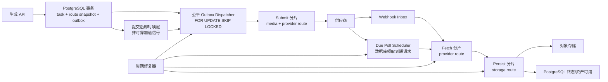
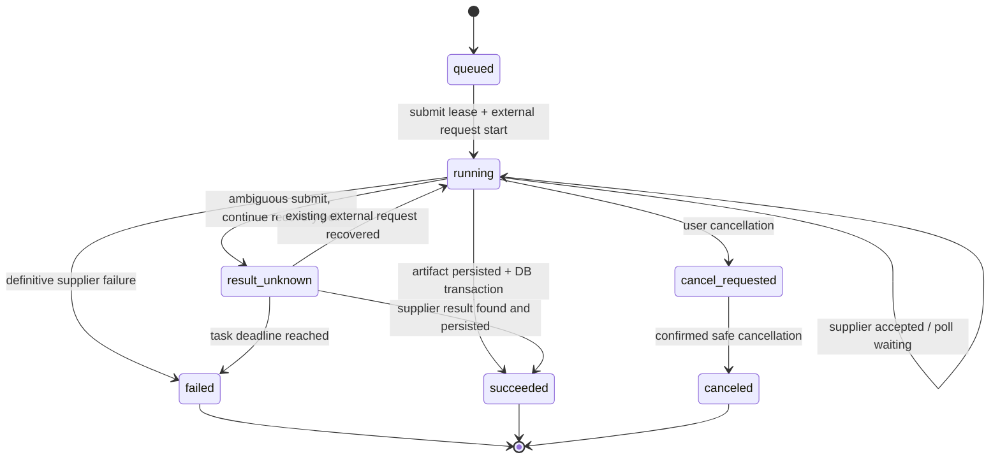

# 生成任务弹性分片队列架构方案

> 状态：设计评审稿
>
> 日期：2026-07-22
>
> 范围：图片、视频、音频生成任务的供应商提交、结果发现、产物下载与持久化
>
> 结论：采用“PostgreSQL 可靠积压 + Outbox + 媒体/供应商/阶段隔离 + 每队列 600 个任务自动分片 + 每分片 5 task/s”的方案

## 实现状态（2026-07-22）

本文同时记录目标架构和分阶段落地范围，不能把未完成的目标能力视为已上线。当前实现已完成以下基础能力：

| 能力 | 状态 | 说明 |
| --- | --- | --- |
| 分片目录、原子容量分配 | 已完成 | PostgreSQL assignment 计数为事实源；单分片上限 600，满载后创建下一分片 |
| 动态队列名与 Worker Runner | 已完成 | 按媒体/阶段/route/shard 发现队列；单进程队列数受配置上限约束 |
| 单队列启动限速 | 已完成 | 默认 5 task/s；配置和 `.env.example` 已同步 |
| Outbox 有界发布 | 已完成 | 发布并发默认 32；队列发布前使用分片路由 |
| 供应商请求幂等 | 已完成 | `workflow_id:task_id` 业务幂等键与原子 external submit 抢占，禁止盲目重复提交 |
| Provider route identity | 已完成 | 任务配置快照、provider route identity、config revision 和 credential version 均已写入任务快照、Outbox 和 provider request；敏感值只保存去密引用/指纹 |
| `skipped` 运行时续转和截止处理 | 已完成 | 截止前与正常 `waiting` 一样持续创建唯一延迟 poll；拿到结果后明确成功/失败，达到轮询截止后由 expire 路径明确 failed，不停在 `skipped`，无需人工修复 |
| `skipped` 高级协调审计 | 部分完成 | `skipReason` 和唯一阶段后继已持久化并可统计；连续无后继的自动强校验/统一 invariant failed 仍待后续阶段 |
| 图片/视频/音频轮询超时账务 | 已完成 | 截止后分别写 `provider_poll_timeout`/`audio_provider_poll_timeout`，释放预留积分；子账户退款使用确定性来源键，重复 expire 不重复退款 |
| Repair poll 动态分片 | 已完成 | 启用 sharding 时 repair 先取得 poll stage assignment，再投递对应动态 shard；仅在分片关闭时兼容固定 poll 队列 |
| 任务中心 GET 只读与增量查询 | 已完成 | 查询不再触发协调/资产同步写入；已支持 `updatedAfter`、keyset `cursor` 和 `nextCursor` |
| Fetch/Persist 独立阶段 | 已完成 | 图片/视频/音频均已接入独立 Fetch job 与 Persist-only job；Fetch 将 attempt 绑定的 storage object handoff 持久化到任务快照，Persist 重试只读取平台对象，不重新查询或下载供应商；旧 finalize payload 继续走兼容路径 |
| 持久公平领取与 Outbox 即时唤醒 | 已完成 | PostgreSQL 持久化主用户/子账户 cursor；普通任务 quantum=1，会员 quantum 可配置；领取使用 `FOR UPDATE SKIP LOCKED`，写入后通过 `LISTEN/NOTIFY` 唤醒，周期扫描保留兜底 |
| Webhook Inbox 与 due poll | 已完成 | Webhook 已完成签名校验、Inbox 去重和状态推进；`next_poll_at` due scheduler 已接入，周期 watchdog 继续保留 |
| 分片回收与压力验收 | 部分完成 | 分片已支持基础 drain/retire；60,000/80,000 突发压测和完整空闲回收验收仍待执行 |

因此，当前版本已覆盖弹性分片、持久公平、即时唤醒、due poll 和 Webhook Inbox 的运行时基础，但仍不是包含压力验收和全部故障注入的最终交付版本。未完成能力在灰度启用前不得写入“已上线”状态。

## 1. 执行摘要

当前系统已经把图片和视频提交、图片/视频/音频轮询以及产物最终化拆成若干 BullMQ 队列，但队列仍主要按媒体类型划分，且 Outbox 单实例按每秒 50 条投递。面对 2,000 个用户同时提交约 60,000 个任务时，仅 Outbox 进入 BullMQ 的理论最短时间就约为 20 分钟，尚未计算 Worker 等待、供应商响应和产物存储时间。

本方案不把 60,000 个任务全部长期堆在一个 BullMQ 队列中，也不把 Worker 并发数误当成队列容量。PostgreSQL 继续保存全部可靠任务。任务先按用户公平选取，再按媒体类型、供应商路由和处理阶段进入物理分片；每个物理队列最多承载 600 个未完成 job，并由 BullMQ 全局 limiter 限制为每秒最多启动 5 个 job。当前可写分片达到 600 后，分片分配器原子创建下一个队列，后续任务进入新分片。

核心拓扑如下：

```text
PostgreSQL tasks/provider_requests/outbox_events（可靠状态和全部积压）
                         |
            公平调度 + 路由快照 + 有界投递
                         v
 generation-{media}-submit-{providerRouteCode}-{physicalShard}
                         |
              供应商已接受 / 同步完成
                         v
 generation-{media}-poll-{providerRouteCode}-{physicalShard}  <- Webhook 优先，轮询兜底
                         |
                  发现可用产物地址
                         v
 generation-{media}-fetch-{providerRouteCode}-{physicalShard}
                         |
                  受控临时产物/流式传输
                         v
 generation-{media}-persist-{storageRouteCode}-{physicalShard}
                         |
                         v
                PostgreSQL + 对象存储
```

“10 分钟”在本文中只定义平台可控的交接目标：突发的 60,000 个任务应在 10 分钟内由平台 Worker 开始执行供应商提交请求。供应商配额、供应商排队、生成速度和可接受吞吐不进入本方案的容量承诺；平台只保证任务及时进入正确队列、及时启动 HTTP 请求、及时安排结果查询和及时进入存储阶段。供应商失败或返回不确定结果时，平台必须沿既有外部请求持续查询，禁止盲目创建第二个供应商任务。

## 2. 目标与非目标

### 2.1 目标

1. 图片、视频、音频的提交、结果发现和产物处理互不阻塞。
2. 同一媒体下不同供应商路由互不阻塞，并能准确使用创建任务时选定的供应商配置。
3. 新任务提交后尽快向供应商发起请求；供应商有结果后尽快发现、下载并持久化。
4. 支持 2,000 个并发用户、约 60,000 个突发任务，平台供应商交接等待不超过 10 分钟。
5. 前一批长时间执行或卡住的任务不能占满整个系统，后续可执行任务仍可推进。
6. 保留现有数据库状态、账务预留/结算、外部请求防重和故障修复能力。
7. 扩缩容过程中不迁移在途任务，不重复请求供应商，不丢失结果。
8. 用户之间公平调度，避免单个大批量用户长期压住其他用户。
9. `skipped` 不得结束活跃任务；必须根据数据库状态继续 submit、poll、fetch 或 persist，直到任务成功、明确失败、取消或超时失败。

### 2.2 非目标

1. 第一阶段不设计供应商并发额度、供应商容量或智能供应商切换；现有供应商限流逻辑保持兼容，但不参与本文的平台吞吐计算。
2. 不承诺供应商在 10 分钟内生成完成。
3. 不通过无限创建队列、无限增加 Worker 或无限占用 Redis 内存解决容量问题。
4. 不改变现有对外生成接口、任务状态语义和计费规则。
5. 不允许任务在供应商可能已经收到请求后自动切换到另一供应商重发。

## 3. 术语与时间边界

| 术语 | 定义 |
| --- | --- |
| 业务任务 | PostgreSQL `tasks` 中的一条生成任务，是用户可见状态的来源 |
| 供应商请求 | `provider_requests` 中的一次外部请求，保存防重键、外部任务 ID 和响应状态 |
| Outbox | 与业务写入同事务提交的 `outbox_events`，保证数据库提交后最终能够投递 |
| 分片容量 | 单个物理队列允许承载的未完成 job 上限，固定为 600 |
| 物理分片 | 实际存在并被 Worker 消费的 BullMQ 队列；当前可写分片达到 600 后创建下一分片 |
| 供应商路由 | 一组确定的供应商执行器、端点、账号/凭据引用和模型配置 |
| 平台交接时间 | 任务事务提交到平台首次实际发起供应商 HTTP 请求的时间 |
| 结果发现时间 | 供应商结果可用到平台收到 Webhook 或成功轮询发现的时间 |
| 产物落库时间 | 发现结果到对象存储写入完成且数据库标记可用的时间 |

## 4. 已核实的现状

### 4.1 队列、并发与速率

| 环节 | 当前实现 | 当前有效值/默认值 | 影响 |
| --- | --- | --- | --- |
| 图片提交 | `generation-submit-image` | 并发 20，默认约 20 job/s | 全部图片供应商共享物理队列 |
| 视频提交 | `generation-submit-video` | 并发 10，默认约 10 job/s | 全部视频供应商共享物理队列 |
| 音频提交 | 创建事件未配置独立 submit 队列时会按非视频回落到图片提交队列 | 无独立 submit 配置 | 音频可能与图片提交互相影响 |
| 图片轮询 | `generation-poll-image` | 并发/默认限速 40/s | 供应商未隔离 |
| 视频轮询 | `generation-poll-video` | 并发/限速 40/s | 供应商未隔离 |
| 音频轮询 | `generation-poll-audio` | 并发/默认限速 40/s | 已按媒体隔离 |
| 产物最终化 | `generation-finalize-artifact` | 并发/出队限速 40/s | 下载、上传、落库共享队列 |
| 对象存储许可 | Redis 许可 | 默认 120 请求/分钟、并发 3 | 最终化 Worker 40 并不等于存储可达 40/s |
| BullMQ 重试 | submit/poll/finalize | 3 次，固定/配置回退 5 秒 | 失败 job 保留 7 天或最多 50,000 条 |
| 任务轮询 | 延迟 job | 每 30 秒一次 | 图片/音频最长 1 小时，视频最长 3 小时 |
| 供应商 HTTP | 统一请求超时策略 | 默认 60 秒 | 一个挂起请求可长时间占据一个 Worker 槽位 |
| 队列健康 | Redis PING + job counts + shard directory | waiting、delayed、active、failed、paused、最老任务年龄 | 首批已支持动态分片聚合；仍需补充容量预测和完整告警 |

并发 40 不是“队列最多 40 个任务”。BullMQ 可以容纳远多于 40 个 job；40 表示单个 Worker 进程同时执行的 job 数。真正的问题是：当 40 个 active job 都在等待慢 I/O 时，该 Worker 不再取下一个 job；如果其他媒体、供应商或阶段共用它们，就会发生队首阻塞和故障扩散。

### 4.2 Outbox 吞吐

项目 `.env` 当前配置为：

```text
GENERATION_OUTBOX_DISPATCH_BATCH_SIZE=50
GENERATION_OUTBOX_DISPATCH_INTERVAL_MS=1000
```

当前 launcher 每轮先串行执行预提交超时处理、租约修复、queued 修复、poll 修复，最后才执行一次 Outbox 投递，然后补足 1 秒循环间隔。即使忽略前置修复耗时，单实例最大也约为：

```text
50 event/轮 * 1 轮/秒 = 50 event/s
60,000 / 50 = 1,200 秒 = 20 分钟
```

改造前 Outbox 领取方式先查询候选，再逐条用条件 `UPDATE` 竞争状态。当前实现已使用集合式 `FOR UPDATE SKIP LOCKED`；generation 作用域进一步锁定持久公平 cursor，避免多个 dispatcher 在同一轮重复决策。周期修复仍保留，用于处理进程退出和通知丢失。

### 4.3 可靠性与状态

PostgreSQL 当前允许的主要状态为：

| 实体 | 状态 |
| --- | --- |
| `tasks` | `queued`、`running`、`succeeded`、`failed`、`cancel_requested`、`canceled`、`result_unknown`、`manual_review_required` |
| `task_attempts` | `created`、`running`、`succeeded`、`failed`、`canceled`、`result_unknown`、`manual_review_required` |
| `provider_requests` | `created`、`submitted`、`accepted`、`running`、`succeeded`、`failed`、`canceled`、`result_unknown`、`manual_review_required` |

现有 `provider_requests` 以 `(provider_name, provider_operation, request_key)` 唯一约束防重。`submitProviderRequest` 会先创建或复用该记录，再通过 `WHERE external_submission_started_at IS NULL` 原子抢占外部提交权；只有抢占成功的 Worker 才调用 `adapter.submit`。其他并发 Worker得到 `already_started`，不会再次调用供应商。明确供应商错误会写 `failed`，没有明确响应的异常会写 `result_unknown`。

因此，当前代码在同一稳定 `request_key` 下能够防止 Worker 重试、Outbox 重投和队列重复 job 导致第二次供应商提交。目标架构必须保留以下边界：

1. 供应商请求 `request_key` 继续使用稳定的 `workflow_id:task_id`；供应商名称和 operation 由现有数据库唯一约束共同限定，不增加 attempt、配置版本或分片信息。
2. 分片号、分片分配版本、Worker ID、BullMQ job ID 和重试次数不得进入供应商请求幂等键。
3. `external_submission_started_at` 一旦存在，任何 submit 重试都只能读取已有请求并转入 poll/recovery，不能再次调用供应商。
4. 用户明确发起“重新生成”时创建新 task ID；系统自动重试不得伪造新的业务任务。

BullMQ 的 `generation-dead-letter` 是异常 job 的运维记录，不是业务事实来源。job 进入死信不能代替数据库状态迁移、积分处理或人工审核。

### 4.4 `skipped` 行为：改造前基线与当前实现

改造前基线是：`skipped` 作为普通成功返回，BullMQ 不会因此自动重试；handler 直接结束且不创建后继 job，可能导致任务停在 `queued`/`running`。该段只用于解释本次修复的背景，不代表当前首批代码行为。

当前实现已接入数据库事实协调器：submit/poll 的 `skipped` 会按 task/provider request 状态选择 submit、poll、finalize 或 stop；连续 `skipped` 不会直接结束任务，也不会重新提交已经开始的外部请求。Poll Worker 将 `skipped` 与正常 `waiting` 使用同一续转路径：截止前按现有 interval 和唯一 `pollAttempt` job ID 继续延迟轮询，供应商返回结果后进入明确成功或失败；达到配置的轮询截止后调用媒体 expire processor，写入明确 failed 并停止继续 poll。该流程由 Worker 自动完成，不要求人工把任务从 `skipped` 状态推进。

视频和音频达到截止后的账务也已接通：视频写入 `provider_poll_timeout`，音频写入 `audio_provider_poll_timeout`，并沿用既有失败账务路径释放预留积分。子账户退款以 task 为确定性来源执行，重复运行 expire 不会重复退款。图片同样在截止后进入明确失败，但本段“音频/视频退款已完成”的结论不扩展为对所有媒体账务路径的额外承诺。

周期 repair 已覆盖同一行为。`repairRunningSeedancePollJobs` 在启用 sharding 且提供 shard store 时，先按媒体、poll stage 和 provider route 获取 assignment，再把 repair job 投递到返回的动态队列；只有关闭分片时才走原固定 poll 队列。因此 Redis job 丢失或旧 poll 无后继时，修复任务不会绕过当前动态分片目录。

仍未完成的是 `skipReason` 持久分类、统一 successor repair 的完整审计、无后继指标和不可解释状态的强校验。这些是可观测性与一致性增强项，不影响当前 `skipped` 在截止前正常 poll、截止后明确 failed 的自动运行链路。

目标方案禁止把 `skipped` 当作阶段终点。Worker 返回 `skipped` 后，阶段协调器必须在同一事务中读取数据库并按下表继续：

| 数据库事实 | 必须执行的下一步 |
| --- | --- |
| task 已成功、失败或取消 | 幂等结束，不再创建后继 job |
| submit 尚未开始，且无有效租约 | 使用原 task 和原供应商幂等键重新进入 submit |
| submit 由另一有效租约持有 | 记录 lease owner；租约到期检查，不创建第二个 submit |
| `external_submission_started_at` 已存在 | 禁止再次 submit；创建或确认 poll/recovery 后继记录 |
| provider request 为 submitted/accepted/running/result_unknown | 按正常任务创建下一次 poll，不因 `skipped` 停止 |
| provider request 已 succeeded | 进入 fetch/persist |
| provider request 已明确 failed | 将 task 迁移为 failed，并执行既有账务处理 |
| poll 暂无结果 | 原子写入唯一的下一次 `next_poll_at`，继续轮询 |
| 达到任务截止时间仍无结果 | 迁移为 `failed/provider_result_timeout`，停止轮询，但仍禁止重新 submit |

`skipped` 后继调度必须使用唯一阶段键，例如 `(task_id, stage, stage_generation)`，而不是每次无条件向 BullMQ `add`。同一 poll 序号只能有一个阶段记录；有效后继记录存在时只确认它，不重复创建。连续出现无法解释的 `skipped` 时采用 5 秒、30 秒、120 秒退避，三次后进入协调器强校验；强校验仍无法生成合法后继时以 `platform_dispatch_invariant_failed` 明确失败，禁止形成无限热循环。

### 4.5 当前任务中心评估

当前用户任务中心以 PostgreSQL `ai_generation_task_snapshots` 为主要读取来源，支持用户/子用户隔离、分页、状态/媒体筛选、搜索、结果资产和失败信息。它不依赖具体 BullMQ 队列名，因此改成动态分片后，用户任务列表和详情契约可以保持不变。就“能否看到 queued/running/completed/failed 和结果”而言，当前功能满足。

改造前存在以下高并发瓶颈，当前已按目标完成处理：

1. `GET /api/task-center/tasks` 已移除超时协调和 snapshot UPDATE，保持纯读取。
2. 列表返回后的项目资产同步写入已移到 Worker/repair，不再由 GET 触发。
3. 前端使用 `updatedAfter` + cursor 增量分页、重叠水位和请求取消；后端记录最近 60 秒 QPS、P95/P99 和增量轮询次数。
4. 用户任务中心继续只展示业务状态；管理端 job 查询、重放、死信和健康视图通过动态 shard directory 发现物理队列。

现有索引覆盖 `(user_id, updated_at, task_id)` 和常用状态查询；分片号、stage attempt、下一次调度时间只放在管理端诊断视图，不进入用户接口契约。

## 5. 服务等级目标（SLO）

所有 SLO 都从 PostgreSQL 时间戳计算，不能只依赖 BullMQ job 时间戳。

| 指标 | 稳态目标 | 60,000 突发目标 | 边界 |
| --- | --- | --- | --- |
| 事务提交 -> Outbox 被领取 | P95 <= 1 秒，P99 <= 5 秒 | P99 <= 30 秒 | 仅平台内部 |
| job 进入物理队列 -> Worker 开始执行 | P95 <= 114 秒，最大 <= 120 秒 | 最大 <= 120 秒 | 600 / 5 = 120 秒；需本地 Worker 并发足够 |
| 事务提交 -> 供应商请求开始 | P95 <= 2 分钟 | 最大 <= 10 分钟 | 只计算平台排队和请求开始，不计算供应商响应 |
| poll 到期 -> 查询请求开始 | P95 <= 114 秒，最大 <= 120 秒 | 最大 <= 120 秒 | 不计算供应商响应和生成时间 |
| 结果已写入平台 -> fetch/persist job 开始 | P95 <= 114 秒，最大 <= 120 秒 | 最大 <= 120 秒 | 不计算下载、上传耗时 |
| 数据库状态变化 -> 任务中心前台可见 | P95 <= 15 秒 | P99 <= 60 秒 | 当前轮询模式；后续可用增量推送优化 |
| 活跃任务无 submit/poll/fetch/persist 后继记录 | 0 | 0 | 不适用 |

本文不承诺供应商响应、生成、下载源站或第三方存储的完成耗时。每队列 5 task/s 是“Worker 开始执行 job”的平台速率，不等于每秒完成 5 个长耗时任务。

## 6. 目标架构



### 6.1 数据职责

| 组件 | 职责 | 不承担的职责 |
| --- | --- | --- |
| PostgreSQL | 业务状态、可靠积压、供应商路由快照、due time、幂等结果、审计 | 高频 Worker 通知 |
| Outbox | 在业务事务和队列投递间提供最终一致性 | 长期占用执行并发 |
| BullMQ | 延迟、重试、短期待执行工作集、Worker 协作 | 唯一任务状态、无限可靠积压 |
| Shard Controller | 维护每队列 600 个任务容量、创建新分片、分配 Worker、排空空闲分片 | 修改供应商业务状态 |
| Worker | 执行一个短阶段并原子写入结果/下一阶段 | 在一个 job 内等待供应商生成完成 |

### 6.2 有界执行缓冲

每个 `{media, stage, providerRouteKey}` 作用域维护一组物理队列。单队列固定容量为 600 个未完成 stage job，固定启动速率为 5 job/s。容量以 PostgreSQL stage assignment 计数为准，定义为已经分配到该分片但尚未完成、失败、取消或迁移到下一阶段的记录数；不能在路由热路径中临时读取 BullMQ `getJobCounts()` 再决定，否则多个 dispatcher 会同时看到空位并超配。

分配器先原子占用现有可写分片的一个名额；没有分片或当前分片已达到 600 时，创建递增的 `shardNo` 并把后续任务分配到新队列。PostgreSQL 仍是可靠事实源，BullMQ job 丢失时按 assignment 重建。60,000 个同阶段任务最多形成约 100 个满载分片，不形成一个 60,000 深度的单队列。

## 7. 供应商路由身份

任务创建时必须冻结以下路由字段，后续 submit、poll、fetch 都从任务快照读取，不能重新按“当前启用配置”计算：

```ts
interface GenerationProviderRouteSnapshot {
  mediaType: "image" | "video" | "audio";
  modelConfigId: string;
  providerConfigRevisionId: string;
  modelCode: string;
  providerName: string;
  providerExecutor: string;
  providerRouteKey: string;
  providerRouteCode: string;
  credentialVersionRef: string;
}
```

`providerRouteKey` 是不含密钥的稳定、低基数字符串或其短哈希，建议由以下信息生成：

```text
providerName + providerExecutor + endpointIdentity + credentialRef + providerAccount + region
```

要求：

1. 不把 API Key、Token、完整凭据写入队列名、日志或 job data。
2. 同一供应商但不同账号、地域或独立配额池必须有不同 `providerRouteKey`。
3. 只更改显示名不应改变 route key；更换凭据/端点/账号应生成新的不可变 provider config revision。
4. poll 和 fetch 必须沿用 submit 的 route key，避免查询到错误供应商或错误账号。
5. persist 使用 `storageRouteKey`，例如 bucket + region + storage account 的安全标识，不与供应商路由混用。
6. `providerConfigRevisionId` 和 `credentialVersionRef` 必须保留到所有关联任务终态，不能因后台配置更新而失效。
7. 队列名只使用 `providerRouteCode`/`storageRouteCode`。它们是 shard directory 分配的低基数、小写字母数字短码，不包含密钥、账号、用户信息或可逆凭据引用。

## 8. 队列拓扑与命名

目标队列名：

```text
generation-{media}-submit-{providerRouteCode}-{shardNo}
generation-{media}-poll-{providerRouteCode}-{shardNo}
generation-{media}-fetch-{providerRouteCode}-{shardNo}
generation-{media}-persist-{storageRouteCode}-{shardNo}
generation-dead-{stage}-{routeCode}
```

示例：

```text
generation-image-submit-r7f3a2-003
generation-video-poll-r9b814-001
generation-audio-fetch-r2d091-000
generation-video-persist-s4a721-002
```

隔离维度的顺序是：

1. `media`：图片、视频、音频资源特征和超时不同。
2. `stage`：submit、poll、fetch、persist 的 I/O 和故障模式不同。
3. `providerRouteKey`：一个供应商路由变慢不拖住其他供应商。
4. `physicalShard`：同一路由内部横向扩容。

BullMQ 5.78.0 禁止 Queue name 包含冒号，因此队列名必须使用连字符并通过 `^[a-z0-9-]+$` 校验。persist 不按供应商分片，而按目标存储路由分片；fetch 按供应商路由分片，以保证任务使用正确的下载适配器和凭据。本方案不按供应商容量计算分片数量。

## 9. 600 容量物理分片与 Worker 编排

### 9.1 分片记录

Shard Controller 为每个 `{media, stage, routeKey}` 保存：

```ts
interface GenerationQueueShard {
  mediaType: "image" | "video" | "audio";
  stage: "submit" | "poll" | "fetch" | "persist";
  routeKey: string;
  routeCode: string;
  shardNo: number;
  capacity: 600;
  rateLimitMax: 5;
  rateLimitDurationMs: 1000;
  admittedCount: number;
  state: "accepting" | "full" | "draining" | "retired";
}
```

`shardNo` 只决定进入哪个物理队列，不属于业务任务身份、供应商身份或供应商幂等键。

### 9.2 原子分配算法

1. 在事务中按 `{media, stage, routeKey, state=accepting}` 查询 `admitted_count < 600` 的最新分片，并使用 `FOR UPDATE SKIP LOCKED`。
2. 找到分片时先将 `admitted_count + 1`，再写 stage assignment 和 Outbox；三者在同一事务提交。
3. 增加后达到 600 时把分片标为 `full`，下一任务不得继续写入。
4. 没有可写分片时，以唯一约束 `(media, stage, route_key, shard_no)` 创建 `max(shard_no)+1`；并发创建冲突时重新领取新分片。
5. BullMQ 发布失败不释放 assignment 名额，Outbox 恢复后仍投递到原分片，避免任务在不同队列重复出现。
6. stage 进入下一阶段或终态时原子减少原分片 `admitted_count`；周期审计用数据库 assignment 与 BullMQ 状态修正计数漂移。

### 9.3 每分片 5 task/s

每个物理队列使用 BullMQ 全局 limiter：

```ts
limiter: { max: 5, duration: 1000 }
```

该 limiter 限制同一队列所有 Worker 合计每秒最多启动 5 个 job。满载 600 个任务的纯排队启动时间上限为：

```text
600 / 5 = 120 seconds
```

Worker concurrency 仍必须足够，否则 5/s 无法实现。只考虑平台资源时，最低并发按实测 stage 执行时长设置：

```text
required_concurrency = ceil(5 * local_stage_duration_p95_seconds * 1.2)
effective_start_rate = min(5, concurrency / local_stage_duration_p95_seconds)
```

这里的 stage duration 是 Worker 从开始到释放并发槽的本地占用时间；不以供应商配额决定分片数，但 HTTP 连接等待仍会占用本地并发和内存，必须计入 Worker 资源预算。

### 9.4 Worker 编排

每个动态队列需要对应的 BullMQ Worker。不得在单进程无限创建 Worker：Shard Controller 将 active shard 分配给 Worker Runner，每个进程默认最多承载 8-16 个队列，并按 Redis 阻塞连接、数据库连接、RSS 和 event-loop lag 限制。Publisher 的 Queue cache 必须增加 idle eviction；Worker Runner 必须监听 shard directory 变更并接管新分片。

### 9.5 排空与回收

`full` 分片在 `admitted_count` 降到低水位后可以重新标记 `accepting`，但同一突发分配优先继续写当前尾分片，避免在多个旧分片间抖动。连续 15 分钟 `admitted_count=0` 的非尾分片进入 `draining`；确认 BullMQ `waiting + delayed + active = 0` 后标记 `retired`。禁止搬运在途 job，分片目录和指标至少保留 7 天。

## 10. 公平调度

直接按创建时间取最老的 60,000 条，会让一个先到的大用户压住后续用户。公平必须发生在 BullMQ 分片之前。

建议使用分层 Deficit Round Robin（DRR）：

1. 第一层按当前主用户业务归属轮转，第二层在该主用户的当前子用户之间轮转；历史迁移归属字段不参与调度。
2. 每个用户每轮获得基础 quantum；现有会员优先级只增加 quantum 或队列 priority，不能无限抢占。
3. 第二层按媒体分配独立预算，视频 10、图片 20/30 的批量规模只影响单用户突发量，不等同于全局并发。
4. 同一用户内部按 `scheduled_at, created_at, task_id` 保序。
5. 调度后的任务再按 route key 进入“当前分片未满则占位，已满 600 则创建下一分片”的分配流程。

数据库领取可使用集合式 CTE：

```sql
WITH candidates AS (
  SELECT id
  FROM generation_stage_dispatches
  WHERE stage = $1
    AND status IN ('pending', 'retryable')
    AND available_at <= now()
  ORDER BY fair_round, user_sequence, available_at, id
  FOR UPDATE SKIP LOCKED
  LIMIT $2
)
UPDATE generation_stage_dispatches dispatch
SET status = 'dispatching', lease_owner = $3, lease_until = $4
FROM candidates
WHERE dispatch.id = candidates.id
RETURNING dispatch.*;
```

多个 dispatcher 因 `SKIP LOCKED` 领取不同记录，可水平扩展；租约超时后由修复器重新开放。

公平性验收同时观察：用户首个任务交接延迟、每用户 P95 等待、最大/中位等待比值，不能只看系统总吞吐。

## 11. Outbox 即时唤醒与可靠修复

创建任务的事务仍同时写入 task 和 Outbox。事务提交成功后增加一个非可靠即时信号，可选 PostgreSQL `NOTIFY generation_outbox_ready` 或 Redis Stream/轻量通知；dispatcher 收到后立即执行投递，不等待下一次周期扫描。同一批任务只发一次 route-level 唤醒信号，dispatcher 对信号做 50-100 ms 合并，禁止 60,000 个任务产生 60,000 个独立唤醒。

即时信号只能缩短延迟，不能成为可靠性边界：

1. 信号丢失时，100-500 ms 的周期扫描仍会发现 Outbox。
2. Outbox 领取改为集合式 `FOR UPDATE SKIP LOCKED`。
3. dispatcher 可多实例运行，batch 按 stage assignment 和单分片 600 容量分配，不再固定每秒只取 50 条。
4. 修复任务从热投递循环拆出独立调度频率，避免四个修复步骤阻塞正常 Outbox。
5. publish 成功后才把事件标记 processed；失败采用带抖动的指数退避。
6. Outbox 需要 `stage`、`provider_route_key`、`provider_config_revision_id`、`shard_no` 等可索引字段，避免每次从 JSON 大范围解析。

建议 dispatcher 初始配置为 4 个实例、每实例每次最多领取 500 条，每个实例内部发布并发先限制为 32，避免一次 `Promise.all(500)` 同时占用数据库和 Redis。该数字只描述平台投递能力，不是供应商限额。

## 12. 提交阶段

submit Worker 只执行以下短流程：

1. 读取 task、路由快照和已有 `provider_requests`。
2. 原子获取 task/submit stage 租约。
3. 根据不可变 provider config revision 构建正确的供应商请求；本文不以供应商限额计算队列分片。
4. 使用稳定业务幂等键创建或复用 `provider_requests`。
5. 写入 `external_submission_started_at` 后调用供应商。
6. 持久化明确接受、同步成功、明确拒绝或结果未知。
7. 生成 poll/fetch 后继阶段记录，提交事务后即时唤醒对应调度器。
8. 释放租约并结束 job，不在 submit Worker 内等待生成完成。

稳定幂等键：

```text
{workflowId}:{taskId}
```

该业务幂等键沿用当前媒体 Worker 的生成方式并存入 PostgreSQL，可按适配器能力传给供应商。BullMQ job ID 另行使用不含冒号的安全编码。`providerConfigRevisionId`、`shardNo`、attempt 和 retry sequence 都不得进入上述键；即使同一 task 的 job 因修复进入另一个 Worker，它仍只复用原 `provider_requests`。若供应商不支持客户端幂等键，仍以本地唯一约束和 `external_submission_started_at` 防止盲重试。

## 13. 结果发现：Webhook 优先、统一轮询兜底

### 13.1 Webhook Inbox

支持回调的供应商优先使用 Webhook：

1. 按供应商要求校验签名、时间窗和重放 nonce。
2. 原始事件写入 `provider_webhook_inbox`，以供应商事件 ID 或内容哈希唯一去重。
3. HTTP 尽快返回 2xx；状态转换由 Inbox Worker 异步执行。
4. 用 `providerRouteKey + externalRequestId` 精确找到请求。
5. 供应商成功时原子创建 fetch stage；明确失败时迁移数据库状态和账务。
6. 乱序回调不能把终态回退到 running。

### 13.2 Due Poll Scheduler

不支持 Webhook 或 Webhook 超时的供应商使用数据库 due polling。PostgreSQL `next_poll_at` 是唯一调度源；目标态不再由上一个 Worker直接创建 BullMQ delayed poll job：

```sql
SELECT ...
FROM provider_requests
WHERE status IN ('submitted', 'accepted', 'running', 'result_unknown')
  AND next_poll_at <= now()
ORDER BY next_poll_at, id
FOR UPDATE SKIP LOCKED
LIMIT $1;
```

领取后按 600 容量规则进入相应 `{media, poll, providerRouteKey}` 队列。Poll Worker 不论返回 `waiting` 还是 `skipped`，只要数据库仍显示 provider request 为非终态，就必须原子写入下一次 `next_poll_at`；同一 `(provider_request_id, poll_sequence)` 只有一条 stage assignment。Webhook 正常的任务只保留低频看门狗轮询。

结果未知任务继续查询既有 `external_request_id`。没有外部 ID但 `external_submission_started_at` 已存在的任务进入原供应商请求恢复逻辑，不自动创建新外部请求。达到任务截止时间仍无法取得明确结果时，将 task 明确标记为 `failed/provider_result_timeout` 并停止轮询；后续迟到结果只能进入审计，不得反向触发第二次提交或重复结算。

## 14. Fetch 与 Persist 拆分

当前 finalize 同时承担供应商下载、对象存储上传和数据库落库。拆成两个阶段：

### 14.1 Fetch

按 `providerRouteKey` 隔离，负责校验 URL、下载状态、内容类型、长度、校验和以及临时产物引用。优先流式从供应商传到受控临时存储，禁止把大视频完整载入 Node.js 内存。

```text
fetch:{taskId}:{artifactIndex}:{sourceVersion}
```

### 14.2 Persist

按 `storageRouteKey` 隔离，负责对象存储 multipart/stream 上传、对象存在性校验、资产记录 UPSERT，以及 task/workflow/计费终态事务。

```text
persist:{taskId}:{artifactIndex}:{contentChecksum}:{storageRouteKey}
```

对象 key 必须确定性生成。重试前先 HEAD/读取资产记录；已经存在且 checksum 相同则复用，避免重复上传。数据库资产 UPSERT 和任务成功状态必须具备唯一约束。

Fetch 成功、Persist 失败时只重试 Persist；不得重新查询供应商或重新下载，除非临时产物已过期。这样可避免对象存储变慢反向占满供应商下载槽位。

## 15. 状态机与阶段不变量



每个阶段都必须满足：

1. 数据库阶段记录是唯一事实来源，BullMQ job 可丢失并由修复器重建。
2. 同一 `{taskId, stage, stageVersion}` 只有一个有效阶段记录。
3. Worker 完成前必须原子写入业务结果以及后继阶段或终态。
4. Worker 崩溃后租约到期，另一 Worker 可恢复；外部提交恢复必须先检查 `provider_requests`。
5. `succeeded`、`failed`、`canceled` 终态不因迟到 job 或 Webhook 回退。
6. BullMQ 重试耗尽后写死信并触发数据库协调，不允许任务留在无后继的 running。
7. `skipped` 必须带 `skipReason`，且对活跃任务必须同时存在有效租约或唯一后继 stage；否则当前事务必须创建下一步，不能把 BullMQ job 正常结束后留空。

## 16. 60,000 任务容量模型

固定规则为每物理队列最多 600 个未完成任务、每秒最多启动 5 个任务。一个满载分片的理论启动排空时间是 120 秒。

```text
shards = ceil(task_count / 600)
per_shard_start_rate = 5 task/s
full_shard_start_window = 600 / 5 = 120 seconds
aggregate_start_rate = active_shards * 5 task/s
```

对“每用户 10 个视频 + 20 张图片”的 2,000 用户场景，先按每种媒体只有一个 provider route 计算基线：

```text
video = 2,000 * 10 = 20,000
image = 2,000 * 20 = 40,000
total = 60,000
```

| 媒体 | 任务数 | submit 分片数 | 每分片速率 | 聚合启动速率 | 理论最后一批开始时间 |
| --- | ---: | ---: | ---: | ---: | ---: |
| 图片 | 40,000 | `ceil(40000/600)=67` | 5/s | 335/s | <= 120 秒 |
| 视频 | 20,000 | `ceil(20000/600)=34` | 5/s | 170/s | <= 120 秒 |
| 合计 | 60,000 | 101 | - | 505/s | <= 120 秒 |

实际任务必须先按 provider route 分组，不能为了凑满 600 把不同供应商路由混进同一队列。实际分片数为：

```text
media_shards = sum(ceil(tasks_of_provider_route / 600))
```

因此多供应商路由会因每组向上取整比表中多出少量分片，但每个任务仍使用创建时冻结的正确供应商。120 秒是队列 limiter 的理论值，前提是所有 submit 分片都已有 Worker、Outbox 已完成分片分配，且本地 concurrency 足以持续每秒启动 5 个 job。平台验收目标仍保留最大 10 分钟，为 Worker 启动、进程编排、数据库和 Redis 抖动保留余量。供应商是否接受以及何时响应不计入该时间。

以前端当前图片上限 30 作为极端输入时，单 provider route 基线为图片 100 个、视频 34 个，共 134 个 submit 分片；多 route 时按上述求和公式增加。压测必须另设该档位，不能把 60,000 场景结果直接外推。

## 17. 自动扩缩容规则

分片创建由任务计数同步触发，不等待 10 秒 autoscaling 窗口。每 10 秒按 `{media, stage, routeKey}` 计算运行健康：

- PostgreSQL executable backlog；
- BullMQ waiting/delayed/active；
- 最近 1/5/15 分钟 effective throughput；
- stage duration P50/P95/P99；
- oldest executable age；
- Worker event loop lag、CPU、RSS；
- Redis 内存、操作延迟；
- 数据库连接池和锁等待；
- 本地 HTTP 连接占用、请求超时和 stage error 比率。

建议规则：

| 动作 | 条件 |
| --- | --- |
| 创建物理分片 | 当前 accepting 分片原子占位后达到 600；下一任务创建 `shardNo + 1` |
| 启动 Worker | shard directory 出现没有 owner 的 accepting/full 分片 |
| 增加单分片 concurrency | 实测启动率低于 5/s，且本地 CPU、RSS、连接和数据库预算正常 |
| 暂停继续向 BullMQ 发布 | Redis、数据库连接池或 Worker Runner 达平台保护阈值；任务留在 PostgreSQL assignment/outbox |
| 排空分片 | `admitted_count=0` 连续 15 分钟，且不是该作用域唯一分片 |
| 隔离异常分片 | 同一分片 stage error 激增；其他分片继续执行 |

分片容量和启动速率固定，不由预测等待时间改变。`predicted_wait` 只用于验证 120 秒理论窗口和触发资源告警；真正的 10 分钟突发目标由动态 Worker Runner、最大活跃分片数、数据库/Redis/网络资源保证。

## 18. 配置参考（已落地及后续）

以下配置中，分片开关、容量、限速、Worker 队列数、发布并发、Outbox 公平 quantum、`LISTEN/NOTIFY` 唤醒、Webhook Inbox、due poll 和任务中心增量 API 已在代码及 `.env.example` 中落地；`.env` 也已按同一默认值配置。前端 nextCursor 轮询状态机和 60,000/80,000 压测仍属于后续阶段。

| 配置 | 建议初值 | 说明 |
| --- | ---: | --- |
| `GENERATION_QUEUE_SHARD_CAPACITY` | 600 | 单物理队列未完成 assignment 上限 |
| `GENERATION_QUEUE_SHARD_RATE_LIMIT_MAX` | 5 | 单物理队列每个窗口最多启动 job 数 |
| `GENERATION_QUEUE_SHARD_RATE_LIMIT_DURATION_MS` | 1000 | 固定 1 秒窗口 |
| `GENERATION_QUEUE_SHARD_REOPEN_THRESHOLD` | 300 | full 分片降到该值后允许重新接受后续稳态任务 |
| `GENERATION_MAX_ACTIVE_SHARDS_PER_STAGE` | 256 | 平台资源保护上限；达到后任务可靠留在 PostgreSQL 并告警 |
| `GENERATION_WORKER_QUEUES_PER_PROCESS` | 16 | 单 Worker Runner 最多持有的动态队列数 |
| `GENERATION_SHARD_SCALE_EVALUATION_MS` | 10000 | 控制器计算周期 |
| `GENERATION_SHARD_SCALE_IN_IDLE_MS` | 900000 | 15 分钟后允许缩容 |
| `GENERATION_DISPATCHER_INSTANCE_CONCURRENCY` | 4 | 单进程并行领取/发布组数 |
| `GENERATION_DISPATCH_PUBLISH_CONCURRENCY` | 32 | 单实例同时执行的 BullMQ publish 上限 |
| `GENERATION_OUTBOX_DISPATCH_BATCH_SIZE` | 50 | 单轮最大领取；仍受 600 容量控制（代码实际配置名） |
| `GENERATION_DISPATCH_SCAN_INTERVAL_MS` | 250 | 即时信号丢失时的扫描兜底 |
| `GENERATION_SKIPPED_REPAIR_DELAYS_MS` | `5000,30000,120000` | 无合法后继时的有限协调退避 |
| `GENERATION_SKIPPED_REPAIR_MAX_ATTEMPTS` | 3 | 超过后强校验并明确成功/失败，不无限热循环 |
| `GENERATION_WEBHOOK_WATCHDOG_INTERVAL_MS` | 300000 | Webhook 任务低频兜底 |
| `GENERATION_STAGE_LEASE_MS` | 按阶段设置 | 必须大于该阶段 P99、低于修复时限 |
| `TASK_CENTER_INCREMENTAL_POLL_ENABLED` | true | 任务中心 API 已支持 cursor/updatedAfter；前端轮询状态机仍可继续改为保存 nextCursor |

供应商/模型/user/storage 的现有限流配置保持兼容，但不用于计算 600 容量和 5 task/s 分片数量。5 task/s 是队列启动上限；若本地 Worker concurrency、连接或其他保护器更低，实际启动率会低于 5/s并产生平台容量告警。

## 19. 可观测性与告警

### 19.1 必须指标

所有指标标签限制在低基数集合：`media`、`stage`、受控的 `route_code`、`shard_no`、`result`。禁止使用 task ID、user ID、credential ref、URL 或任意高基数 `provider_route_key` 作为指标标签。完整 route key 只进入结构化日志和管理端查询。

```text
generation_stage_backlog{media,stage,route}
generation_stage_executable_backlog{media,stage,route}
generation_stage_predicted_wait_seconds{media,stage,route}
generation_stage_oldest_age_seconds{media,stage,route}
generation_stage_duration_seconds{media,stage,route,result}
generation_stage_throughput_total{media,stage,route,result}
generation_stage_lease_expired_total{media,stage,route}
generation_stage_orphan_total{media,stage,route,reason}
generation_stage_skipped_total{media,stage,route,reason}
generation_stage_successor_missing_total{media,stage,route}
generation_outbox_dispatch_lag_seconds{event_type}
generation_outbox_claim_conflict_total
generation_provider_http_seconds{media,route,operation,result}
generation_provider_ambiguous_total{media,route}
generation_webhook_lag_seconds{route}
generation_artifact_bytes{media,route}
generation_shard_active_count{media,stage,route}
generation_shard_admitted_count{media,stage,route,shard}
generation_shard_capacity{media,stage,route,shard}
generation_shard_created_total{media,stage,route}
generation_shard_worker_assigned{media,stage,route,shard}
task_center_query_seconds{mode}
task_center_rows_returned_total{mode}
```

### 19.2 告警

| 级别 | 条件 | 动作 |
| --- | --- | --- |
| P0 | 活跃任务无后继阶段、重复供应商请求或重复扣费 | 立即停止相关路由新提交，保留查询/恢复 |
| P1 | 任一分片 admitted_count > 600 | 立即停止该分配器并修复计数/唯一约束 |
| P1 | 满载分片最老 job 等待 > 120 秒 | 增加 Worker concurrency/Runner；检查平台资源 |
| P1 | submit 平台等待 > 10 分钟 | 增加 Runner；若已达 256 分片保护上限则告警平台容量不足 |
| P1 | Webhook/Poll 发现成功但 Persist 无进展 > 5 分钟 | 隔离 storage route 并扩 persist |
| P1 | 重复 supplier submit guard 命中异常增长 | 停止新 submit，审计 request key 与 shard assignment |
| P2 | Outbox lag > 30 秒或 stale processing 增长 | 扩 dispatcher/检查数据库与 Redis |
| P2 | dead letter 增长、skipped 无后继或协调次数达到 3 | 强校验并明确迁移成功/失败，禁止继续热循环 |

健康接口需要从固定 7 个队列扩展为动态分片目录聚合视图，同时保留按物理分片下钻。只显示总 waiting 会掩盖单个供应商热点，因此必须展示最大预计等待路由和最老可执行任务。

## 20. 故障场景

| 场景 | 预期行为 |
| --- | --- |
| Redis 不可用 | API 事务和 Outbox 可提交；BullMQ 不可投递，恢复后补发 |
| Dispatcher 崩溃 | 租约超时后其他实例 `SKIP LOCKED` 重新领取 |
| Submit Worker 调用前崩溃 | 复用同一 stage/provider request 后安全重试 |
| 调用供应商后、保存响应前崩溃 | 不盲重发；按 provider request 恢复查询，必要时 result unknown |
| 单一供应商超时 | 只占用该 route key 的 submit/poll 分片，其他路由继续 |
| 前 40 个请求卡住 | 只影响其媒体/阶段/供应商/物理分片；其他分片继续取任务 |
| Webhook 重复或乱序 | Inbox 唯一去重，终态单向迁移 |
| Poll Worker 重复执行 | 读取同一 provider request，状态转换幂等 |
| 供应商产物 URL 过期 | fetch 按供应商能力刷新已有请求的 URL，不重新生成 |
| 对象存储变慢 | persist 独立扩容/退避，不占 submit、poll、fetch 槽位 |
| BullMQ job 丢失 | 数据库阶段记录和修复器重建 job |
| 新分片创建后 Worker 崩溃 | shard assignment 不变，其他 Runner 领取该 shard owner lease 后继续 |
| `skipped` 但任务仍活跃 | 按数据库事实创建/确认正常下一阶段；已开始外部提交时只 poll，绝不重发 submit |
| 连续 3 次 `skipped` 仍无合法后继 | 强校验数据库；能 poll 则继续 poll，否则明确成功或失败，不继续热循环 |
| 死信增长 | 数据库协调器判定 retry、poll、fetch、persist 或 failed；不静默结束 |

## 21. 分阶段实施

### 阶段 0：基线和保护

1. [已完成] 基于 PostgreSQL 任务创建、供应商请求、durable handoff `fetchedAt` 和资产版本时间戳，提供 commit-to-submit、result-to-fetch、fetch-to-persist 的 24 小时 P95/P99 指标。
2. [已完成] Worker 将 `skipped` 与正常 `waiting` 一样在截止前持续 poll，截止后自动 expire 为 failed；原因持久分类、唯一阶段后继和全量活跃任务无后继审计均已落地。
3. [已完成] 已有重复供应商请求保护和回归测试；图片、视频、音频均纳入终态未结算积分审计和幂等积分对账，截止失败自动释放预留积分且重复 expire 不重复退款。
4. [已完成] 增加回归测试，证明相同 request key、不同 BullMQ job/shard/Worker 只会调用一次 `adapter.submit`。
5. [已完成] 任务中心记录最近 60 秒 QPS、P95/P99、返回行数、增量轮询次数和累计请求数；GET 路径协调写次数固定为 0，并通过平台健康指标暴露。

回滚：仅指标和校验，可关闭告警，不改变现有消费。

### 阶段 1：Outbox 横向扩展和即时唤醒

1. [已完成] Outbox 领取使用集合式 `FOR UPDATE SKIP LOCKED`，并通过 PostgreSQL 持久 cursor 实现主用户 -> 子账户跨批公平轮转；会员 quantum 可配置。
2. [已完成] 热 Outbox 投递与周期维护已拆成独立进程：`worker:generation-outbox` 只负责 `LISTEN/NOTIFY` 唤醒、Outbox 领取和 BullMQ 发布；`worker:generation-repair` 独立负责 due-poll、提交租约修复、漏投修复、poll repair 和空闲分片回收，可分别扩容和重启。开发整栈会同时启动两者。
3. [已完成] Outbox ready trigger 使用 PostgreSQL `LISTEN/NOTIFY` 提交后唤醒 dispatcher；通知合并，周期扫描作为兜底。
4. [部分完成] 单 dispatcher publish 并发已限制为 32；独立连接并发领取和 cursor 锁已验证，多 dispatcher 生产灰度与压测仍待完成。
5. [已完成] 任务中心 GET 的协调/资产同步写入已移出，并支持只读增量 cursor 查询。
6. [已完成] Poll repair 在分片启用时通过 shard assignment 投递动态 poll 队列；固定队列只保留为关闭分片时的兼容路径。

回滚：停用额外实例和即时唤醒，恢复原周期 dispatcher；Outbox 数据兼容。

### 阶段 2：媒体、供应商、阶段静态隔离

1. [已完成] 增加独立 audio submit。
2. [已完成] 基于任务配置快照冻结去密 provider route identity、`providerConfigRevisionId` 和 `credentialVersionRef`，并沿 Outbox/provider request 传递。
3. [首批已完成] 按媒体、阶段和 provider route 创建 submit/poll/fetch/persist 物理分片。
4. [部分完成] 新任务只向冻结 route 的新队列投递；按供应商逐个切流和完整双写审计仍待补齐。

回滚：新任务切回旧队列；已在新队列的任务排空，禁止搬迁。

### 阶段 3：Fetch/Persist 拆分

1. [已完成] 引入按 task/attempt 唯一绑定的 durable artifact handoff；大文件流式进入平台对象存储，不跨队列传递内存对象。
2. [已完成] 视频、图片、音频均注册独立 Fetch processor 和 Persist-only processor；动态 Worker 按 `artifactStage` 分配 fetch/persist shard。
3. [已完成] Persist 只读取已 available 的 storage object；Persist 重试不访问供应商，Fetch/Persist 限流重试 job ID 按 stage 隔离。
4. [已完成] 资产版本按 source task/attempt/storage key 串行复用，避免 Persist 在资产写入后崩溃造成重复版本。

回滚：停止新 fetch/persist 投递，已创建阶段排空；未开始任务回到兼容 finalize 路径。

### 阶段 4：弹性分片和公平调度

1. [首批已完成] 上线 `generation_queue_shards`、单分片 600 容量和原子 assignment。
2. [首批已完成] 上线动态 Worker Runner，每个进程最多监听配置数量的分片队列（默认 16）。
3. [首批已完成] 对每个物理队列启用 BullMQ 全局 `5 job / 1000 ms` limiter。
4. [已完成] 启用容量上限、低水位重开和 draining/retired 生命周期控制。
5. [已完成] 启用主用户 -> 子账户两级持久公平 cursor；普通任务 quantum=1，会员 quantum 由 `GENERATION_OUTBOX_MEMBERSHIP_QUANTUM` 配置。
6. [已完成] 60,000/80,000 突发压测均通过，并启用空闲分片回收。60,000 场景 assignment 24.36 秒、预计平台交接 144.36 秒；80,000 场景 assignment 32.20 秒、预计平台交接 152.20 秒，均低于 10 分钟。

回滚：停止创建新分片并冻结 shard directory；现有分片继续排空，新 stage assignment 暂留 PostgreSQL，禁止搬迁在途 job。

### 阶段 5：Webhook 与快速结果落库

1. [基础完成] 已提供按供应商标识隔离的签名校验入口、Inbox 唯一去重和异步状态推进；供应商专属签名格式仍按接入批次补充。
2. [已完成] `provider_requests.next_poll_at` due scheduler 保留低频 watchdog poll，并通过 Outbox 投递正常 poll 阶段。
3. [部分完成] 已提供 Webhook pending/unmatched/lag 和 due poll 指标；完成生产丢失率、乱序率与发现延迟观测后再降低常规轮询频率。

回滚：关闭该供应商 Webhook 路由，恢复 due poll，不影响 submit 和 persist。

## 22. 测试方案

### 22.1 单元测试

- providerRouteKey 稳定性和敏感信息排除；
- BullMQ 队列名字符校验，确保不包含冒号或敏感信息；
- 单分片第 600 个 assignment 成功、第 601 个进入新 shard；
- 同一分片多 Worker 合计每秒最多启动 5 个 job；
- DRR 公平顺序和会员 quantum；
- Worker concurrency 与 5/s 启动速率计算；
- stage 幂等键、`skipped` 分类和正常后继选择；
- Webhook 签名、重复、乱序；
- poll 退避和 `Retry-After`。

### 22.2 数据库集成测试

- 多 dispatcher `FOR UPDATE SKIP LOCKED` 无重复成功领取；
- dispatcher 崩溃后租约恢复；
- task、Outbox、stage 后继原子性；
- 100 个 dispatcher 并发占位时任一 shard 的 admitted_count 永不超过 600；
- provider request 并发 UPSERT 只有一条；
- 已设置 external submission started 后禁止盲重试；
- 同一 task 被分配到不同 shard/job ID 时仍只调用一次 adapter submit；
- submit skipped 且尚未外部提交时复用同一幂等键继续 submit；
- submit/poll skipped 且已有外部提交时只创建唯一 poll 后继；
- poll skipped 在任务截止前持续生成唯一 next_poll_at，截止后明确失败；
- fetch 成功/persist 失败只重试 persist；
- 迟到 Webhook 不能回退终态；
- dead letter 后数据库协调结果明确。

### 22.3 端到端与故障注入

- 2,000 用户，各 10 视频 + 20 图片，共 60,000 任务；
- 2,000 用户，各 10 视频 + 30 图片，共 80,000 极端任务；
- 60,000 单 route 基线验证图片 67、视频 34 个 submit 分片；多 route 验证分片数等于各 route 的 `ceil(count/600)` 之和；
- 80,000 单 route 基线验证图片 100、视频 34 个 submit 分片；
- 每个分片用 1 秒滑动窗口验证 job start 数不超过 5；
- 一个供应商的前 40 个 HTTP 请求挂起 60 秒，确认其他 route 继续；
- Redis 断开/恢复、dispatcher kill -9、Worker kill -9；
- “已接受但响应丢失”后重复运行 submit Worker，确认不产生第二个供应商请求；
- Webhook 重复、乱序、延迟和完全丢失；
- 大视频下载慢、COS 120 rpm/并发 3 限制、临时存储耗尽；
- 新分片创建时旧分片仍有 waiting/active job；
- 2,000 个任务中心客户端按 15 秒周期读取，验证只读增量查询和数据库负载。

测试登录必须遵守项目约束，只使用 `/api/auth/password/login` 和固定测试密码规则；除短信能力专项测试外不得调用短信验证码链路。

## 23. 验收标准

1. 任一物理队列未完成 assignment 永不超过 600；第 601 个并发任务原子进入新分片。
2. 任一物理队列所有 Worker 合计每秒启动 job 数不超过 5；满载分片在本地 concurrency 足够时 120 秒内启动完毕。
3. 60,000 单 route 基线产生 67 个图片和 34 个视频 submit 分片；多 route 场景严格满足 `sum(ceil(route_count/600))`，平台 commit-to-provider-request-start 最大值 <= 10 分钟。
4. 80,000 单 route 基线产生 100 个图片和 34 个视频 submit 分片；多 route 按同一公式分配，不丢任务、不重复外部提交，数据库和 Redis 不失稳。
5. 相同 task/request key 在 Outbox 重投、BullMQ 重试、Worker 崩溃和跨 shard 恢复中，`adapter.submit` 调用次数始终为 1。
6. 活跃任务出现 `skipped` 后必须存在有效租约、唯一 submit/poll/fetch/persist 后继或终态；无后继数量为 0。
7. 已存在 `external_submission_started_at` 的 skipped/failed job 只能继续 poll 原请求，不能再次 submit；轮询持续到成功、明确失败、取消或截止时间超时失败。
8. 图片、视频、音频任一分片满载或前 40 个 job 卡住时，不阻止其他分片继续以各自 5/s 上限启动任务。
9. Dispatcher 或 Worker Runner 任意单实例退出后 2 分钟内自动恢复处理，assignment 不迁移、不重复。
10. 每个用户首个任务平台交接 P99 <= 120 秒，不能由单一主用户或其大量子用户长期独占全部槽位。
11. 任务中心 GET 为只读；2,000 客户端活跃轮询场景下 P95 <= 500 ms，数据库无由 GET 触发的协调写入，状态变化 P99 <= 60 秒可见。
12. 指标能按媒体、阶段、route code 和 shard 定位容量、启动速率、skipped 后继与故障来源。

## 24. 后续实施涉及文件

下表区分首批已经修改的模块与后续阶段预计涉及的模块。它不是“未修改文件”承诺；实际变更仍以对应阶段的代码和迁移为准。

| 范围 | 预计文件/模块 |
| --- | --- |
| 队列配置与命名 | `apps/backend/src/modules/model-gateway/generation-queue.config.ts` |
| BullMQ 发布和 job contract | `generation-bullmq.publisher.ts`、`generation-bullmq.job.ts` |
| Worker 阶段处理 | `generation-bullmq.worker.ts`、各媒体 worker/finalizer |
| Outbox 领取 | `modules/shared/outbox/outbox-dispatch-repair.service.ts`、`generation-outbox.dispatcher.ts` |
| Outbox/修复 launcher | `scripts/run-generation-outbox-dispatcher.mjs`（热投递）、`scripts/run-generation-queue-maintenance.mjs`（周期维护） |
| Worker launcher | `scripts/run-generation-video-worker.mjs` 或新的统一 worker launcher |
| 路由快照 | `generation-task-snapshot.service.ts`、模型配置路由模块 |
| 动态健康视图 | `generation-queue-health.service.ts`、管理端健康接口 |
| 管理端队列任务操作 | `generation-queue-job-ops.service.ts`、死信重放和动态队列发现 |
| Redis/数据库修复 | `generation-redis-repair.service.ts`、统一 skipped successor repair |
| 用户任务中心 | `phone-auth-dev-server.ts` 的 task-center 查询、前端增量轮询、相关索引和测试 |
| 数据库 | `packages/db/migrations/*`、baseline 及相关 schema tests |
| 新增模块 | shard directory/controller、dynamic worker runner、fair scheduler、webhook inbox、due poll scheduler、stage dispatch store |

所有实施继续遵守最小改动原则：每一阶段单独迁移、单独灰度、可独立回滚，不在同一批次顺手重构现有供应商适配器或对外 API。

## 25. 最终决策

采用以下组合，而不是单一大队列或单纯提高 concurrency：

1. PostgreSQL 承载全部可靠状态和 assignment，BullMQ 作为单队列有界执行缓冲。
2. 图片、视频、音频分别隔离。
3. submit、poll、fetch、persist 分阶段隔离。
4. submit/poll/fetch 按 providerRouteKey 隔离，persist 按 storageRouteKey 隔离。
5. 每个物理队列固定最多 600 个未完成任务，达到 600 后原子创建下一分片。
6. 每个物理队列固定使用全局 5 job/s limiter；Worker concurrency 按本地 stage 占用时长配置。
7. Outbox 集合式并发领取、即时唤醒、周期修复同时存在。
8. Webhook 优先，数据库 due polling 兜底。
9. 用户公平调度发生在分片之前。
10. `skipped` 不结束活跃任务，必须根据数据库事实进入正常下一阶段并持续轮询到明确终态。
11. 供应商业务幂等键与 shard/job/Worker 完全解耦，任何自动恢复都不重复 submit。

该方案能消除“前 40 个任务卡住导致所有后续任务无法推进”的平台级阻塞，并把 60,000 个 submit 任务拆成约 101 个最大深度 600 的队列。10 分钟平台交接目标只取决于本方 Worker Runner、HTTP 并发、请求占用时间、数据库、Redis 和网络资源；供应商配额、生成能力和处理速度不纳入本文验收。

## 26. 现状依据

- `apps/backend/src/modules/model-gateway/generation-queue.config.ts`
- `apps/backend/src/modules/model-gateway/generation-bullmq.publisher.ts`
- `apps/backend/src/modules/model-gateway/generation-bullmq.worker.ts`
- `apps/backend/src/modules/model-gateway/generation-outbox.dispatcher.ts`
- `apps/backend/src/modules/model-gateway/generation-outbox.service.ts`
- `apps/backend/src/modules/model-gateway/generation-queue-health.service.ts`
- `apps/backend/src/modules/model-gateway/generation-timeout.policy.ts`
- `apps/backend/src/modules/model-gateway/provider-rate-limiter.ts`
- `apps/backend/src/modules/shared/outbox/outbox-dispatch-repair.service.ts`
- `scripts/run-generation-outbox-dispatcher.mjs`
- `scripts/run-generation-video-worker.mjs`
- `packages/db/baseline/user-centric-schema.sql`
- `docs/architecture/generation-request-lifecycle-review-2026-07-21.md`
