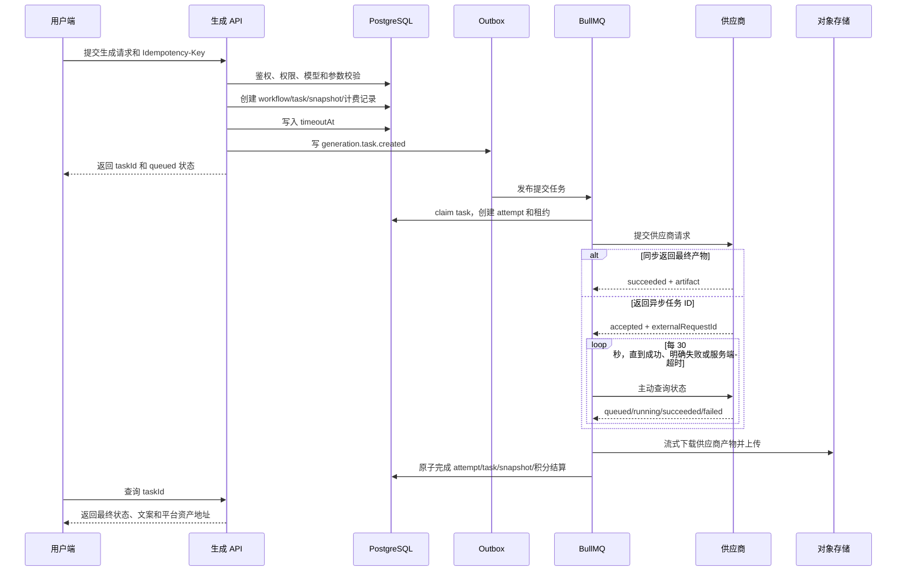

# 生成请求全链路与风险评估

更新日期：2026-07-21

适用范围：当前准备开放的客易云、灵动、酷模智多星，以及平台统一的图片、音频、视频生成状态机。

## 1. 结论

当前生成链路采用“平台主动查询供应商结果”，不是等待供应商回调：

- 图片：统一业务总时限 1 小时。
- 音频：统一业务总时限 1 小时。
- 视频：统一业务总时限 3 小时。
- 异步供应商任务：平台每 30 秒主动轮询一次。
- 音频最多 120 个正常轮询周期，视频最多 360 个正常轮询周期。
- `timeoutAt` 是服务端最终口径；前端到时只做最后一次服务端查询，不自行伪造失败。
- 已明确未提交给供应商的失败可以退款。
- 已经开始外部提交但结果无法确认的任务不得自动重提，也不得自动退款，进入待复核。
- 供应商明确返回失败时可以失败结算并退款。
- 供应商返回产物后，平台直接以流的方式下载并上传对象存储，视频不整体加载到 Node.js 内存，也不落本地临时文件。

## 2. 统一策略

唯一运行时策略源为：

`apps/backend/src/modules/model-gateway/generation-timeout.policy.ts`

| 媒体类型 | 业务总时限 | 轮询间隔 | 正常轮询上限 | 说明 |
| --- | ---: | ---: | ---: | --- |
| 图片 | 1 小时 | 供应商异步时为 30 秒；当前酷模强制同步 | 120 次等价周期 | 酷模当前请求保持 HTTP 连接等待最终结果 |
| 音频 | 1 小时 | 30 秒 | 120 次 | 平台主动查询供应商任务 |
| 视频 | 3 小时 | 30 秒 | 360 次 | 平台主动查询供应商任务 |

模型配置中的历史 `timeoutMs`、`requestTimeoutMs`、`pollIntervalMs`、`maxPollAttempts` 不再覆盖统一策略。需要区分两类超时：

1. 业务总时限：从用户请求创建任务时开始计算，图片/音频 1 小时，视频 3 小时。
2. 单次网络操作超时：限制一次 HTTP 建连、响应体读取或产物下载，防止单个连接无限挂起。它不是生成任务总时限，不应统一成 1 小时或 3 小时。

## 3. 主链路

## 4. 请求入口

### 4.1 校验

请求进入后依次完成：

- 登录态和当前用户、子账户业务归属校验。
- 项目、剧集、分镜或资产目标权限校验。
- 模型是否启用、媒体类型是否匹配、供应商协议是否受支持。
- 模型参数白名单、尺寸、比例、素材类型和数量校验。
- 引用资产版本解析，并生成供应商可读取的临时地址。
- 积分是否足够。

校验失败发生在供应商提交之前，不产生供应商任务。若已创建本地任务或已预扣积分，失败收口必须关闭任务并返还对应积分。

### 4.2 幂等

- API 使用 `Idempotency-Key` 和请求快照哈希识别重复请求。
- 同一个幂等键、同一个请求：返回已有任务，不再次创建供应商任务。
- 同一个幂等键仍在处理中：返回处理中冲突，不并发执行第二次。
- 同一个幂等键、不同请求体：按幂等冲突处理。
- 供应商文档没有明确提供幂等键时，平台禁止在“外部提交可能已经发生”后盲目重提。

### 4.3 持久化对象

一次请求会形成以下记录：

| 对象 | 作用 |
| --- | --- |
| `workflows` | 聚合一个或多个任务的总体状态 |
| `tasks` | 生成任务主状态、队列、租约、当前 attempt、`timeoutAt` |
| `task_attempts` | Worker 的一次执行尝试和锁状态 |
| `provider_requests` | 供应商请求、外部任务 ID、是否已开始外部提交 |
| `ai_generation_task_snapshots` | 前端查询所需的进度、结果、失败和积分摘要 |
| `credit_reservations`/账本 | 预留、消费、释放或待复核 |
| `outbox_events` | PostgreSQL 到 BullMQ 的可靠投递意图 |

## 5. 队列与分工

| 队列 | 职责 | 不负责的事情 |
| --- | --- | --- |
| `generation-submit-image` | 图片供应商提交 | 不轮询视频 |
| `generation-submit-video` | 视频和音频供应商提交 | 不长时间等待生成完成 |
| `generation-poll-video` | 视频、音频主动轮询 | 不执行大文件归档 |
| `generation-finalize-artifact` | 下载供应商产物、上传对象存储、创建资产版本 | 不再次提交供应商任务 |
| `generation-dead-letter` | 保存耗尽重试的队列任务 | 不自动改变 PostgreSQL 业务状态 |

提交、轮询、归档拆队列的原因是避免大量 30 秒轮询或大文件传输挤占新任务提交能力。

Outbox 发布失败时：

- 初次提交事件尚未接触供应商，可以结束任务并退款。
- 轮询或归档事件失败时，供应商侧可能已有任务或产物，进入待复核，不直接退款。
- 若失败结算本身失败，Outbox 保留为可重试状态，由修复任务继续处理。

## 6. Worker 租约和崩溃恢复

Worker claim 任务时：

- `tasks` 从 `queued` 变为 `running`。
- 创建 `task_attempts`。
- 写 `locked_by`、`locked_until`、`heartbeat_at`。
- `current_attempt_id` 指向当前 attempt。

租约过期后的处理取决于供应商提交是否开始：

| 情况 | 自动处理 |
| --- | --- |
| 没有 `external_submission_started_at`，也没有外部任务 ID | 可判定未提交，结束失败并退款 |
| 已有外部任务 ID，且视频可继续查询 | 清理过期租约并恢复轮询 |
| 已开始外部提交，但没有可恢复外部任务 ID | `result_unknown`，积分保持，等待人工复核 |
| Worker 晚到成功，但任务已被另一终态结算 | 由 task/attempt 行锁和当前 attempt 校验拒绝覆盖 |

原则：宁可转人工复核，也不因自动重提造成重复生成和重复扣费。

## 7. 供应商提交

### 7.1 提交前

- 获取用户、模型和供应商并发许可。
- 使用任务 ID、工作流 ID、请求哈希和 payload 哈希创建或复用 `provider_requests`。
- 在真正发出 HTTP 请求前记录 `external_submission_started_at`。
- 日志只保存脱敏请求，不保存 API Key。

### 7.2 提交结果分类

| 结果 | 状态 | 自动重试 | 积分 |
| --- | --- | --- | --- |
| 本地限流，尚未调用供应商 | 保持运行并延迟重排 | 是，按 `retryAfterMs` | 保持预留 |
| 供应商接受并返回外部任务 ID | `submitted/accepted` | 不重提，进入轮询 | 保持预留 |
| 同步返回最终产物 | `succeeded`，进入归档 | 不重提 | 归档成功后消费 |
| 供应商明确业务失败 | `failed` | 默认不自动重提 | 返还 |
| 网络中断、超时、响应无法判断，且外部提交已开始 | `result_unknown` | 否 | 待复核，不返还 |
| 响应声称成功但缺少产物，无法证明未生成 | `result_unknown/manual_review_required` | 否 | 待复核，不返还 |

## 8. 主动轮询

供应商轮询是平台主动发起，不是被动等待 webhook。

正常过程：

1. 提交成功后创建第一次延迟轮询任务。
2. 30 秒后调用供应商查询接口。
3. `queued/accepted/running/processing`：更新快照进度，再排下一次 30 秒轮询。
4. `succeeded/completed`：保存供应商产物地址，转归档队列。
5. `failed`：记录供应商失败，结束任务并退款。
6. 未知状态或成功但缺少结果地址：不得当作正常运行或成功，按协议错误或待复核处理。
7. 达到 `timeoutAt`：由服务端超时结算；没有供应商取消能力时转待复核。

轮询请求被限流时，可以按供应商给出的等待时间重排同一次轮询，不增加业务提交次数。业务总时限仍由 `timeoutAt` 兜底，不能因 429 无限延长。

## 9. 三家供应商对照

### 9.1 客易云 GlobalAiOpc

官方文档：<https://docs.globalaiopc.com/zh/api-reference/video/seedance2/seedance2-asset-upload>

当前协议结论：

- Bearer 鉴权。
- Seedance2 素材上传：`POST /kyyReactApiServer/kyyVideo2/asset/upload`。
- 上传成功返回 `data.assetId`，生成时按官方合同使用 `asset://{assetId}`。
- 视频任务状态按文档只接受 `queued`、`processing`、`completed`、`failed`。
- `completed` 必须同时有 `video_url`，否则不能视为成功。
- 官方建议约 20 到 40 秒或 30 到 60 秒查询，平台 30 秒符合建议。
- 结果 URL 有效期 1 天，平台拿到地址后立即流式归档。
- 文档未提供通用视频取消接口，因此 3 小时超时不能假定供应商已取消。
- Manxue 只允许文档中的 720p/1080p 和六种固定比例。
- Special 不允许只有音频而没有图片或视频参考。

未自动化的部分：素材上传后等待审核为 `Active` 的阶段。当前链路可以使用已经准备好的 `asset://`，但没有可持久恢复的自动素材准备任务。不能把上传和审核临时塞进生成 adapter，因为“素材已上传、生成任务尚未提交”之间崩溃会丢失 asset ID，无法幂等恢复。

### 9.2 灵动

官方文档：<https://www.lingdongapi.com/docs/api/?v=20260517>

当前协议结论：

- Base URL：`https://www.lingdongapi.com`。
- Bearer 鉴权。
- 视频创建：`POST /v1/video/generations`。
- 视频查询：`GET /v1/video/generations/{task_id}`。
- 视频下载：`GET /v1/videos/{task_id}/content`，下载请求也必须携带 Bearer。
- 图片创建：`POST /v1/images/generations`。
- `cvk-image-2` 参考图字段使用 `images`。
- 当前 `cvk-*` 请求不发送文档外的 `generate_audio`、`watermark`、`seed`。
- 保留旧 `sd-*`、`sora-*` 兼容分支，但不把旧创建路径用于 `cvk-*`。
- 文档未提供取消接口，也未声明供应商幂等键。

因此，灵动视频超时或提交结果不明时必须转待复核，不能自动取消、自动退款或盲目重提。

### 9.3 酷模智多星 Cumob

官方文档：<https://api.cumob.com/docs>

当前协议结论：

- 图片创建：`POST /v1/images/generations`。
- Bearer 鉴权。
- `async=false` 时等待最终结果；`async=true` 时才使用 `GET /v1/status/{id}` 或 webhook。
- 当前平台强制 `async=false`、`stream=false`，不发送 webhook，因此当前酷模图片链路没有后台轮询。
- 结果只从官方 `data[].url` 读取，不能从参考图或 metadata 中猜 URL。
- 状态只接受 `queued`、`running`、`succeeded`、`failed`。
- 请求不发送当前文档没有列出的 `negative_prompts`、`style`、`seed`、`n`。
- 当前只支持单图结果。
- HTTP 请求超时覆盖 fetch 和完整响应体读取，防止只限制到响应头。

HTTP 429 按官方建议做受限重试，但不放宽其他错误：

- 只有收到明确 HTTP 429、响应中没有外部任务 ID、且仍在图片 1 小时总时限内时，才允许重排同一个本地任务。
- 优先使用供应商 `Retry-After`；没有该响应头时使用 5 秒起步、最高 5 分钟的指数退避。
- 重排时原 attempt 结束为 `canceled`，同一个 `provider_requests` 恢复为 `created`，下一次 Worker 创建新 attempt。
- 网络断开、超时、5xx 或响应无法解析不走该分支，仍按外部提交结果不明确处理，避免重复生成。

## 10. 产物归档

### 10.1 视频是否加载到内存

不会。视频归档流程为：

1. 使用供应商 URL 发起下载。
2. 将 Web `ReadableStream` 转为 Node.js `Readable`。
3. 通过计数 `Transform` 校验实际字节数和上限。
4. 直接把流传给对象存储 `putObject`。
5. 上传完成后把 `storage_objects` 标为 `available`。
6. 创建项目上传记录和资产版本。

视频不整体转为 `Buffer`，不写本地临时文件。只有供应商直接返回 base64 图片时，图片本身需要解码为内存字节；这不适用于视频链路。

### 10.2 上传重试

- 单次归档调用中的对象存储上传默认总尝试 3 次。
- 默认重试间隔 1 秒。
- URL 产物每次重试重新下载并建立新的上传流，不能复用已消费的流。
- 视频归档在队列重试之外还有独立的传输恢复计数，下载或上传失败最多收口到 10 次传输尝试，耗尽后转后台处理。
- 视频下载和上传都纳入失败分类。
- 对象存储已成功、但资产记录写入失败：保留对象存储键并进入待复核，可执行“只补资产记录”的恢复任务，避免重复上传。

## 11. 状态语义

| 状态 | 含义 | 是否允许自动再次提交供应商 | 积分 |
| --- | --- | --- | --- |
| `queued` | 本地已受理，尚未被 Worker claim | 可以，但必须是同一任务首次提交 | 已预留或子账户已扣 |
| `running` | 正在提交、轮询或归档 | 否，除非明确证明尚未外部提交 | 保持 |
| `succeeded` | 平台资产已落库，任务完成 | 否 | 消费 |
| `failed` | 已有明确失败结论 | 用户可新建任务 | 返还或未扣 |
| `canceled` | 未提交或供应商已确认取消 | 用户可新建任务 | 返还 |
| `result_unknown` | 供应商是否生成无法确认 | 否 | 待复核 |
| `manual_review_required` | 已有产物或存储迹象，但平台状态需修复 | 否 | 待复核 |

`result_unknown` 和 `manual_review_required` 在用户界面统一显示“待复核”，不能显示“失败且已退款”。

## 12. 失败与结算矩阵

| 失败点 | 是否可能已生成 | 自动动作 | 是否退款 | 用户文案重点 |
| --- | --- | --- | --- | --- |
| 参数、权限、模型校验失败 | 否 | 拒绝请求 | 不扣或返还 | 指出可修正输入 |
| 积分不足 | 否 | 结束本地任务 | 不扣 | 积分不足 |
| Outbox 初次发布失败 | 否 | 结束任务 | 是 | 队列提交失败，积分已返还 |
| 提交 Worker 租约过期，未开始外部提交 | 否 | 结束任务 | 是 | 队列执行超时，积分已返还 |
| 本地限流 | 否 | 延迟重排 | 否 | 继续等待 |
| 供应商明确失败 | 否或供应商明确无结果 | 结束任务 | 是 | 模型生成失败，积分已返还 |
| 外部提交后网络断开 | 是 | `result_unknown` | 否 | 待复核，请勿重复提交 |
| 外部提交后 Worker 崩溃，无外部 ID | 是 | `result_unknown` | 否 | 待复核 |
| 有外部 ID 且 Worker 崩溃 | 是 | 恢复轮询 | 否 | 继续生成 |
| 轮询达到总时限，供应商无取消接口 | 是 | `result_unknown/manual_review_required` | 否 | 超时待复核 |
| 成功状态但缺少产物地址 | 是 | 待复核 | 否 | 结果不完整，等待核对 |
| 产物下载失败 | 是 | 归档重试；耗尽后按结果不确定处理 | 不应假定退款 | 结果已生成但归档失败 |
| 对象存储上传失败 | 是 | 归档重试；耗尽后后台处理 | 不应假定退款 | 平台归档失败 |
| 对象已存储、资产记录失败 | 是 | 只补写资产记录 | 否 | 已保存，等待后台补写 |
| 最终成功和超时结算并发 | 是 | 行锁只允许一方提交 | 取决于获胜终态 | 以后端最终状态为准 |

## 13. 自动重试边界

### 可以自动重试

- Redis/BullMQ 的同一业务步骤，默认 3 次、指数退避起点 5 秒。
- 尚未调用供应商时的本地限流。
- 供应商轮询查询，因为它是只读操作。
- 对象存储下载和上传，默认 3 次。
- Outbox/Redis 丢任务后的同一任务修复投递。
- 已上传对象存在时的资产记录补写。

### 禁止自动重试

- 外部提交已经开始，但没有供应商幂等保证，也无法确认供应商是否受理。
- 供应商已明确失败后用同一任务自动重新生成。
- `result_unknown` 或 `manual_review_required` 未恢复业务状态前直接 replay DLQ。
- 仅凭前端超时创建第二个任务。

## 14. 服务端超时结算

后台修复调度器以 `timeoutAt` 为主；历史数据没有 `timeoutAt` 时按媒体类型回退：

- `episode_generate_image`：创建时间加 1 小时。
- `episode_generate_audio`：创建时间加 1 小时。
- `episode_generate_video`：创建时间加 3 小时。

超时结算必须在事务内锁定当前 task 和 attempt，并再次检查：

- 当前是否仍为可结算非终态。
- 当前 attempt 是否仍是 `current_attempt_id`。
- 供应商提交是否已经开始。
- 是否已经有明确供应商失败、成功产物或可恢复外部任务 ID。

结算规则：

- 未开始外部提交：`failed`，退款。
- 已开始但结果不明：`result_unknown/manual_review_required`，不退款。
- 供应商明确失败：`failed`，退款。
- 已有产物：优先恢复归档，不按普通超时退款。

## 15. 积分一致性

主账户使用 reservation，子账户使用成员积分账本。两者必须遵循同一业务结论：

- 成功：`consumed`。
- 明确失败或确认取消：`released`。
- 结果不明或需补资产：`manual_review_required`。

前端只有在账本/快照明确为 `released` 时才能显示“积分已返还”。不能因为 task 是失败样式就推断已经退款。

成功最终化把以下动作放在同一受锁事务中：

- 校验当前 task 和 attempt。
- 结算积分。
- 更新生成快照。
- 更新 attempt 和 task 为 `succeeded`。

这样可以阻止超时修复与晚到 Worker 同时把同一笔积分分别消费和返还。

## 16. DLQ 与人工恢复

- BullMQ job 重试耗尽后写入 Dead Letter Queue。
- DLQ 是队列证据，不是业务状态来源。
- replay 前必须检查 PostgreSQL 中的 task/attempt/provider request 是否已经恢复到允许执行的状态。
- 状态未恢复时返回 409，原 DLQ job 保留。
- replay 成功后才删除原 DLQ job，并使用新的 replay job ID。
- 管理员需要先判断是“可继续轮询”“可补写资产”“明确失败退款”还是“供应商侧成功应消费积分”。

推荐人工复核顺序：

1. 用 `provider_requests.external_request_id` 到供应商查询。
2. 若供应商失败，记录证据并退款。
3. 若供应商成功，立即下载仍有效的产物并补归档。
4. 若对象存储已有文件，只补项目上传记录和资产版本。
5. 若仍无法确认，保持待复核，不重提、不退款。

## 17. 用户端轮询和文案

- 用户端轮询平台 API，不直接请求供应商。
- 用户端看到 `timeoutAt` 到期时，必须最后查询一次平台状态。
- `manual_review_required`、`result_unknown`：标签统一为“待复核”。
- 待复核文案必须包含“请勿重复提交”或等价提示。
- `released`：可以显示“积分已返还”。
- `manual_review_required`：显示“积分状态等待后台复核”或“积分保持预留”。
- 供应商原始错误、堆栈、HTTP 响应体和内部 failure code 不直接暴露给普通用户。

## 18. 当前剩余风险

### P1：客易云素材准备阶段尚未持久化

影响：需要先上传并审核素材的模型，当前只能接收已准备好的 asset URI，不能完整自动化。

建议：新增独立 `asset_prepare` task，持久化 asset ID、审核状态、重试次数和关联生成 task；审核 Active 后再投递生成提交。

### P1：灵动缺少完整状态枚举、错误码和幂等协议

影响：未知响应只能保守转待复核，无法自动分类所有错误。

建议：向供应商索取机器可读 OpenAPI、完整状态表、错误码、取消接口和幂等约定，再扩展 adapter。

### P2：供应商没有取消接口导致超时不能自动退款

影响：图片/音频 1 小时、视频 3 小时后可能积累待复核任务和冻结积分。

建议：建立待复核 SLA、供应商后台查询工具和批量核账报表。只有确认失败或确认取消后退款。

### P2：Outbox 与业务记录之间仍依赖修复任务兜底

影响：API 进程在创建 task 后、写 Outbox 前崩溃时，任务可能短暂没有 Redis job。

现有缓解：queued task 修复扫描会补发 outbox；补发 job ID 包含稳定任务 ID，避免同一队列重复执行。

建议：后续将 workflow/task、积分预留、snapshot、provider request 和初始 outbox 收敛到一个数据库事务。

### P2：供应商临时 URL 过期

影响：客易云结果 URL 只有 1 天；持续归档失败后可能无法恢复文件。

建议：产物成功后优先级立即提升到归档；监控 `provider_succeeded` 到 `storage available` 的延迟，并在 URL 过期前告警。

## 19. 监控指标

至少应按供应商和模型统计：

- 请求数、受理数、明确失败数、成功数。
- 提交耗时、首次轮询耗时、生成总耗时、归档耗时。
- 30 秒轮询数量和 429 次数。
- `result_unknown`、`manual_review_required` 数量和金额。
- 超时前未提交、超时后待复核、明确失败退款的数量。
- Worker 租约过期和恢复次数。
- Outbox 滞留、BullMQ failed、DLQ 数量。
- 供应商成功但缺少 URL 的数量。
- 对象存储下载、上传和资产补写失败次数。
- 供应商成功到平台归档完成的 P50/P95/P99。

建议告警：

- 待复核任务超过内部 SLA。
- 客易云成功产物超过 30 分钟仍未归档。
- 同一供应商连续出现未知状态。
- DLQ replay 409 持续增长。
- 积分 reservation 长时间保持 `manual_review_required`。

## 20. 评估时的验收清单

- [ ] 图片、音频任务 `timeoutAt = requestedAt + 1h`。
- [ ] 视频任务 `timeoutAt = requestedAt + 3h`。
- [ ] 异步供应商每 30 秒由后台主动查询。
- [ ] 前端没有独立的失败计时口径。
- [ ] 供应商外部提交开始后，网络异常不自动重提。
- [ ] 明确失败才自动退款。
- [ ] 结果不明转待复核，且不显示已退款。
- [ ] 视频使用流式下载和流式上传，没有整文件 `arrayBuffer`/`Buffer`。
- [ ] 归档重试耗尽后不会覆盖已有供应商成功证据。
- [ ] 最终成功和超时结算有行锁竞态测试。
- [ ] 子账户退款幂等且在事务内。
- [ ] DLQ 未恢复业务状态时不能 replay。
- [ ] Worker 关闭等待在途 exhausted handler。
- [ ] 客易云、灵动、酷模字段和路径与官方文档一致。

## 21. 本次验证证据

代码定向测试：

- 服务端超时入口：4/4。
- 前端超时、待复核和失败文案：5/5。
- BullMQ Worker：17/17。
- Queue config：4/4。
- Provider fetch 超时：2/2。
- 酷模 adapter：10/10。
- GPT Image Worker：18/18。
- 灵动 adapter 与下载鉴权：19/19。
- GlobalAiOpc adapter 与 Seedance Worker：29/29。
- 音频链路：6/6。
- Redis 修复：9/9。
- DLQ 管理操作：6/6。
- ProviderRequest 和生成快照终态保护：7/7。
- Task finalization 回滚和竞态：2/2。
- 模型配置 schema：11/11。
- `git diff --check`：通过。

正式 `.env` 数据库复查：

- active 图片、音频、视频模型中，含 `timeoutMs/requestTimeoutMs/pollIntervalMs/maxPollAttempts` 的配置数均为 0。
- active 音频 dispatch polling interval：30000ms。
- active 视频 dispatch polling interval：30000ms。
- 客易云、灵动、酷模和统一超时四份迁移账本校验和与当前 SQL 一致。

运行态复查：

- 开发栈已重启。
- phone-auth、generation-outbox、generation-worker 均已启动。
- `http://127.0.0.1:4310/` 返回 HTTP 200。
