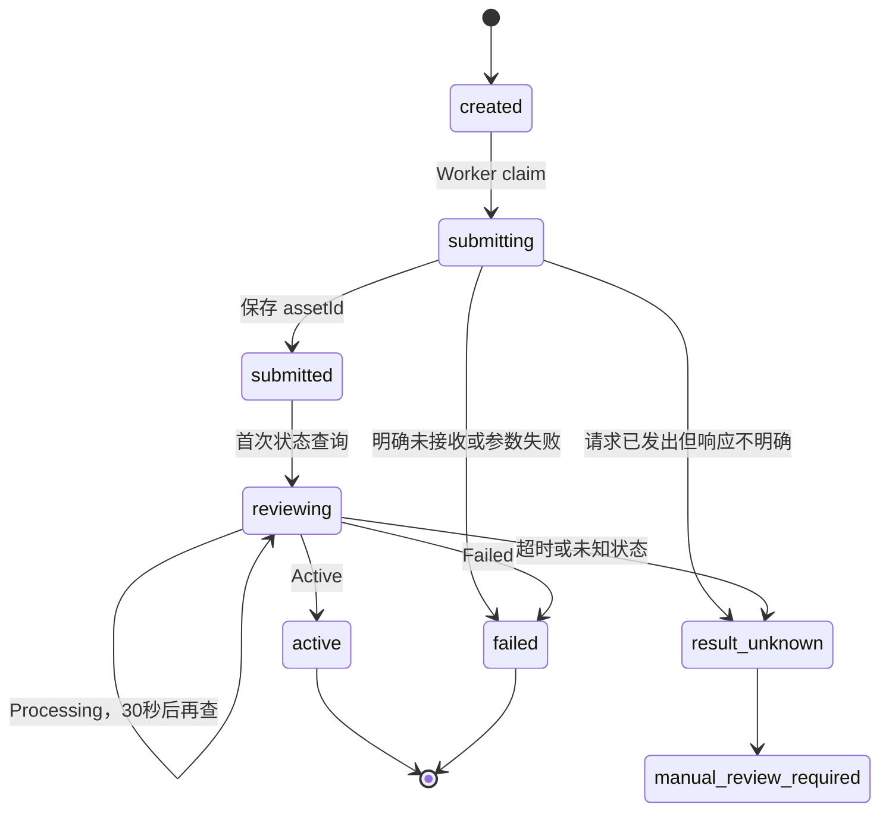
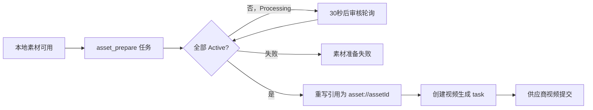

# 客易云素材上传与审核链路设计

更新日期：2026-07-21

适用范围：GlobalAiOpc/客易云 Seedance2.0、`sd2_manxue` 系列在图片、视频、音频参考素材上的上传、审核、复用和生成前置准备。

## 1. 先说结论

客易云的“上传素材”不是把二进制文件直接 POST 给供应商，而是把一个供应商可访问的素材 URL 提交给客易云。客易云返回 `assetId`，生成任务再使用 `asset://{assetId}` 引用。

不能把这一步临时塞进视频 adapter。正确实现必须是一个独立、可持久恢复的 `asset_prepare` 阶段，原因是存在两个关键崩溃窗口：

1. 客易云已经接收素材，但平台还没保存 `assetId`。
2. 素材已经审核为 `Active`，但平台还没投递视频生成任务。

如果不持久化，重试可能重复上传素材，或者永远丢失已经产生的 `assetId`。

当前实现边界：视频 adapter 已能接受审核完成后的 HTTP(S) URL 和官方 `asset://{assetId}`，但尚未实现自动提交素材、持久化 `assetId`、审核轮询、批量部分成功恢复和管理端人工复核。本文件后续章节是待实施设计，不能把现有“直接把素材 URL 传给视频生成接口”视为已经完成了客易云素材上传与审核。

## 2. 官方接口

### 2.1 Seedance2.0 通用素材上传

官方文档：<https://docs.globalaiopc.com/zh/api-reference/video/seedance2/seedance2-asset-upload>

请求：

```http
POST https://zcbservice.aizfw.cn/kyyReactApiServer/kyyVideo2/asset/upload
Authorization: Bearer {API_KEY}
Content-Type: application/json
```

请求体：

```json
{
  "assetType": "Image",
  "url": "https://platform-storage.example/path/reference.png",
  "name": "角色参考图"
}
```

字段：

| 字段 | 必填 | 说明 |
| --- | --- | --- |
| `assetType` | 是 | `Image`、`Video`、`Audio`、`Document`，首字母大写 |
| `url` | 是 | 客易云服务器可访问的素材 URL |
| `name` | 否 | 供应商侧用于识别和管理的名称 |

官方列出的格式约束：

- 图片：jpeg、png、webp、bmp、tiff、gif。
- 视频：文档当前明确列出 480p、720p。
- 音频：wav、mp3。

成功响应：

```json
{
  "code": 0,
  "msg": null,
  "data": {
    "assetId": "asset-20260330142158-q75m8"
  }
}
```

业务失败示例：

```json
{
  "code": 1001,
  "msg": "素材 URL 无法访问",
  "data": null
}
```

判定规则：HTTP 2xx 不是最终成功条件，必须同时满足：

- `code` 数值为 `0`。
- `data.assetId` 是非空字符串。

生成时使用：

```text
asset://asset-20260330142158-q75m8
```

平台只按官方合同写入和接受 `asset://{assetId}`。历史 `assetId://` 不是当前官方文档的一部分，应从 adapter 和测试中删除。

### 2.2 Seedance2.0 素材详情和审核状态

上传后通过详情接口主动查询，直到状态为 `Active`：

```http
GET https://zcbservice.aizfw.cn/kyyReactApiServer/kyyVideo2/asset/{assetId}
Authorization: Bearer {API_KEY}
```

响应数据包含 `assetId`、`name`、`assetType`、`url`、`status`、`createTime`。官方状态只有：

| 状态 | 处理 |
| --- | --- |
| `Processing` | 30 秒后继续查询 |
| `Active` | 审核完成，可用于生成 |
| `Failed` | 素材准备明确失败 |

素材不存在时官方示例返回 `code=-1`、`data=null`。必须校验响应中的 `assetId` 与请求一致；未知状态不能当作 `Processing`。

官方还提供永久删除：

```http
DELETE https://zcbservice.aizfw.cn/kyyReactApiServer/kyyVideo2/asset/{assetId}
Authorization: Bearer {API_KEY}
```

删除成功的 `code` 是字符串 `"0"`。删除不可恢复，不能作为上传失败或生成取消的自动补偿；同一个素材可能被多个生成任务复用，只能在确认无任何引用后由人工或保留策略清理。

### 2.3 sd2_manxue 批量提交审核

官方文档：<https://docs.globalaiopc.com/zh/api-reference/video/sd2-manxue/sd2-manxue-asset-upload>

请求：

```http
POST https://zcbservice.aizfw.cn/kyyReactApiServer/asset/sd2Manxue/assetUpload
Authorization: Bearer {API_KEY}
Content-Type: application/json
```

请求体：

```json
{
  "imageUrls": ["https://platform-storage.example/portrait.png"],
  "videoUrls": ["https://platform-storage.example/reference.mp4"],
  "audioUrls": ["https://platform-storage.example/bgm.mp3"]
}
```

规则：

- `imageUrls`、`videoUrls`、`audioUrls` 至少有一个非空数组。
- 图片建议宽高比在 `0.4 ~ 2.5` 之间。
- 图片宽高建议在 `300 ~ 6000 px` 之间。
- 一个批次可以部分成功，不能因为 `failedItems` 非空就回滚已经返回 `assetId` 的项目。

成功项结构：

```json
{
  "code": "0",
  "msg": null,
  "data": {
    "items": [
      {
        "assetType": "Image",
        "originalUrl": "https://platform-storage.example/portrait.png",
        "assetId": "asset_img_001",
        "status": "submitted"
      }
    ],
    "failedItems": []
  }
}
```

必须按 `originalUrl` 或提交批次中的稳定索引把返回项映射回本地素材。每个成功 item 单独持久化 `assetId`；每个失败 item 单独记录失败原因。

### 2.4 sd2_manxue 查询审核状态

官方文档：<https://docs.globalaiopc.com/zh/api-reference/video/sd2-manxue/sd2-manxue-asset-status>

请求：

```http
POST https://zcbservice.aizfw.cn/kyyReactApiServer/asset/sd2Manxue/assetStatus
Authorization: Bearer {API_KEY}
Content-Type: application/json
```

请求体：

```json
{
  "assetIds": ["asset_img_001", "asset_video_001"]
}
```

官方状态：

| 状态 | 平台含义 | 后续动作 |
| --- | --- | --- |
| `Processing` | 审核中 | 30 秒后主动查询 |
| `Active` | 审核通过 | 保存 `asset://{assetId}`，允许生成 |
| `Failed` | 审核失败 | 结束该素材准备任务，不进入生成 |

响应也可能包含 `failedItems[]`。这是“本次状态查询失败”，不等同于素材审核 `Failed`；应按查询异常重试，不能把素材永久判失败。

## 3. 推荐状态机



平台内部建议状态：

| 状态 | 是否终态 | 是否可自动重提上传 |
| --- | --- | --- |
| `created` | 否 | 是，尚未外部提交 |
| `submitting` | 否 | 仅在确认请求未发出时 |
| `submitted` | 否 | 否，已有 `assetId` |
| `reviewing` | 否 | 否，只查询状态 |
| `active` | 是 | 否，可复用 |
| `failed` | 是 | 用户修正素材后创建新准备任务 |
| `result_unknown` | 否 | 否，转人工核对 |
| `manual_review_required` | 是 | 否 |

## 4. 数据模型

建议新增 `provider_asset_preparations`，不要复用业务资产表的 `assetId` 字段，因为本地资产 UUID 和客易云 `assetId` 是两个概念。

建议字段：

| 字段 | 作用 |
| --- | --- |
| `id` | 平台准备记录 UUID |
| `admin_user_id` | 当前主账户业务归属 |
| `created_by_user_id` | 实际发起操作的主账户或子账户用户 |
| `project_id` | 项目归属 |
| `source_storage_object_id` | 平台对象存储素材 |
| `source_asset_version_id` | 可选，本地资产版本 |
| `provider_name` | `globalaiopc` |
| `provider_credential_identity` | API Key 所属账号的稳定、不可逆标识；不保存 API Key |
| `provider_family` | `seedance2` 或 `sd2_manxue` |
| `provider_asset_type` | `Image/Video/Audio/Document` |
| `provider_asset_id` | 客易云返回的 `assetId` |
| `provider_asset_uri` | `asset://{assetId}` |
| `status` | 上述平台内部状态 |
| `external_submission_started_at` | 外部提交闸门 |
| `submitted_at` | 已保存 `assetId` 的时间 |
| `last_polled_at` | 最近查询时间 |
| `next_poll_at` | 下一次允许查询时间 |
| `prepare_timeout_at` | 生成内准备时等于父生成任务 `timeoutAt`；独立预上传时使用自己的截止时间 |
| `failure_code` | 平台机器错误码 |
| `failure_message` | 脱敏错误摘要 |
| `request_hash` | 幂等请求哈希 |
| `source_content_hash` | 源文件内容哈希 |
| `provider_response_redacted_json` | 脱敏供应商响应 |
| `created_at/updated_at` | 审计时间 |

建议唯一约束：

```text
(admin_user_id, provider_name, provider_credential_identity, provider_family,
 source_storage_object_id, source_content_hash, provider_asset_type)
```

同一主账户、同一供应商凭据身份、同一供应商系列、同一个未变化的文件直接复用已有 `active` 记录；文件内容变化或供应商账号/API Key 身份变化必须创建新记录，避免拿旧账号的 `assetId` 给新账号使用。

另建 `generation_task_provider_assets` 关联表：

| 字段 | 作用 |
| --- | --- |
| `task_id` | 父生成任务 |
| `preparation_id` | provider asset preparation |
| `role` | `first_image/last_image/reference_image/reference_video/reference_audio` |
| `ordinal` | 同一角色内的稳定顺序 |

这张表支持同一 Active 素材复用、一个任务依赖多个素材、保留请求顺序，以及删除素材前反查所有任务引用。

## 5. 与生成任务的关系

不要在原视频 task 内同时承担素材准备和视频生成。建议工作流结构：



具体规则：

1. API 接收生成请求时解析所有参考图片、视频、音频。
2. 已存在匹配的 `active` provider asset，直接复用。
3. 没有匹配记录时创建 `asset_prepare` task。
4. 视频生成 task 处于 `blocked_on_assets`，尚未创建 ProviderRequest，尚未向视频生成接口提交。
5. 使用 `generation_task_provider_assets` 固定素材角色和顺序；全部素材 `Active` 后生成不可变的 provider asset snapshot。
6. 将对应请求字段替换为 `asset://{assetId}`。
7. 视频生成沿用请求受理时已经确定的 `timeoutAt`，只使用剩余时间。

用户发起视频生成后，从素材准备、审核、视频提交、视频生成到平台归档必须共用同一个 3 小时总时限。素材审核会消耗这 3 小时，不能在审核通过后重新开始计时。只有用户在素材库提前执行、尚未关联具体生成请求的预上传任务，才使用独立的素材准备时限。

## 6. 超时与轮询

- 审核状态由平台主动查询，不使用 webhook。
- 轮询间隔统一 30 秒，不允许模型配置覆盖。
- 客易云详情页示例代码使用 5 秒、最多等待 300 秒，但官方没有把它声明为审核 SLA；平台采用统一 30 秒轮询不违反接口合同。
- 与生成请求绑定时，所有素材准备记录继承父任务的 `timeoutAt`：图片/音频生成请求总计 1 小时，视频生成请求总计 3 小时。
- 素材库独立预上传时，图片/音频素材准备使用 1 小时，视频素材准备使用 3 小时。
- 父视频任务到时仍有素材为 `Processing`：停止自动生成，父任务按“尚未提交视频供应商”失败并释放生成积分；素材准备记录保留审核证据，可继续人工核对，但以后即使变为 Active 也不能自动提交已经过期的生成任务。
- 如果客易云未来对素材审核单独计费，需要新增独立账本事件，不能混入视频生成 reservation。

## 7. 幂等和崩溃恢复

### 7.1 发请求前崩溃

- 本地状态仍为 `created`。
- 没有 `external_submission_started_at`。
- 可以安全重新 claim 并提交。

### 7.2 发请求后、保存 assetId 前崩溃

- `external_submission_started_at` 已存在。
- 不知道客易云是否已经创建素材。
- 官方文档未提供幂等键，因此禁止自动重提。
- 状态转 `result_unknown`，由后台按 URL、时间和供应商日志核对。

### 7.3 保存 assetId 后崩溃

- 恢复任务读取 `provider_asset_id`。
- 不重新上传，只重新加入状态查询队列。

### 7.4 Active 后、生成提交前崩溃

- `active` 是可复用终态。
- 恢复任务重新检查被阻塞的生成工作流并投递视频生成。
- 生成任务幂等键保持不变，不能新建第二个用户任务。

## 8. 部分成功处理

`sd2_manxue` 批量上传和批量状态查询都可能部分成功：

- 每个本地素材必须有独立 preparation 行。
- 一个批次只负责减少 HTTP 请求，不作为事务原子边界。
- `data.items[]` 按项成功。
- `failedItems[]` 按项失败或重试。
- 提交前按 URL 去重；官方成功项只有 `originalUrl`，没有客户端 item ID，同 URL 对应多个角色时无法仅靠响应可靠映射。
- 未出现在两者中的提交项按响应不完整处理，不能猜测成功或失败。
- 数据库可以一次事务写入整个响应的逐项结果，保证同一批次审计一致。

## 9. URL 和文件安全

客易云会从 `url` 下载文件，因此平台应只提交自己对象存储的受控地址：

- 不接受用户直接传任意外部 URL 绕过平台校验。
- 上传前确认 `storage_objects.status = available`。
- 校验 MIME、文件大小、图片尺寸和宽高比。
- 签名 URL 有效期必须覆盖供应商拉取窗口。
- URL 日志只保留对象键或脱敏地址，不记录签名查询参数。
- API Key 只从 `.env` 指定变量读取，不能写入数据库或响应日志。

如果对象存储支持供应商固定出口 IP，可进一步限制签名 URL 使用范围；官方未提供出口 IP 前不要自行假设。

## 10. 队列设计

建议新增两个队列：

| 队列 | 职责 |
| --- | --- |
| `generation-prepare-provider-asset` | 生成受控 URL、提交素材、保存逐项 `assetId` |
| `generation-poll-provider-asset` | 每 30 秒批量查询审核状态 |

Worker 规则：

- submit Worker 按用户和供应商限并发。
- poll Worker 可以把多个 `assetId` 合并成一次官方批量查询。
- 同一 preparation 同时只能有一个活跃 poll job。
- job ID 包含 preparation ID 和 poll attempt，重复发布保持幂等。
- Redis job 丢失时，由 PostgreSQL repair 扫描 `submitted/reviewing` 且 `next_poll_at` 到期的记录补发。
- DLQ replay 前先恢复 PostgreSQL 状态，不能只重放队列快照。

## 11. 错误分类

| 场景 | failure code 建议 | 状态 | 自动重试 |
| --- | --- | --- | --- |
| 本地文件不存在 | `provider_asset_source_missing` | failed | 否 |
| MIME/尺寸不合法 | `provider_asset_validation_failed` | failed | 否 |
| URL 明确无法访问 | `provider_asset_url_unreachable` | failed | 修复 URL 后新建 |
| HTTP 429 且明确未受理 | `provider_asset_rate_limited` | created | 是，退避 |
| 网络中断且是否受理不明 | `provider_asset_submission_ambiguous` | result_unknown | 否 |
| HTTP 2xx 但 `code != 0` | `provider_asset_business_failed` | failed | 按错误码决定 |
| `code=0` 但无 assetId | `provider_asset_invalid_response` | result_unknown | 否 |
| 审核 Processing | 无 | reviewing | 30 秒轮询 |
| 审核 Failed | `provider_asset_review_failed` | failed | 否 |
| 查询接口临时失败 | `provider_asset_poll_failed` | reviewing | 是，只重试查询 |
| 未知审核状态 | `provider_asset_unknown_status` | result_unknown | 否 |
| 审核超时 | `provider_asset_review_timeout` | manual_review_required | 否 |

## 12. 管理端需要提供的能力

- 按项目、用户、供应商、状态筛选 preparation。
- 查看本地 storage object、脱敏源 URL、provider asset ID。
- 手工立即查询状态。
- 将供应商明确失败的记录结束为 failed。
- 将已确认 Active 的记录恢复为 active，并唤醒被阻塞生成任务。
- 对结果不明记录添加复核说明。
- 禁止普通“重试”按钮绕过外部提交闸门。
- 删除供应商素材前通过 `generation_task_provider_assets` 确认没有运行中或历史保留引用；默认不自动删除。

## 13. 监控与告警

至少统计：

- 提交素材数、成功返回 assetId 数、部分失败数。
- `Processing -> Active` 的 P50/P95/P99。
- 按素材类型的审核失败率。
- `submission_ambiguous` 和 `review_timeout` 数量。
- Active 后等待视频提交的任务数。
- 同一内容哈希重复创建的客易云 asset 数量。
- 距离签名 URL 过期不足 10 分钟仍未完成提交的数量。

告警建议：

- `submitted/reviewing` 超过内部 SLA。
- `active` 但被阻塞生成任务超过 2 分钟未唤醒。
- 同一源文件在短时间生成多个 provider asset ID。
- 客易云连续返回未知状态或响应缺少 assetId。

## 14. 实施顺序

1. 新增 `provider_asset_preparations`、`generation_task_provider_assets` 表、状态约束和唯一索引。
2. 新增客易云通用上传和 Manxue 审核 adapter，仅处理协议转换。
3. 新增 prepare/poll 队列和 PostgreSQL repair。
4. 生成 API 增加资产依赖解析和 `blocked_on_assets` 阶段。
5. 生成请求受理时立即固定 3 小时父 `timeoutAt`，全部 Active 后创建不可变 asset snapshot，并在剩余时间内提交视频。
6. 增加管理端复核、状态查询和恢复入口。
7. 增加部分成功、崩溃窗口、重复投递和未知状态测试。
8. 最后才对用户开放自动素材准备。

## 15. 验收标准

- 同一素材重复提交不会产生第二个客易云 asset。
- 外部请求不明时不会自动重提。
- 批量响应部分成功时逐项落库。
- 只有 `Active` 素材能进入视频生成请求。
- 审核轮询固定 30 秒，模型配置无法覆盖。
- 从生成请求受理到最终完成不超过 3 小时，审核通过后不会重置 `timeoutAt`。
- Worker 在四个崩溃窗口恢复后不会丢 assetId 或重复生成。
- 用户、子账户、项目归属均以当前主用户及其子用户为准。
- API Key、签名 URL 查询串和供应商原始敏感响应不进入普通日志。
- 待复核记录不能通过普通 DLQ replay 绕过业务状态检查。
