# 灵曦剧场创作手册

> 适用对象：第一次使用灵曦剧场完成短剧、漫剧或分镜视频创作的用户。
> 更新时间：2026-07-09
> 阅读方式：按截图一步步操作，从登录、新建项目、准备剧本、进入剧集工作台，到分镜视频生成与导出检查。

这份手册只写当前产品里已经有的功能。截图使用演示项目拍摄，真实创作时请替换成你的作品名称、剧本、角色、场景、提示词和视频结果。

## 1. 登录进入工作台

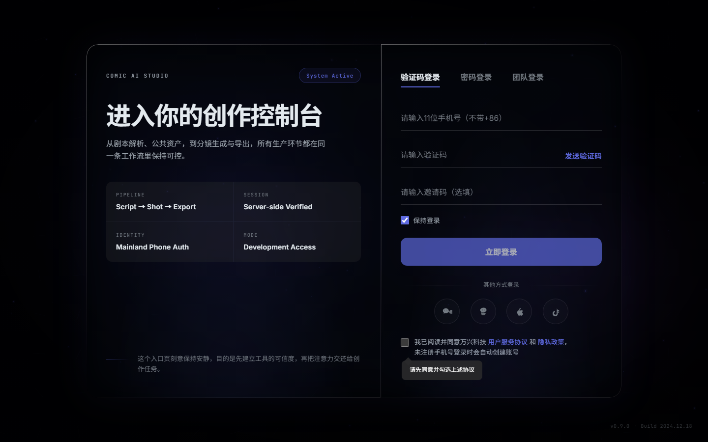

打开灵曦剧场后，先在登录页完成账号登录。登录成功后会进入创作工作台。

怎么做：

1. 输入你的手机号或账号。
2. 按页面提示完成登录。
3. 进入后确认左侧能看到“首页、画布、剧本、项目、资产库、团队”等入口。

完成标志：

- 页面不再停留在登录页。
- 右上角能看到账号头像、积分入口等状态信息。

卡住怎么办：

- 如果登录后又回到登录页，说明会话失效，重新登录即可。
- 如果生成或导出时提示会员/积分不足，需要先处理会员或积分状态。

## 2. 从首页开始

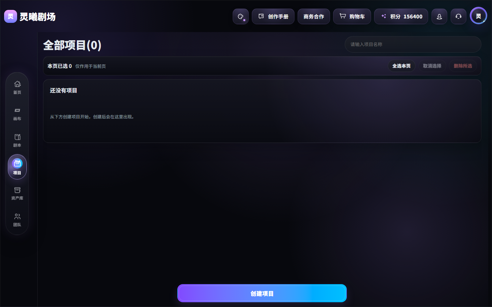

首页是创作入口。新用户建议从“创建项目”开始；如果你已经有剧本，也可以先去“剧本”页整理内容，再回到项目创建。

怎么做：

1. 点击左侧“首页”。
2. 找到“创建项目”入口。
3. 如果只是测试流程，可以先创建一个短项目；正式制作时建议先准备好故事梗概和第一集正文。

完成标志：

- 你知道接下来要创建哪个作品。
- 已经确定作品大概是竖屏还是横屏。

## 3. 新建项目

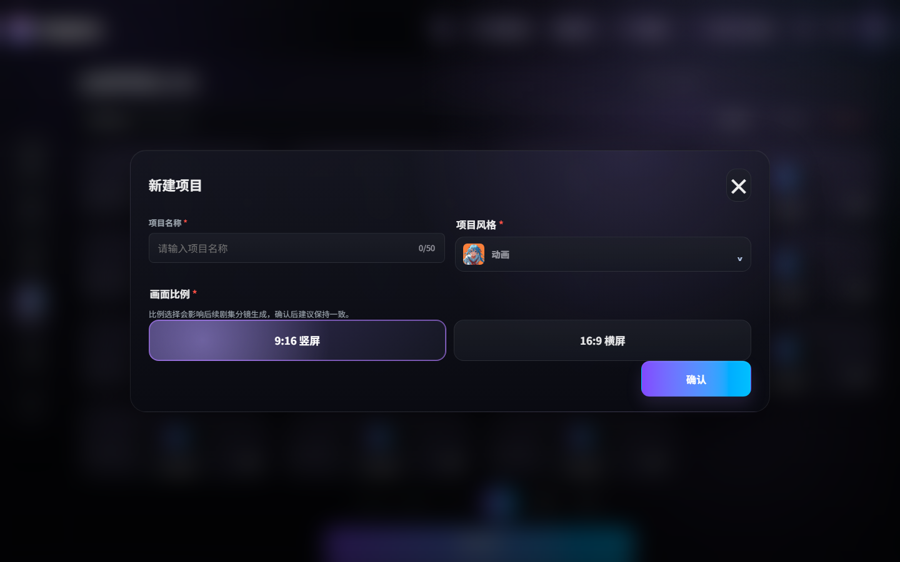

项目是一部作品的生产容器。后续剧本、资产、分镜、图片、视频和导出都围绕项目进行。

怎么做：

1. 点击“创建项目”。
2. 填写“项目名称”。
3. 选择“项目风格”，例如人像摄影、电影写真、中国风、动画、3D 渲染等。
4. 选择“画面比例”：竖屏短剧通常选 `9:16`，横屏内容选 `16:9`。
5. 点击确认创建。

完成标志：

- 项目出现在项目列表里。
- 进入项目后能看到“总览、资产、剧集、统计”几个区域。

注意：

- 画面比例会影响后续分镜图和视频构图，正式项目不要频繁切换。
- 项目名称建议用作品名，不要只写“测试”。

## 4. 准备剧本

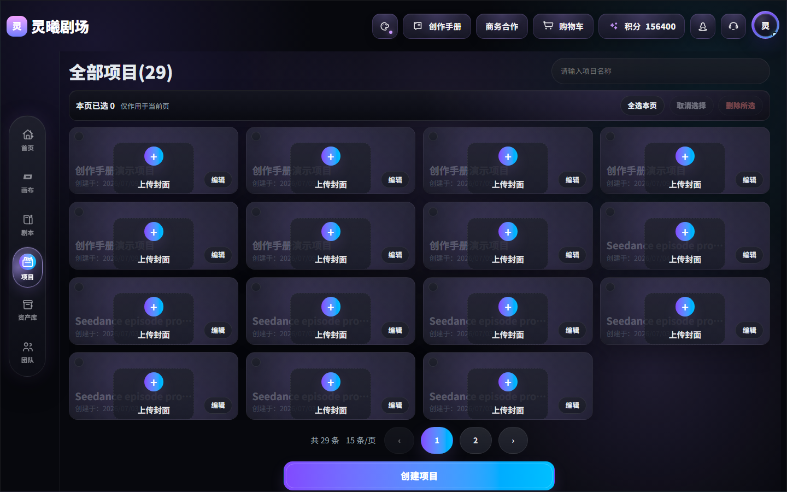

剧本页用于整理故事和正文。你可以从故事灵感创建剧本，也可以管理已有剧本。

怎么做：

1. 点击左侧“剧本”。
2. 如果已有正文，进入“我的剧本”选择对应剧本。
3. 如果还没有正文，可使用页面里的 AI 原创剧本设定入口。
4. 把每集内容写成清晰段落，重点写清人物、场景、动作和结果。

完成标志：

- 至少有一集可用于分镜制作。
- 每一集都有明确场景和镜头动作，而不是只有一句剧情概括。

写法建议：

- 好写法：`夜晚，旧街区。女主蹲下捡起发光的旧式通讯器，屏幕闪出一段模糊视频。`
- 不推荐：`女主发现线索，很震惊。`

## 5. 查看项目总览

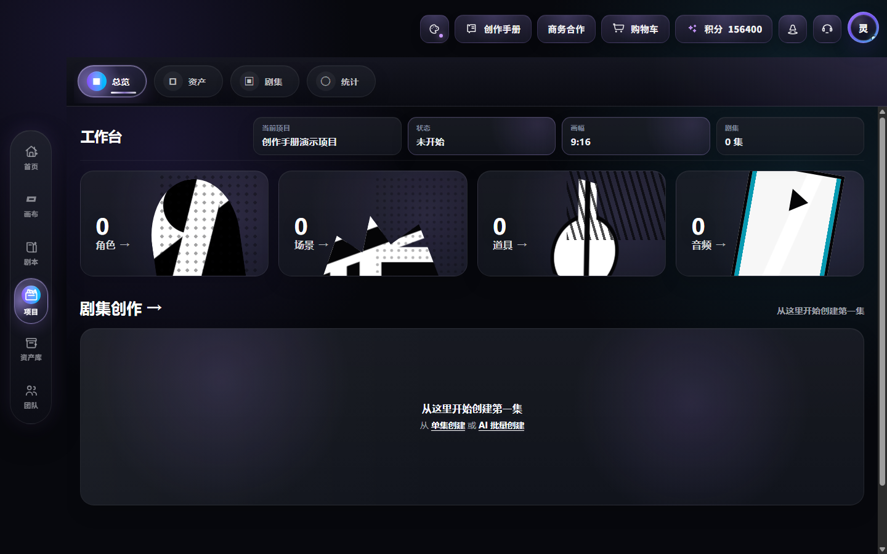

项目总览用于确认当前作品的基础状态，包括画幅、剧集、资产数量和生产入口。

怎么做：

1. 点击左侧“项目”。
2. 打开刚创建的项目。
3. 在“总览”里确认项目名称、画幅、剧集数量和资产数量。

完成标志：

- 你能看到当前项目的生产状态。
- 你知道下一步是补资产，还是直接进入剧集制作。

## 6. 准备项目资产

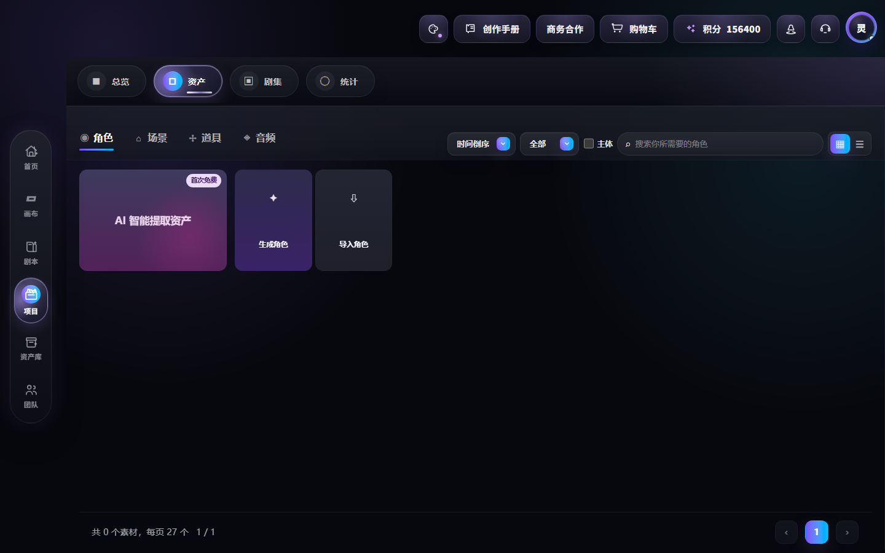

资产是后续分镜稳定的关键。角色、场景、道具越清楚，分镜图和视频越容易保持一致。

怎么做：

1. 在项目内点击“资产”。
2. 优先准备主角、关键场景和重要道具。
3. 可以手动添加，也可以从项目资产库或团队资产库选择。

完成标志：

- 角色、场景、道具至少各有一个可用素材或文字描述。
- 素材名称能被你一眼识别，例如“废土主角”“旧街区夜景”“旧式通讯器”。

## 7. 导入或添加资产

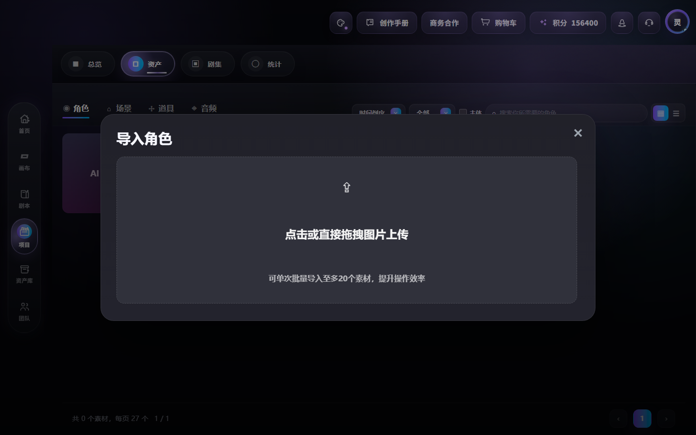

当项目资产不足时，进入导入弹窗补齐素材。当前产品支持角色、场景、道具等资产类型。

怎么做：

1. 点击“导入资产”或“手动添加”。
2. 选择资产类型。
3. 上传图片或从资产库选择。
4. 给资产写清楚描述：外貌、服装、时代、光线、材质、用途。

完成标志：

- 资产卡片能出现在项目资产页。
- 在剧集工作台里可以通过“项目资产库”或“团队资产库”引用它。

卡住怎么办：

- 如果团队资产库不可用，通常是会员权益或团队权限未开通。
- 如果上传失败，检查文件格式和大小。

## 8. 进入剧集制作

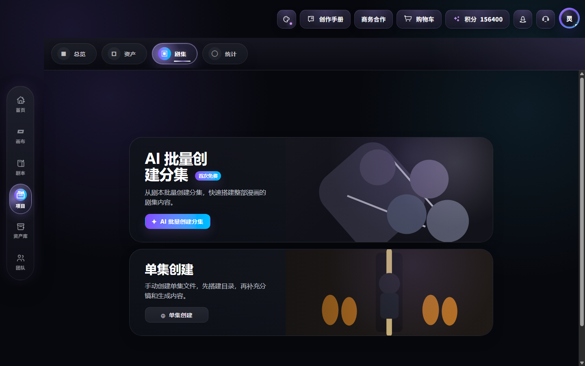

剧集页是进入分镜工作台的入口。你可以批量创建分集，也可以单集创建。

怎么做：

1. 在项目内点击“剧集”。
2. 如果你已经有分集正文，优先用“AI 批量创建分集”。
3. 如果只做一集测试，点击“单集创建”。
4. 创建后打开对应剧集，进入剧集工作台。

完成标志：

- 剧集列表里出现可进入的剧集。
- 点击剧集后进入包含“角色/场景”和“分镜”的工作台。

## 9. 在剧集工作台补角色/场景

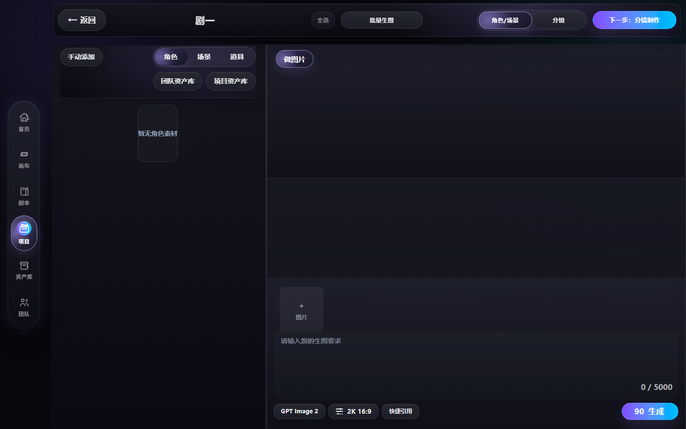

进入剧集工作台后，先处理“角色/场景”。这里决定本集会用哪些角色、场景和道具。

怎么做：

1. 确认右上角切换停在“角色/场景”。
2. 左侧选择角色、场景或道具。
3. 点击“手动添加”“项目资产库”或“团队资产库”补素材。
4. 在下方输入生图要求，必要时先生成角色图或场景图。

完成标志：

- 左侧不再是“暂无角色素材”。
- 关键角色和场景已经可以在分镜里引用。

卡住怎么办：

- 如果这里为空，先回项目资产页补素材，或在当前页手动添加。
- 如果点击生成提示积分不足，先充值或开通对应权益。

## 10. 新增并编辑分镜

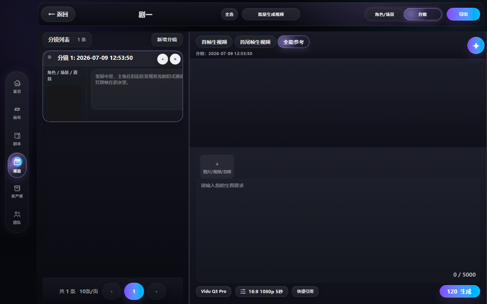

切到“分镜”后，开始把剧情拆成镜头。每条分镜都应能单独生成一张图和一段视频。

怎么做：

1. 点击右上角“分镜”。
2. 点击“新增分镜”。
3. 在分镜描述里写清镜头内容。
4. 需要多镜头时继续新增分镜。

完成标志：

- 左侧“分镜列表”至少有 1 条分镜。
- 每条分镜都有明确画面描述。

推荐描述结构：

`画幅 + 景别 + 主体 + 动作 + 环境 + 光线/情绪`

示例：

`竖屏中景，主角在旧街区发现发光的旧式通讯器，冷色灯牌映在积水里，氛围紧张。`

## 11. 先做分镜图

视频生成前，先得到稳定的分镜图。当前视频链路会要求首帧图或参考图，直接跳到视频往往会被系统拦住。

怎么做：

1. 选中一条分镜。
2. 检查分镜描述是否完整。
3. 按当前页面的图片生成入口生成图片。
4. 图片结果出现后，点击“设为分镜图”。

完成标志：

- 分镜卡片里出现图片预览。
- 当前分镜有可用首帧图。

卡住怎么办：

- 如果生成按钮旁显示积分数，说明本次生成会消耗积分。
- 如果结果不满意，先改描述，再重新生成，不要急着进入视频。

## 12. 切到视频生成

有了分镜图后，再切到视频模式。当前工作台支持“首帧生视频”“首尾帧生视频”“全能参考”等模式。

怎么做：

1. 在分镜工作台选择“首帧生视频”。
2. 检查模型、比例、清晰度和时长。
3. 如果使用“首尾帧生视频”，需要同时准备首帧和尾帧。
4. 在提示词里写运动、镜头和情绪变化。

完成标志：

- 页面没有提示“请先上传首帧图片”。
- 生成按钮可点击。

提示词示例：

`镜头缓慢推进，主角低头看向发光通讯器，蓝光照亮脸部，背景旧街区保持冷色压抑。`

## 13. 生成视频并设为分镜视频

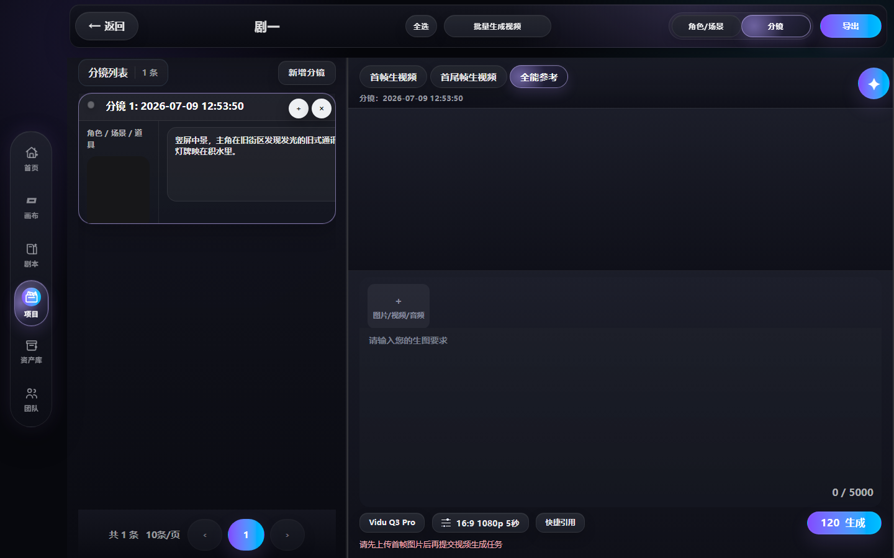

点击生成后，等待视频任务完成。视频完成后，结果区域会出现视频卡片和“设为分镜视频”操作。

怎么做：

1. 点击“生成”。
2. 等待任务完成，不要重复快速点击。
3. 视频结果出现后先预览。
4. 满意后点击“设为分镜视频”。

完成标志：

- 分镜卡片中能看到视频预览或视频状态。
- 当前分镜不再提示缺少视频。

卡住怎么办：

- 如果页面提示“请先上传首帧图片后再提交视频生成任务”，回到上一步先设为分镜图。
- 如果任务失败，检查会员/积分、模型配置和提示词，再重新提交。
- 如果生成长时间无结果，刷新任务状态或稍后重试。

## 14. 打开导出

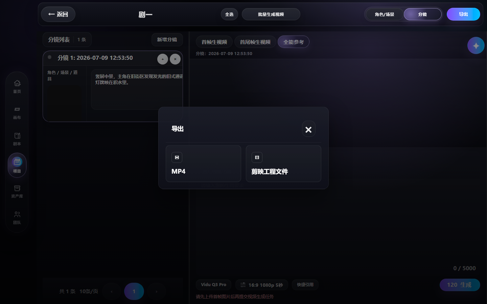

所有分镜都有视频后，再点击右上角“导出”。导出弹窗提供 MP4 和剪映工程文件入口。

怎么做：

1. 点击“导出”。
2. 选择 `MP4` 或“剪映工程文件”。
3. 等待系统检查素材完整性。

完成标志：

- 如果所有分镜都有视频，系统会生成可下载内容。
- 如果有分镜缺图或缺视频，系统会提示不能导出。

## 15. 下载视频或处理缺失项

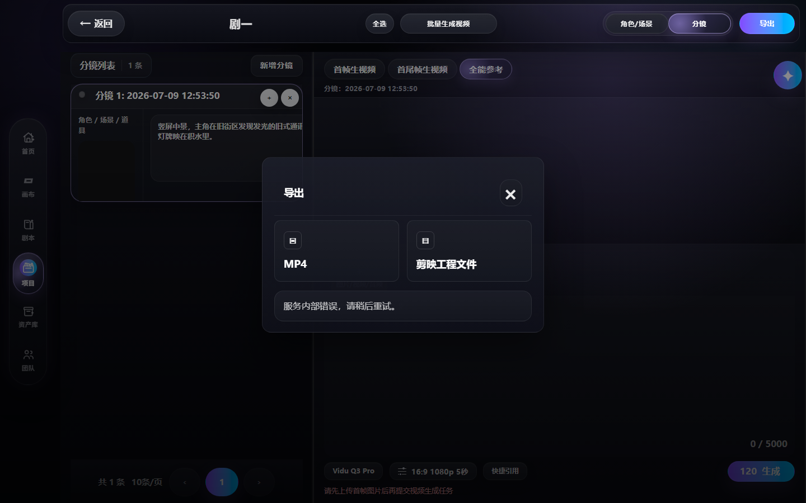

导出前系统会检查当前剧集是否满足导出条件。截图里的状态表示素材还没有满足完整导出条件，这是正常的保护机制。

怎么做：

1. 如果出现下载入口，点击下载。
2. 如果出现“服务内部错误”“缺少视频”“请稍后重试”等提示，先回到分镜列表检查每条分镜。
3. 对缺少视频的分镜，重新生成并设为分镜视频。
4. 所有分镜完成后，再次导出。

完成标志：

- MP4 或工程文件可以下载。
- 每条分镜都有最终视频。

## 一条完整链路回顾

按当前产品，推荐顺序是：

1. 登录进入工作台。
2. 新建项目，确定风格和画幅。
3. 在剧本页准备正文。
4. 在项目资产页补角色、场景、道具。
5. 进入剧集页，创建或打开单集。
6. 在剧集工作台先补角色/场景。
7. 切到分镜，新增并编辑分镜。
8. 先生成分镜图，并设为分镜图。
9. 再用首帧图生成视频，并设为分镜视频。
10. 所有分镜视频完成后导出 MP4 或剪映工程。

## 常见问题

**为什么不能直接生成视频？**
当前视频模式通常需要首帧图、尾帧图或参考素材。先做分镜图，可以减少人物漂移和画面不稳定。

**为什么导出失败？**
导出需要完整素材。只要还有分镜没有视频，或视频结果没有设为分镜视频，就可能无法导出。

**什么时候用资产库？**
角色、场景、道具会反复出现时，先放进资产库。这样每条分镜都能引用同一批素材，画面更统一。

**什么时候用画布？**
画布适合做单镜头实验、素材探索和非线性节点尝试。正式剧集生产建议从“项目 -> 剧集 -> 分镜工作台”走完整链路。
