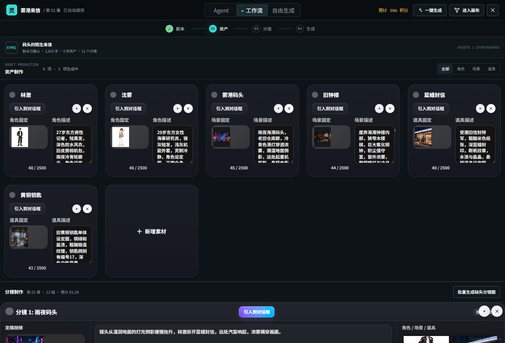
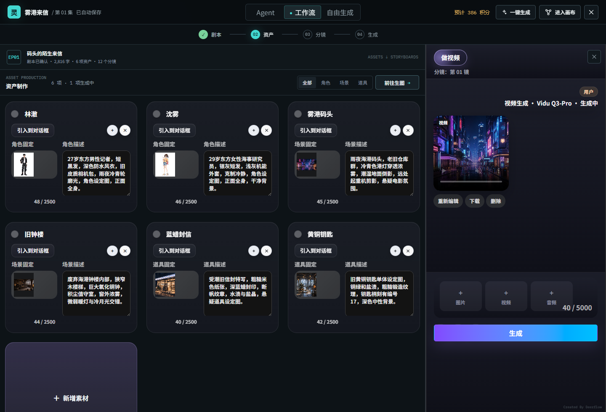
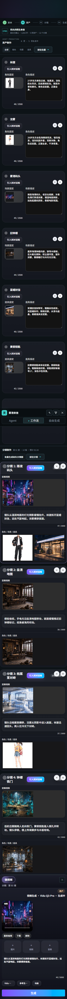

# 三模式创作工作台与剧集工作流布局设计

## 1. 文档状态

- 状态：工作流交互原型已确认，待生产实现
- 日期：2026-08-13
- 范围：首页三模式切换、现有剧集工作台的工作流布局
- 非范围：接口实现、数据库变更、生成调度改造、正式页面代码
- 交互原型：`design-previews/workflow-mode-prototype/index.html`

### 1.1 一句话定义

工作流模式不是一套新的制作页面，而是**现有剧集工作台的工作流布局**：继续使用同一个 `renderEpisodeWorkbench`、同一个 `workbench.ui`、同一批资产与分镜对象、同一套图片/视频生成能力，只改变入口、排列方式和生成工作台的显示时机。

允许存在工作流模式入口或路由，但该入口必须挂载现有剧集工作台组件树，不能创建第二套资产页、分镜页或生成页。

### 1.2 用户看到的最终页面

| 区域 | 最终功能 | 默认状态 |
| --- | --- | --- |
| 顶部栏 | Agent / 工作流 / 自由生成切换、自动保存状态、积分预估、一键生成、进入画布、关闭 | 工作流模式高亮 |
| 项目摘要 | 当前剧集、章节、字数、资产数、分镜数和阶段状态 | 始终显示 |
| 资产区 | 角色、场景、道具筛选；现有资产卡片内直接编辑；多列自动换行 | 全宽显示 |
| 分镜区 | 现有完整分镜卡片、媒体、描述、对白/旁白、引用和操作 | 位于资产区下方，全宽显示 |
| 生成工作台 | 现有图片/视频生成结果对话区和 Prompt Dock | 默认关闭，不占宽度 |
| 一键生成 | 全部资产与分镜 / 仅缺失资产 / 仅缺失分镜 | 右上角菜单 |
| 任务状态 | 提交后轻提示，后台任务继续运行 | 页面不显示任务队列 |

页面不显示“前往生图”和“前往分镜”。点击资产卡直接打开图片工作台，点击分镜卡直接打开视频工作台。

### 1.3 两种进入流程

#### 从首页创建或进入工作流

```text
首页选择工作流
  -> 上传剧本/小说或输入故事要求
  -> 使用现有项目与剧集创建/选择能力
  -> 使用现有小说转剧本、剧本解析能力
  -> 打开 renderEpisodeWorkbench(workflow 布局)
  -> 查看并编辑现有资产与分镜
  -> 单卡生成或调用现有批量生成
  -> 结果写回现有剧集、画布和任务历史
```

#### 从已有剧集切换到工作流

```text
打开已有剧集
  -> 切换为工作流布局
  -> 不复制、不调用工作流专用接口、不做同步
  -> 如需重新加载，继续使用剧集工作台现有加载器
  -> 直接显示当前 workbench.ui 中的资产、分镜和生成结果
  -> 任一布局中的修改立即反映到另一布局
```

### 1.4 页面内操作流程

```text
默认：资产 + 分镜全宽显示，生成工作台关闭

点击资产卡
  -> 复用现有选中资产行为
  -> 右侧打开现有生成工作台
  -> museScopeMode = assets
  -> 显示图片模型、参考图片、提示词和图片结果

点击分镜卡
  -> 复用现有选中分镜行为
  -> 右侧打开或更新现有生成工作台
  -> museScopeMode = storyboard
  -> 显示视频模型、参考图片/视频/音频、提示词和视频结果

关闭工作台
  -> 只关闭右侧 UI
  -> 资产与分镜恢复全宽
  -> 不清空业务数据、不取消任务
```

### 1.5 复用与新增边界

| 能力 | 处理方式 | 生产来源 |
| --- | --- | --- |
| 剧集工作台 | 复用 | `renderEpisodeWorkbench` |
| 资产区与资产卡 | 复用 | `renderAssetPanel` 及现有资产卡逻辑 |
| 分镜区与分镜卡 | 复用 | `renderStoryboardPanel`、`renderStoryboardCard` |
| 图片/视频生成工作台 | 复用 | 现有生成结果对话区、`renderPromptDock` |
| 资产、分镜、提示词和选择状态 | 复用 | 同一个 `workbench.ui` 和剧集业务对象 |
| 保存、冲突处理、轮询、结果回填 | 复用 | production workbench 现有状态层 |
| 模型、参数、附件、参考素材 | 复用 | 现有图片/视频生成配置 |
| 批量生成、积分、任务中心 | 复用 | 现有批量任务与积分链路 |
| 工作流入口/模式切换 | 新增纯 UI 入口 | 进入同一剧集工作台 |
| 资产上、分镜下的排列 | 新增布局变体 | CSS / 布局参数 |
| 生成工作台打开/关闭 | 新增纯 UI 状态 | 不复制业务数据 |
| 一键生成范围菜单 | 新增 UI 选择器 | 调用现有批量生成动作 |
| 阶段条 | 新增展示层 | 从现有资产、分镜和任务状态派生 |

明确禁止：

- 不新建工作流资产接口、分镜接口、生成接口或任务接口。
- 不新建工作流专用数据库表、DTO、缓存副本或同步接口。
- 不复制 `workbench.ui`，不实现剧集页与工作流页之间的双向同步代码。
- 不重写资产卡、分镜卡、Prompt Dock、模型选择、参考素材或生成结果卡。
- 不新建页面内任务队列，也不新建另一套积分、轮询和结果回填逻辑。
- 原型 HTML 只表达布局和交互，不作为生产组件源码复制。

## 2. 背景与目标

当前首页输入框已经具备附件、图片模型、视频模型和 Canvas Agent 入口，画布内也已有剧本拆解、资产节点、分镜节点、批量生成与任务中心。新设计不复制这些能力，而是把不同创作意图显式分为三种模式，并提供一致的项目上下文和任务反馈。

目标：

1. 用户进入首页后能明确选择 Agent、工作流或自由生成，不再依赖系统猜测意图。
2. Agent 模式保持默认，发送后直接进入画布并启动 Agent。
3. 工作流模式把现有剧集中的剧本、资产、分镜和生成能力按连续制作流程重新排列，任务仅保留轻提示和现有全局入口。
4. 自由生成模式复用画布内现有 Agent 对话界面，以受限生成模式直接选择图片、视频或音频模型；它不具有画布操作能力。
5. 三种模式共享模型目录、积分规则、素材库、项目归属、生成任务和结果历史。

## 3. 产品原则

### 3.1 三种入口，一套底层对象

三种模式只是操作方式不同，不能形成三套互不兼容的数据：

- 项目是作品归属容器。
- 画布节点是资产、分镜和生成结果的结构化来源。
- 生成任务是运行状态的唯一来源。
- 素材库保存可跨项目复用的已确认资产。
- 工作流页面是同一批画布节点的结构化视图，不保存节点内容副本。
- 自由生成只复用画布内 Agent 对话界面和生成链路，生成结果不自动成为画布节点，也不能通过该模式修改画布。

### 3.2 工作流不是向导

资产、分镜和生成存在高频交叉检查。把它们拆成“下一步”式向导，会导致用户来回切页确认角色一致性、镜头引用和生成状态。因此工作流采用单页制作台：所有核心对象同时可见，阶段状态用于提示完成度，不用于限制导航。

### 3.3 生成不阻塞编辑

关闭工作流页面后，后台任务继续运行。用户可继续修改未提交项、进入画布或离开项目。已经提交的任务保留提交快照，后续文本修改不应静默改变运行中的请求。

## 4. 三种模式、入口与切换

三种模式共用账号、项目、模型、积分、上传、生成任务和结果数据，只改变用户发起工作的方式与页面排列。模式切换不能复制资产、分镜或生成结果，也不能创建一套新的后端业务。

“自由生成”即最初提出的“对话模式”。它复用画布内现有 Agent 对话界面，但运行在无画布工具权限的生成范围中：用户像即梦一样直接生成图片、视频或音频，不能通过该对话读取、创建或修改画布内容。

### 4.1 总体模式对比

| 模式 | 默认 | 适用场景 | 主要输入 | 发送后进入 | 核心复用能力 | 结果归属 |
| --- | --- | --- | --- | --- | --- | --- |
| Agent | 是 | 目标开放、需要 AI 规划和多步协作 | 自然语言、图片、视频、文档、模型偏好 | 当前或新建项目的画布，启动现有 Canvas Agent 会话 | Agent 对话、工具调用、画布节点与连线、附件、生成任务 | 当前项目画布及现有任务/会话历史 |
| 工作流 | 否 | 已有小说或剧本，希望连续完成剧本、资产、分镜和生成 | 小说、剧本、TXT、MD、PDF、DOCX、自然语言补充 | 当前或新建剧集的 `renderEpisodeWorkbench` 工作流布局 | 小说转剧本、剧本解析、资产卡、分镜卡、Prompt Dock、批量生成 | 当前剧集、同一 `workbench.ui` 及现有任务历史 |
| 自由生成 | 否 | 已有明确创意，希望在对话中直接生成图片、视频或音频 | 提示词、参考图片/视频/音频、模型和参数 | 画布内现有 Agent 对话界面的受限生成模式 | 对话消息流、媒体模型选择、参数、附件、生成任务、轮询和结果展示 | 当前自由生成对话及现有生成记录；不写入画布 |

是否需要 Agent 规划，是三种模式最直接的选择标准：需要 AI 拆解任务时使用 Agent；需要按剧集制作链路集中处理时使用工作流；只需要一次图片或视频生成时使用自由生成。

### 4.2 Agent 模式（默认）

Agent 模式保留当前 Canvas Agent 的使用方式，不新建 Agent 页面或 Agent 接口。

主要功能：

- 用户通过自然语言描述目标，可同时上传图片、视频和文档，并选择模型偏好。
- 点击发送后，系统使用现有项目/画布选择或创建能力解析上下文，然后直接进入画布并启动现有 Canvas Agent 会话。
- Agent 可继续使用已有工具完成内容理解、节点创建、节点修改、连线、资产/分镜处理及图片/视频生成。
- 用户可在画布中继续对话、调整节点、查看生成状态和处理结果，不被固定制作步骤限制。
- 在项目内切换到 Agent 时，直接进入当前项目画布；没有项目上下文时，沿用现有项目和画布创建流程。
- Agent 创建的节点、媒体和任务仍写入现有项目画布、会话历史和任务历史，不产生“Agent 模式副本”。

发送流程：

```text
选择 Agent（默认）
  -> 输入目标并上传附件
  -> 点击发送
  -> 使用现有项目/画布解析或创建能力
  -> 打开当前项目画布
  -> 启动现有 Canvas Agent 会话
  -> Agent 调用现有画布工具和生成能力
  -> 结果写入当前画布及现有任务历史
```

### 4.3 工作流模式

工作流模式面向完整剧集制作。它不是另一套页面，而是现有剧集工作台的工作流布局；详细页面结构见第 5 至 12 节。

主要功能：

- 用户可选择已有项目和剧集，或上传/粘贴小说、剧本及相关文档。
- 小说输入复用现有小说转剧本能力，确认正式剧本后再调用现有解析能力生成资产和分镜结构。
- 页面中资产在上、分镜在下，同时显示；两者使用现有完整卡片和卡内编辑能力。
- 生成工作台默认关闭。点击资产卡打开现有图片工作台，点击分镜卡打开现有视频工作台，且可以关闭。
- 右上角“一键生成”只选择现有批量生成的执行范围，不新增生成调度。
- 工作流与普通剧集页读写同一份剧集数据和 `workbench.ui`；任一处修改，另一处立即显示同一状态。
- 生成任务离开页面后继续运行，状态和结果仍由现有任务中心、轮询及结果回填链路处理。

进入流程：

```text
选择工作流
  -> 选择已有剧集，或输入/上传小说与剧本
  -> 使用现有项目、剧集、小说转剧本及解析能力
  -> 打开 renderEpisodeWorkbench(workflow 布局)
  -> 在同一页编辑资产和分镜
  -> 点击卡片进行单项生成，或调用现有一键批量生成
  -> 结果写回当前剧集、画布和现有任务历史
```

### 4.4 自由生成模式（原对话模式）

自由生成模式面向“在对话中直接出图、出视频或生成音频”，不启动 Agent 规划，不解析剧本，也不进入工作流布局。它复用画布内现有 Agent 对话界面、消息流、附件入口、模型选择和生成结果展示，通过模式权限限制只开放媒体生成能力，而不是复用项目生成工作台或新建一套自由生成页面。

自由生成与 Agent 模式的区别不在对话界面，而在能力范围：

| 能力 | Agent 模式 | 自由生成模式 |
| --- | --- | --- |
| 自然语言对话 | 支持 | 支持生成意图输入 |
| 图片/视频/音频模型选择与生成 | 支持 | 支持 |
| 读取画布节点和连线 | 支持现有 Agent 能力 | 禁止 |
| 创建、修改、删除画布节点和连线 | 支持现有 Agent 能力 | 禁止 |
| 调用画布编辑工具或改变画布视图 | 支持现有 Agent 能力 | 禁止 |
| 生成结果自动写入画布 | 按现有 Agent 行为 | 禁止 |

这一限制必须落实在对话运行范围和工具权限上，不能仅在界面上隐藏画布按钮。自由生成请求不得携带可修改画布的工具集合，也不得通过消息副作用触发节点或连线写入。自由生成的失败提示使用媒体生成语义，不向用户暴露“Canvas/画布”内部术语。

公共生成配置：

- 自由生成固定为自动执行，不展示“审核批准”等审批模式下拉，也不进入人工审批卡片。
- 输入区底部提供一个媒体类型下拉框，在“生成图片 / 生成视频 / 音频生成”之间切换；顶部不再放置三组媒体按钮。
- 每种类型只展示管理员已启用的模型，显示模型备注，不显示 API Key 名称、供应商密钥或接口内部字段。
- 参数控件由现有模型 `parameterSchema` 和 `defaultParams` 生成，积分预估继续使用现有模型价格配置。
- 发送时把当前媒体类型、模型和参数写入现有 Agent 消息；后端在任务校验前强制绑定用户选择，随后继续复用既有任务创建、价格计算、积分预扣和结果历史链路。

图片栏功能：

- 输入图片提示词，选择现有图片模型。
- 添加参考图片。
- 使用现有控件设置画幅、数量及模型支持的其他参数。
- 复用现有积分预估、任务提交、进度轮询、失败重试和图片结果展示。

视频栏功能：

- 输入动态提示词，选择现有视频模型。
- 按模型能力添加参考图片、参考视频和参考音频。
- 使用现有控件设置时长、分辨率及模型支持的其他参数。
- 复用现有积分预估、任务提交、进度轮询、失败重试和视频结果展示。

音频栏功能：

- 输入音频提示词，选择现有音频模型。
- 使用模型声明的音色、语速等参数；无参数的模型不显示空参数区。
- 复用现有积分预估、任务提交、进度轮询、失败重试和音频结果展示。

结果处理：

- 生成结果显示在复用的 Agent 对话消息流中，并继续进入现有生成任务与结果记录。
- 即使从项目或画布内进入，自由生成对话也不能读取选中节点、修改节点、创建节点或将结果自动插入画布。
- 从首页无项目上下文进入时，沿用现有对话和生成记录的归属规则，不新增“临时结果库”。
- 自由生成对话只负责生成和展示结果，不提供节点创建、节点替换、连接节点或其他影响画布的操作。

生成流程：

```text
选择自由生成
  -> 打开画布内现有 Agent 对话界面的受限生成模式
  -> 选择图片或视频生成
  -> 输入提示词、选择模型并添加参考素材
  -> 调整现有模型参数
  -> 直接提交现有生成任务
  -> 在复用的对话消息流中查看进度与结果
  -> 对话不读取或修改画布
```

### 4.5 两层模式切换

模式切换在两个位置出现，但行为不同：

| 位置 | 控件 | 切换后的行为 |
| --- | --- | --- |
| 首页主输入框上方 | Agent / 工作流 / 自由生成三段式分段控件 | 只改变输入框、附件和参数区；用户点击发送后才进入对应主界面或提交生成 |
| 项目内顶部栏 | 同一三段式分段控件 | Agent 进入画布，工作流进入当前剧集工作流布局，自由生成打开画布内现有 Agent 对话界面的受限生成模式，但不向它开放画布上下文和画布工具 |

默认与记忆规则：

- 每次新会话首次进入首页默认选中 Agent，确保“自然语言发送后进入画布”是主路径。
- 同一页面会话内返回首页时可保留本次选择；不把其他账号或其他项目的模式偏好带入当前上下文。
- 图片/视频模型和高级参数按模式独立记忆，不在切换时强行转换。

### 4.6 六种切换行为

| 从 | 切换到 | 保留内容 | 切换后动作 | 明确不做 |
| --- | --- | --- | --- | --- |
| Agent | 工作流 | 纯文本草稿、兼容文档、当前项目上下文 | 选择当前/已有剧集，或使用现有能力创建剧集并解析输入 | 不把 Agent 会话复制成剧本，不自动提交解析 |
| Agent | 自由生成 | 纯文本草稿、兼容参考附件 | 将现有 Agent 对话界面切换为受限生成模式，由用户选择图片/视频/音频和模型 | 不沿用画布选中内容，不开放画布工具，不自动发起生成 |
| 工作流 | Agent | 当前项目、剧集已保存状态及运行任务 | 进入当前项目画布并启动/恢复现有 Agent 会话 | 不复制剧集对象，不取消生成任务 |
| 工作流 | 自由生成 | 兼容的文本/附件草稿 | 打开画布内现有 Agent 对话界面的受限生成模式 | 不向对话传入选中资产、分镜或画布上下文 |
| 自由生成 | Agent | 当前项目上下文、兼容文本与附件草稿 | 进入画布并恢复 Agent 的现有工具范围，由用户发送后启动 Agent | 不自动把自由生成历史结果转成画布节点 |
| 自由生成 | 工作流 | 当前项目上下文、兼容剧本文档 | 选择/进入当前剧集；没有剧集时走现有创建和解析流程 | 不把普通生成提示词当作剧本，不复制生成历史 |

所有方向共同遵守：

- 切换模式不自动提交请求、不扣积分、不取消已经运行的任务。
- 纯文本草稿和兼容附件可以带入；目标模式不支持的参数保留在原模式，下次返回时恢复。
- 已经生成的媒体、资产和分镜保持原有归属，不因切换模式被移动或复制。
- 工作流卡内编辑沿用剧集工作台现有自动保存、冲突处理和离开保护，不新增工作流草稿同步层。
- 切换时缺少目标模式所需上下文，只调用现有项目、画布或剧集选择/创建能力。

### 4.7 三种模式共用能力

| 共用能力 | 处理规则 |
| --- | --- |
| 登录、用户与项目归属 | 完全沿用现有权限和当前主用户/子用户归属规则 |
| 项目、剧集与画布 | 使用同一业务对象，不按模式建立副本 |
| 模型目录与能力判断 | 使用现有图片/视频/文本模型配置及参考素材能力判断 |
| 文件与参考素材上传 | 使用现有上传、鉴权和素材引用链路 |
| 积分、价格与确认 | 使用现有预估、扣减和失败返还规则 |
| 生成任务 | 使用现有提交、队列、轮询、取消和重试能力 |
| 结果历史与回填 | 使用现有生成历史；自由生成结果只回到对话消息流，不自动回填画布 |
| 任务可见性 | 模式页面不新建任务队列，继续由现有全局任务中心承载 |

三种模式新增的只有入口、目标界面选择、工作流布局参数和少量纯 UI 展示状态；不得仅因增加模式切换而新增后端接口、数据库表、DTO 或同步服务。

## 5. 工作流布局信息架构

### 5.1 桌面布局

工作流为接近全屏的项目工作台，不使用普通居中弹窗。页面由七个区域组成：

1. 顶部栏：项目名称、三模式切换、保存状态、积分预估、进入画布、关闭。
2. 顶部项目摘要：当前剧本、章节、字数、资产数和分镜数；不再长期占用左侧栏。
3. 中央制作区：资产制作在上、分镜制作在下，形成连续的纵向制作流，不通过标签切换隐藏内容。
4. 资产制作区：直接挂载剧集页现有角色、场景、道具卡片，名称和描述沿用卡片内原位编辑行为，不另设第二套编辑器。
5. 分镜制作区：直接挂载剧集页现有分镜卡片和编辑行为，不另造精简卡片或工作流专用字段。
6. 生成对话工作台：默认关闭；点击资产卡或分镜卡时从右侧出现，可主动关闭。它复用项目现有剧集工作台的生成结果对话区和 Prompt Dock；资产对应图片栏，分镜对应视频栏。工作台关闭时资产与分镜占据全部可用宽度。
7. 一键生成：位于页面右上角，通过菜单选择生成全部资产与分镜、仅缺失资产或仅缺失分镜。

实现约束：工作流页面只是现有剧集工作台的排列变体，不复制、派生或重写资产卡、分镜卡、生成结果、Prompt Dock 和按钮。正式实现仍由同一个 `renderEpisodeWorkbench` 组合调用内部 `renderAssetPanel`、`renderStoryboardPanel`、`renderPromptDock`，仅由布局参数决定资产与分镜上下排列，并控制生成工作台的右侧显示/关闭。原型中的交互只用于演示；正式代码不允许用 DOM 转换或字段监听来模拟组件复用。

### 5.2 同源状态与实时一致性

工作流布局和常规剧集布局不是两份页面数据，也不得通过“保存后同步”维持一致。它们是同一个 production workbench 组件树在不同布局参数下的呈现，必须直接读取和修改同一个 `workbench.ui`、同一个剧集资产集合、同一个分镜数组及同一生成历史：

- 在剧集中修改资产名称、描述、分镜描述、素材引用、选中版本或生成结果，同一状态更新触发工作流布局重渲染，工作流模式立即显示相同内容。
- 在工作流模式中修改以上字段，同一状态更新触发剧集布局重渲染，剧集页面立即显示相同内容。
- 自动保存、冲突检测、任务轮询和生成结果回填只执行一次，由现有 production workbench 状态层负责。
- 禁止新建工作流专用资产/分镜 DTO、缓存副本或双向同步接口。
- 工作流模式的新增代码只能是布局变体、模式入口和必要的滚动/选中状态，不得 fork 现有组件业务逻辑。

验收时必须验证同一集的双入口一致性：在剧集布局修改任一资产名称或描述、任一分镜描述、引用素材及生成结果后，切换到工作流布局无需刷新或再次保存即可看到变更；反向操作同样成立。若需要额外的 `syncWorkflow*`、`copyEpisode*` 或映射 DTO 才能一致，则实现不通过验收。

推荐桌面栅格：

```text
顶部项目栏 + 模式切换
┌────────────────────────────────────────────────────────────┐
│ 项目 / 剧本摘要                                              │
├────────────────────────────────────────────────────────────┤
│ 资产制作（默认全宽）                │ 按需生成工作台     │
├────────────────────────────────────────────────────────────┤
│ 分镜制作（默认全宽）                │ 图片 / 视频栏      │
└────────────────────────────────────────────────────────────┘
```

### 5.3 窄屏布局

- 小于 1024px 时，项目摘要保持顶部紧凑展示；点击卡片后，生成对话工作台排列在资产与分镜内容之后，关闭后不占据页面空间。
- 资产制作与分镜制作保持上下排列，移动端也不通过切换按钮隐藏任一区域。
- 资产卡片改为单列或双列，并保留剧集页资产卡片的全部字段与编辑能力。
- 分镜卡片改为纵向排列，并保留剧集页分镜卡片的全部字段与编辑能力。
- 不为了适配移动端删减模型、失败重试或任务状态。

## 6. 单页核心区域

### 6.1 顶部阶段状态

阶段显示“剧本、资产、分镜、生成”四段，但每段都可以点击定位页面区域。

状态枚举：

- `not_started`：未开始
- `running`：处理中
- `needs_review`：需要确认
- `ready`：可进入下一阶段
- `partial`：部分完成或存在失败项
- `completed`：已完成

阶段条不是强制锁。只在确实缺少依赖时禁用某项生成，并在控件旁说明缺少的具体内容。

### 6.2 项目与剧本摘要

支持来源：

- 选择项目已有剧本
- 上传 TXT、MD、DOCX、PDF
- 直接粘贴正式剧本
- 上传或粘贴小说，由文本模型先转换为正式剧本

页面显示正式剧本，而不是直接拿小说原文拆资产。小说链路固定为：

```text
小说原文 -> 剧本生成 -> 用户确认正式剧本 -> 资产/分镜解析
```

顶部摘要显示当前章节名称、字数、资产数、镜头数和解析状态。完整章节管理继续使用项目已有入口；重新解析时保留已经生成的媒体版本，不自动删除或覆盖。

### 6.3 资产制作区

资产按角色、场景、道具筛选，位于分镜制作区上方。这里直接渲染现有 `renderAssetPanel`，仅由工作流布局让其使用自适应卡片网格，同一行尽量展示多项，容器宽度不足时自动换行。卡片内容、编辑方式和操作能力与剧集页保持完全一致，包括：

- 预览图或空状态
- 名称和资产描述沿用现有卡片内编辑与失焦保存行为
- 被多少个分镜引用
- `待确认 / 待生成 / 生成中 / 已完成 / 失败`
- 版本数量
- 单项编辑、上传、生成、重试

资产制作区提供“仅看缺失”和“批量生成缺失项”。点击资产卡后，右侧生成对话工作台打开并严格进入项目 `assets` 范围，强制图片模式并初始化资产生成草稿；图片栏支持添加多张参考图片。

### 6.4 分镜制作区

分镜区直接渲染现有 `renderStoryboardPanel` 和 `renderStoryboardCard`，卡片字段、标题、对白/旁白、素材引用、编辑行为及操作按钮均不得因工作流入口而删减或改名。工作流模式只负责把完整分镜卡片排列在资产区下方，包括：

- 镜号与时长
- 分镜预览图
- 剧集页现有的标题、描述、对白/旁白和素材引用
- 剧集页现有的提示词与编辑字段
- 静态图状态
- 视频状态
- 行级生成、重试和更多操作

修改任一分镜字段会直接更新同一个分镜对象，不复制数据。点击分镜卡后，右侧生成对话工作台打开并严格进入项目 `storyboard` 范围和视频栏，恢复当前分镜生成上下文。

### 6.5 项目现有生成对话工作台

工作流页面按需显示项目现有剧集工作台的生成对话组件和状态，不另建一套通用设置侧栏：

- 上部为当前对象与图片/视频栏标识。
- 中部为生成请求及结果历史，可显示图片或视频结果、状态与积分。
- 底部复用项目 Prompt Dock，包含参考素材托盘、提示词输入、生成方式、模型和明确的生成按钮。
- 点击资产卡直接以 `assets` 范围打开图片工作台，不显示额外“前往生图”按钮。
- 点击分镜卡直接以 `storyboard` 范围打开视频工作台，不显示额外“前往分镜”按钮。
- 初始不显示；点击资产或分镜后显示，关闭后释放右侧宽度，资产与分镜恢复全宽。
- 模型、附件、参考素材、参数、提示词、积分显示和提交动作继续由现有剧集工作台状态驱动，工作流页面不建立第二套生成状态。

参考素材入口：

- 资产图片栏：可添加多张参考图片。
- 分镜视频栏：可添加参考图片、参考视频和参考音频；三类素材使用独立入口和独立限制提示。
- 上传项必须可预览、替换和移除，提交时保存本次请求快照。

批量入口必须明确本次作用范围；单项生成按钮沿用项目现有生成组件的文案与行为：

- 项目组件：`立即生成图片` / `立即生成视频`
- `批量生成 12 个缺失资产`

不得只显示含义模糊的“立即生成”。

### 6.6 任务状态

工作流页面不显示任务队列，也不在页面内增加任务中心区域。提交成功后只使用轻提示反馈；任务继续由项目现有全局任务中心承载，可查看：

- 对象类型和名称
- 模型
- 当前阶段
- 进度或排队序号
- 积分冻结/实际消耗
- 创建时间
- 取消、重试、查看结果

失败任务不能让整批任务变成不可操作。批次状态允许 `partial`，成功结果立即可用，失败项可单独重试。

## 7. 关键交互流程

### 7.1 从首页进入工作流布局

1. 首页切换到工作流。
2. 上传剧本/小说或输入故事要求。
3. 选择创建新项目或加入已有项目。
4. 系统打开工作流页面并开始解析。
5. 正式剧本先出现，资产与分镜区域显示逐步返回的结果。
6. 用户确认或修改解析结果。
7. 批量生成缺失资产。
8. 检查分镜的资产引用并生成分镜图/视频。
9. 结果可直接进入画布继续编辑。

### 7.2 解析变更

- 正式剧本修改后标记受影响的资产和分镜为“内容已变更”。
- 已生成媒体保留历史版本，不自动失效或删除。
- 用户选择重新解析时，先展示差异：新增、更新、可能移除。
- 删除真实下游节点必须二次确认；仅解除当前工作流关系不得删除素材库资产。

### 7.3 离开与恢复

- 自动保存文本和结构化编辑草稿。
- 生成任务提交后独立运行。
- 再次打开项目时恢复滚动位置、当前章节、资产分类和选中分镜。
- 任务失败或完成通过全局任务中心同步通知。

## 8. 状态与异常

必须覆盖：

- 空项目：引导上传剧本，不显示伪造内容。
- 解析中：正式剧本、资产、分镜分区分别显示独立进度。
- 部分解析失败：保留成功分区，可单独重试失败分区。
- 无可用模型：准确提示缺少图片模型或视频模型配置。
- 积分不足：生成按钮旁显示所需和可用积分，允许减少数量或更换模型。
- 文件解析失败：保留原上传记录，允许更换文件或直接粘贴文本。
- 任务结果未知：进入人工检查状态，不自动重复扣费提交。
- 网络中断：本地草稿保留；恢复后刷新服务端任务快照。
- 节点被画布外部修改：工作流读取相同画布文档并刷新，不覆盖外部变更。

## 9. 权限边界

- 项目与团队归属只基于当前主用户及其子用户关系。
- 子账户沿用现有授权能力，不因新增模式获得越权创建或删除权限。
- 模型目录、积分价格和可用参数以后端管理员配置为准。
- 工作流页面不展示或接受历史迁移旧归属字段。

## 10. 数据与接口复用约束

本次方案默认不新增后端接口、数据库结构或媒体生成链路。工作流模式必须调用生产环境已经存在的能力：

- 项目、剧集与正式剧本的读取和保存。
- 小说转剧本及剧本解析。
- 角色、场景、道具和分镜的读取、编辑、删除、引用与版本管理。
- 图片/视频模型配置、生成参数、参考素材上传和生成提交。
- Canvas generation batch 批量生成。
- 任务创建、轮询、取消、重试、积分冻结/结算和结果归档。
- 画布节点文档、revision、节点运行历史和全局任务中心。

前端只允许增加以下编排信息：

- 当前是否为 `workflow` 布局。
- 右侧生成工作台是否打开。
- 一键生成菜单当前选择的范围。
- 工作流页面自己的滚动位置；若现有状态已有对应字段则直接复用。

阶段完成度、缺失数量、失败数量和运行中数量必须从现有资产、分镜和任务状态派生，不保存第二份聚合业务数据。

只有在正式实现中确认某个动作没有任何现有入口时，才允许单独提出接口变更评审；不得因为原型展示了一个按钮就默认新增接口。

## 11. 已确认交互原型

### 11.1 原型文件

| 交付物 | 路径 | 用途 |
| --- | --- | --- |
| 可交互原型 | [`design-previews/workflow-mode-prototype/index.html`](../../design-previews/workflow-mode-prototype/index.html) | 产品、设计与研发共同评审基准 |
| 默认全宽态 | [`desktop.png`](../../design-previews/workflow-mode-prototype/desktop.png) | 桌面端默认布局参考 |
| 工作台打开态 | [`workbench-open.png`](../../design-previews/workflow-mode-prototype/workbench-open.png) | 点击分镜后的视频工作台参考 |
| 窄屏态 | [`mobile.png`](../../design-previews/workflow-mode-prototype/mobile.png) | 移动端纵向布局参考 |
| 原型元数据 | [`finalized.json`](../../design-previews/workflow-mode-prototype/finalized.json) | 原型模式、迭代次数和范围声明 |

原型是布局与交互参考，不是待复制到生产环境的第二套页面实现。生产代码必须继续复用现有 production workbench 组件和状态。

### 11.2 默认全宽态



- 生成工作台默认不显示，也不保留空白占位。
- 资产区和分镜区上下连续排列，共同占据全部可用页面宽度。
- 资产使用自适应网格，一行尽可能展示多个现有资产卡，宽度不足时自动换行。
- 分镜使用现有横向分镜卡并纵向排列。
- 资产区不显示“前往生图”，分镜区不显示“前往分镜”。点击卡片本身就是打开生成工作台的入口。
- 右上角保留“一键生成”菜单，可选择“全部资产与分镜”“仅缺失资产”“仅缺失分镜”。
- 页面不显示任务队列。

### 11.3 按需生成工作台



生成工作台复用现有 `renderPromptDock` 及生成结果对话区，只改变显示时机：

| 用户动作 | 内容区 | 工作台 | 范围与媒体模式 |
| --- | --- | --- | --- |
| 初次进入工作流 | 全宽 | 关闭 | 无 |
| 点击资产卡 | 缩窄并保留当前滚动位置 | 右侧打开 | `assets` + 图片 |
| 点击另一资产卡 | 保持当前布局 | 更新当前对象 | `assets` + 图片 |
| 点击分镜卡 | 缩窄并保留当前滚动位置 | 右侧打开或更新 | `storyboard` + 视频 |
| 点击另一分镜卡 | 保持当前布局 | 更新当前对象 | `storyboard` + 视频 |
| 点击工作台关闭按钮 | 恢复全宽 | 关闭且释放宽度 | 清除仅与布局有关的选中高亮 |
| 按 `Esc` | 恢复全宽 | 关闭 | 与关闭按钮相同 |

资产图片工作台允许添加多张参考图片。分镜视频工作台允许分别添加参考图片、参考视频和参考音频。模型、生成方式、积分、提示词、附件、历史结果及提交行为全部沿用项目现有实现。

### 11.4 一键生成

“一键生成”位于页面右上角，使用菜单明确本次作用范围：

| 选项 | 作用对象 | 跳过规则 |
| --- | --- | --- |
| 全部资产与分镜 | 当前剧集的资产和分镜 | 已完成且无需更新的对象不重复提交 |
| 仅缺失资产 | 当前剧集未生成或失败的资产 | 已完成资产跳过 |
| 仅缺失分镜 | 当前剧集未生成或失败的分镜 | 已完成分镜跳过 |

菜单只负责选择现有批量生成能力的范围，不新建任务协议或调度链路。提交前沿用项目现有积分预估和确认规则，提交后只显示轻提示。

### 11.5 组件与状态映射

| 原型区域 | 生产实现 | 状态来源 |
| --- | --- | --- |
| 工作流组合页 | `renderEpisodeWorkbench` 的 workflow 布局变体 | `workbench.ui` |
| 资产卡片区 | `renderAssetPanel` | 当前剧集资产集合、`selectedEpisodeCardId` |
| 分镜卡片区 | `renderStoryboardPanel` / `renderStoryboardCard` | `workbench.ui.storyboards`、`selectedStoryboardId(s)` |
| 图片/视频工作台 | 现有生成结果对话区 + `renderPromptDock` | `museScopeMode`、现有模型与生成状态 |
| 一键生成 | 现有批量生成能力 | 现有任务、积分和轮询状态 |

工作台的打开/关闭可以新增为纯界面状态，但资产、分镜、提示词、引用、生成任务和结果不得复制到工作流专用状态中。

### 11.6 窄屏原型



- 默认仍先显示资产和分镜，不显示生成工作台。
- 资产卡片改为单列，分镜卡片内部改为纵向布局。
- 点击卡片后，生成工作台排列在资产与分镜内容之后；关闭后不占据空间。
- 不因窄屏删减参考素材、模型、重试、积分或生成状态。

### 11.7 原型覆盖范围

交互原型展示：

- 顶部三模式切换
- 单页项目摘要，以及上下连续排列的资产制作、分镜制作
- 直接复用剧集页资产卡片及其名称、描述、引用、版本与编辑能力
- 直接复用剧集页完整分镜卡片及其标题、描述、对白/旁白、引用与操作能力
- 按需出现且可关闭的项目现有生成结果对话区与 Prompt Dock；资产点击进入图片栏，分镜点击进入视频栏
- 右上角一键生成范围菜单
- 资产图片参考图入口，以及视频参考图片、参考视频、参考音频入口
- 角色/场景/道具筛选
- 资产与分镜卡片选择状态，以及对应的项目图片/视频生成范围切换
- 模拟提交任务、进度和结果状态
- 桌面与窄屏响应式布局

原型不展示真实接口调用、积分扣费、文件解析和模型返回结果，不作为生产代码使用。

## 12. 生产实现验收

1. 首页首次进入默认选中 Agent；用户发送后直接进入当前或新建项目画布，并启动现有 Canvas Agent，不新建 Agent 页面或接口。
2. 工作流发送后进入现有 `renderEpisodeWorkbench` 的工作流布局；已有剧集不得被复制为工作流专用剧集。
3. 自由生成必须复用画布内现有 Agent 对话界面、消息流、附件、模型选择和生成结果展示，不得改为复用项目图片/视频工作台或另建页面。
4. 自由生成运行范围只能提交和展示图片、视频或音频生成；请求侧不得注入画布上下文或画布工具，且不能读取、创建、修改、删除画布节点与连线。
5. 三种模式切换不自动提交请求、不扣积分、不取消运行任务，也不复制资产、分镜、媒体或生成历史。
6. 切换后保留允许共享的文本/附件草稿；自由生成不得因此获得项目画布内容，不兼容的模型参数按原模式独立保留。
7. 工作流使用全屏工作台，资产在上、分镜在下，不通过标签切换隐藏任一区域。
8. 默认不显示生成工作台，资产和分镜占据完整宽度；工作台关闭后必须立即释放宽度。
9. 点击资产卡打开现有图片工作台；点击分镜卡打开现有视频工作台；不显示“前往生图”和“前往分镜”。
10. 资产、分镜、生成结果对话区和 Prompt Dock 必须复用现有组件，不得根据原型 HTML 重写一套。
11. 剧集页和工作流布局直接读写同一个 `workbench.ui` 和业务对象，任何一侧修改后另一侧无需同步接口即可看到结果。
12. 一键生成只选择现有批量生成能力的范围，不创建第二套任务、积分、轮询或结果回填逻辑。
13. 模式页面不显示任务队列；提交反馈使用轻提示，后台任务继续由现有全局任务中心承载。
14. 不得仅为三模式入口新增后端接口、数据库表、模式专用 DTO、数据副本或同步服务。
15. 桌面端和窄屏端均不得出现横向溢出、卡片异常拉伸、文本遮挡或工作台无法关闭。
