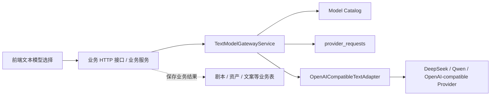

# Text Model Gateway v1 Design

> Date: 2026-06-01
> Status: Pending written-spec review
> Scope: 后端内部文本模型网关 service，支持 OpenAI-compatible chat completions 流式调用
> Out of scope: 公开 `/v1/chat/completions` API、后台管理页面、自动 fallback、业务提示词模板、业务任务编排、完整原始输入输出存储

## 1. 背景

当前项目已经有 `apps/backend/src/modules/model-gateway`，并且 `provider_requests` 表已经能记录 provider request attempt、payload hash、外部提交开始时间、外部请求 id、状态和失败码。现有 gateway 更偏图像生成和通用 provider request 记录，还没有面向文本大模型的 OpenAI-compatible 调用层。

本次 v1 要解决的是：剧本解析、提示词优化、资产描述生成、文案润色等所有文本模型能力，都通过一个内部基础服务调用用户选择的模型。网关只做基础设施职责，不理解业务，不决定业务流程。

已有的 2026-05-25 LLM gateway spec 偏未来完整平台。本 spec 是当前 v1 的收敛版，明确删掉第一版不做的范围。

## 2. 已确认决策

1. v1 只做后端内部 service，不做公开 OpenAI-compatible HTTP edge。
2. 请求体采用 OpenAI-compatible Chat Completions 形态，优先复用 OpenAI Node SDK，并通过 `baseURL` 接入 DeepSeek、Qwen / DashScope compatible mode 等 provider。
3. v1 做流式，主返回形态是 `AsyncIterable<ChatCompletionChunk>`。
4. 网关不管理业务 prompt template。`messages`、`response_format`、温度等请求参数由业务服务组装。
5. 网关不做 model capabilities 限制。业务能否使用某个模型不是网关策略。
6. 模型来自后端 model catalog。未知 model 严格失败。
7. 不做自动 fallback。用户选哪个模型，网关就只调用那个模型；失败后由前端弹窗提示用户换模型。
8. 网关不保存完整原始输入/输出，只保存 hash、摘要、provider request facts、usage、错误信息等审计事实。业务结果由业务表保存。
9. 网关所有调用都是同步 await / stream。队列、任务、重试、业务补偿都属于调用方服务。
10. 结构化结果的业务解析由业务服务负责。网关只保证 provider/protocol 层面的严格成功或失败。

## 3. 推荐方案

采用 **Internal TextModelGatewayService + OpenAI-compatible SDK adapter + backend model catalog**。

其它方案及取舍：

| 方案 | 优点 | 缺点 | 结论 |
| --- | --- | --- | --- |
| 内部 service + OpenAI-compatible SDK adapter | 最贴近当前 monorepo；业务调用简单；能复用 `provider_requests`；未来可拆成独立服务 | 第一版需要自己写 model catalog 和流式状态收口 | 采用 |
| 直接做公开 `/v1/chat/completions` | 更像完整 OpenRouter / OpenAI proxy；生态工具能直接接 | 第一版会引入鉴权、限流、租户 key、SSE HTTP 兼容等额外成本 | 暂缓 |
| 各业务模块直接接 provider SDK | 初期写得快 | provider key、审计、错误、usage、模型选择会散落到业务模块 | 不采用 |

## 4. 模块边界



`TextModelGatewayService` 只依赖：

- model catalog；
- OpenAI-compatible adapter；
- `provider_requests` persistence；
- hash / summary / usage 记录工具。

`TextModelGatewayService` 不依赖：

- 剧本、资产、分镜、文案等业务模型；
- 业务 prompt template；
- 前端交互位置；
- 业务任务队列；
- 后台管理 UI。

## 5. Service 接口

v1 service 采用类似 OpenAI SDK 的命名，降低业务方理解成本。

```ts
type TextModelGatewayRequestContext = {
  organizationId: string;
  workspaceId?: string | null;
  projectId?: string | null;
  workflowId?: string | null;
  taskId?: string | null;
  attemptId?: string | null;
  createdByUserId?: string | null;

  requestKey: string;
  requestHash: string;
  payloadHash: string;
  payloadSummary?: string;

  // 仅用于审计和排查，不参与路由策略。
  providerOperation: "llm.chat.completions";
};

type TextGatewayChatStreamResult = {
  providerRequestId: string;
  stream: AsyncIterable<ChatCompletionChunk>;
  abort: () => void;
  completed: Promise<TextGatewayFinalUsage>;
};

await textModelGateway.chat.completions.create(
  {
    model: "deepseek-chat",
    messages,
    stream: true,
    stream_options: { include_usage: true },
    temperature,
    response_format,
  },
  {
    organizationId,
    workspaceId,
    projectId,
    requestKey,
    requestHash,
    payloadHash,
    payloadSummary,
    providerOperation: "llm.chat.completions",
  },
);
```

第一个参数是 OpenAI-compatible 请求体，可以直接映射到 SDK。第二个参数是网关审计上下文，不转发给 provider。

业务方不需要手动 finalize。网关返回的 `stream` 是包裹过的 async iterable，会在正常结束、抛错、中途 abort 时自动收口 `provider_requests` 状态。`completed` 只是给需要等待最终 usage / 状态的调用方使用。

v1 的稳定路径是 `stream: true`。不需要前端逐字显示的业务，也可以在业务服务里消费完整个 async iterable，再把完整文本写入业务表。

## 6. Model Catalog

v1 的 model catalog 先放在后端配置或代码中，后续后台管理上线后迁移到 DB 管理。

最小字段：

```ts
type TextModelCatalogEntry = {
  id: string;
  label: string;
  providerName: string;
  providerModel: string;
  baseURL: string;
  apiKeyEnv: string;
  enabled: boolean;
};
```

说明：

- 业务传入的 `model` 必须等于 catalog `id`。
- `providerModel` 是发送给上游的真实模型名。
- 不设计 `capabilities` 字段。
- `enabled = false` 的模型不出现在前端列表，也不能被调用。
- catalog 只解决路由事实，不做业务策略。

第一批 provider 以 OpenAI-compatible 为主，优先 DeepSeek 和 Qwen / DashScope compatible mode；OpenRouter 可以后续作为同类 upstream provider 接入。

## 7. 流式生命周期

1. 业务服务组装 OpenAI-compatible request 和 gateway context。
2. 网关根据 `model` 查 catalog，找不到或未启用则严格失败。
3. 网关在外部调用前创建或复用 `provider_requests` 记录。
4. 网关标记 `external_submission_started_at`，然后调用 OpenAI SDK。
5. adapter 返回上游 stream，service 对业务暴露 `AsyncIterable<ChatCompletionChunk>`。
6. 业务服务 `for await` 消费 chunk，可以转发 SSE，也可以自行聚合完整文本。
7. 网关通过包裹后的 async iterable 观察流结束：
   - 正常结束且收到 final usage：记录 `succeeded`、usage summary、provider request facts。
   - 正常结束但没有 usage：记录 `succeeded`，usage source 标记为 provider missing。
   - 断流、abort 或 SDK 抛错：记录 `failed`、`canceled` 或 `result_unknown`，失败码包含 `stream_interrupted_before_usage`、`provider_stream_error` 等。
8. 业务解析失败、JSON schema 不满足、写业务表失败等，由业务服务决定如何回滚或提示；网关不把它当 provider 成功或失败。

## 8. 存储与隐私

网关 v1 不保存完整原始输入/输出。`provider_requests.payload_redacted_json` 和 `response_redacted_json` 只保存摘要级信息，例如：

```json
{
  "model": "deepseek-chat",
  "messageCount": 4,
  "inputSummary": "用户要求优化分镜提示词，包含角色、场景、风格约束",
  "payloadHash": "sha256:..."
}
```

业务需要持久化的内容，例如优化后的提示词、资产描述、润色后的文案、剧本解析结果，写入对应业务表。

如果未来需要多轮对话记忆，应由业务侧建立 conversation/message 或版本表；网关不承担业务上下文存储。

## 9. 错误处理

网关错误统一抛出可被业务服务映射的 typed error：

| 错误 | 场景 | 业务表现 |
| --- | --- | --- |
| `model_not_configured` | catalog 中没有该 model | 前端弹窗让用户换模型 |
| `model_disabled` | 模型存在但未启用 | 前端弹窗让用户换模型 |
| `provider_auth_missing` | 目标 provider API key 未配置 | 前端弹窗或后台运维提示 |
| `provider_request_conflict` | requestKey 复用但 hash 不一致 | 业务请求失败，避免重复 side effect |
| `provider_stream_error` | 上游流式请求失败 | 前端弹窗让用户重试或换模型 |
| `stream_interrupted_before_usage` | 连接断在 final usage 前 | 业务失败或未知结果，网关保留审计事实 |

不做自动 fallback，也不在网关里换模型重试。

## 10. 测试范围

v1 至少覆盖：

1. model catalog 解析：model -> providerName/baseURL/providerModel/apiKey。
2. 未知 model / disabled model 严格失败。
3. OpenAI-compatible adapter 构造正确请求：`baseURL`、`apiKey`、`model`、`messages`、`stream_options.include_usage`。
4. 流式 chunk 可被 `for await` 消费。
5. final usage chunk 被记录到 provider request response summary。
6. 断流时 provider request 标记为失败或 unknown，并记录 failure code。
7. `provider_requests` 在外部提交前创建，且外部提交开始后不盲重试。
8. 不把完整 prompt / completion 写入 gateway persistence。
9. 业务服务可以消费 stream 后自行写业务表。

## 11. 后续扩展

v1 留出但不实现：

- 后台管理模型目录；
- 公开 OpenAI-compatible `/v1/chat/completions`；
- 请求配额、租户 API key、rate limit；
- OpenRouter / LiteLLM 等 upstream gateway；
- 非 OpenAI-compatible native provider；
- embeddings、responses、tools、vision、audio；
- 成本账单和用户侧计费结算；
- model health、fallback、routing policy。

这些扩展不能反向污染 v1 的核心边界：网关是基础服务，业务意图和业务结果属于调用方。
