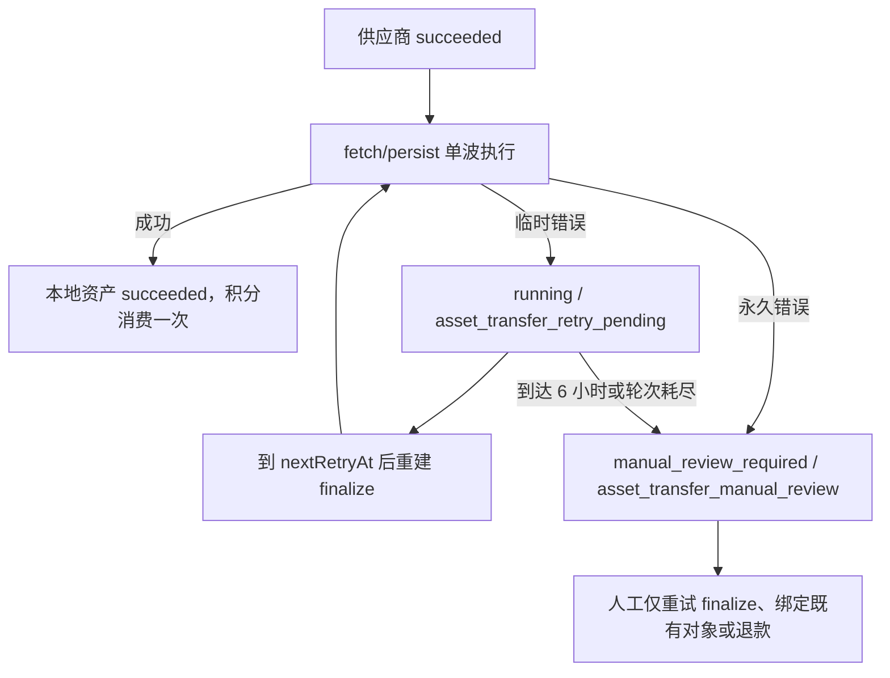

# 图片结果有界恢复设计

## 背景

图片供应商可能已经成功生成并扣费，但平台在下载供应商结果、上传对象存储或写入资产记录时失败。现有实现有两个互相冲突的行为：

- finalize 队列单波重试耗尽后，会把任务立即标记为 `manual_review_required`。
- 队列维护进程看到供应商请求已经 `succeeded`，又会持续创建新的 finalize 事件，且没有全局截止时间。

结果是用户看到终态“待复核”，前端停止轮询；后台却仍可能继续恢复并最终成功。同时，无界恢复会长期占用资源，运维也看不到轮次和截止时间。

## 目标

- 只调整图片链路，视频和音频行为保持不变。
- 供应商成功后停止供应商状态轮询，只恢复既有图片结果的本地落盘。
- finalize 单波失败后在最多 6 小时内进行有界、持久、可观测的跨波恢复。
- 恢复期间任务保持 `running`、积分保持预留，任务中心继续刷新。
- 永久错误、轮次耗尽或到达 6 小时截止时间后才进入人工复核。
- finalize 恢复不得再次调用供应商生成接口。
- 已成功状态优先于迟到的队列失败回调，避免成功结果被覆盖。

## 保持不变的供应商链路

1. 图片提交使用本地任务 UUID 作为 `Idempotency-Key`。
2. BananaRouter 返回真实供应商 `taskId` 后持久化。
3. `generation-poll-image` 每 30 秒调用 `GET /v1/async-tasks/{taskId}`，默认最多 1 小时。
4. 供应商状态为 `succeeded` 后，将结果 URL 或兼容的 base64 结果写入 `provider_requests.response_redacted_json`。
5. 此后不再查询供应商状态，进入 fetch/persist 两阶段 finalize。

供应商 24 小时幂等窗口只用于“提交响应丢失”时用同一幂等键找回原任务，不是 finalize 的恢复时长。

## 图片 finalize 状态机



恢复期间：

- `tasks.status = running`
- `task_attempts.status = running`
- `ai_generation_task_snapshots.status = running`
- `progress_stage = asset_transfer_retry_pending`
- `credit_reservations.status = active`
- 不设置业务失败终态，不释放积分，不重新提交图片生成。

人工复核期间：

- `tasks.status = manual_review_required`
- `task_attempts.status = manual_review_required`
- `progress_stage = asset_transfer_manual_review`
- `failure_code = provider_output_storage_failed`
- 积分保持人工复核状态，禁止自动退款或二次生成。

## 恢复计划

首次 finalize 是第 1 轮，失败后的间隔为：

| 已失败轮次 | 下一轮间隔 | 理论累计时间 |
| --- | ---: | ---: |
| 1 | 2 分钟 | 2 分钟 |
| 2 | 5 分钟 | 7 分钟 |
| 3 | 15 分钟 | 22 分钟 |
| 4 | 30 分钟 | 52 分钟 |
| 5 | 1 小时 | 1 小时 52 分钟 |
| 6 | 2 小时 | 3 小时 52 分钟 |
| 7 | 2 小时 | 5 小时 52 分钟 |

第 8 轮仍失败时直接进入人工复核。无论轮次如何，只要当前时间达到 `recoveryDeadlineAt = recoveryStartedAt + 6h`，不再创建新一轮。恢复波次内的下载、上传、重试等待及对象存储 `HEAD` 校验也必须使用剩余窗口作为超时上限，不能跨越截止时间继续阻塞。

## 持久化恢复状态

恢复元数据写入现有 `ai_generation_task_snapshots.provider_status_json.artifactRecovery`，不新增表或列：

```json
{
  "state": "retry_pending",
  "round": 3,
  "startedAt": "2026-08-03T10:00:00.000Z",
  "nextRetryAt": "2026-08-03T10:22:00.000Z",
  "deadlineAt": "2026-08-03T16:00:00.000Z",
  "lastFailureCode": "provider_output_download_failed",
  "lastErrorMessage": "provider_artifact_download_503"
}
```

该字段随任务快照持久化，Redis 丢失、Worker 重启或维护进程重启后仍可恢复。任务中心 SQL 只投影 `artifactRecovery` 子对象，不读取或传输完整供应商响应。

## 错误分类

自动恢复的临时错误：

- 下载超时、连接中断、HTTP 408/429/5xx。
- 对象存储临时上传错误、限流或超时。
- 图片已上传但资产/版本记录因数据库瞬时错误未写入。
- finalize 队列或 Redis 暂时不可用。

立即人工复核的永久错误：

- 供应商成功记录中没有图片 URL/base64 结果。
- 供应商图片 URL 在单波重试后仍返回 HTTP 400/401/403/404/410/422。
- 返回内容不是图片、base64 编码或图片签名无效、超过 64 MiB，或 URL 不符合安全策略。
- 对象存储缺少必要配置或不支持上传。

永久分类依据结构化 `failureCode`、HTTP 状态和原始错误代码；仅用于运维状态，不向用户泄露供应商身份或敏感响应。

## 原子性和去重

- 维护进程只处理 `provider_requests.status = succeeded` 的图片任务。
- 任务领取继续使用数据库 `last_dispatched_at`、活动 outbox 检查和行锁去重。
- 领取时同时确认任务仍未成功；成功、取消等终态不允许被迟到失败覆盖。
- 每一波使用新的 outbox 事件 ID，因此 BullMQ job ID 不冲突。
- fetch 阶段先查找已有 artifact handoff；persist 阶段复用已有存储对象，避免重复上传。
- 所有积分结算继续使用现有 allocation key，成功只消费一次。

## 任务中心

任务中心仍只访问本地 `/api/task-center/tasks`，不直接查询 BananaRouter 或对象存储。

恢复中的返回字段：

- `providerSucceeded: true`
- `recoveryRound`
- `recoveryStartedAt`
- `nextRetryAt`
- `recoveryDeadlineAt`
- `lastFailureCode`

界面显示“供应商已完成，平台正在保存图片”，并展示当前轮次、下次恢复时间和最晚恢复时间。只有恢复中的任务存在时，刷新对齐最近的 `nextRetryAt`，最长间隔 5 分钟；其他普通生成任务仍使用现有 15 秒、30 秒、60 秒节奏。

## 运维和积分

- 第 6 轮起恢复元数据标记 warning，便于日志和任务中心识别长尾任务。
- 永久错误或 6 小时截止时写入 `admin_action_required` 的失败详情。
- 人工操作只允许：重试 finalize、绑定现有存储对象、确认无法交付后退款。
- 若供应商已扣费但平台最终无法交付，退款由平台承担，不向用户重复扣费。

## 非目标

- 不修改视频、音频的异步轮询和 finalize 策略。
- 不引入 WebSocket。
- 不新增供应商查询入口，不让浏览器直接访问供应商。
- 不在 finalize 中重新调用图片生成接口。
